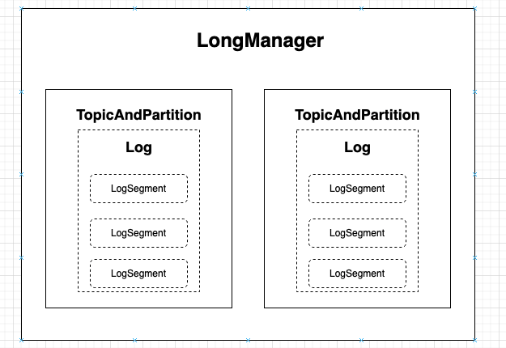
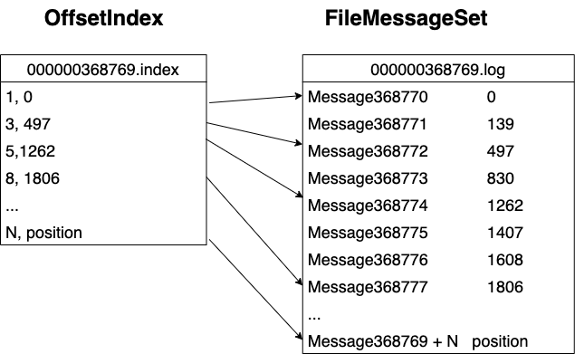
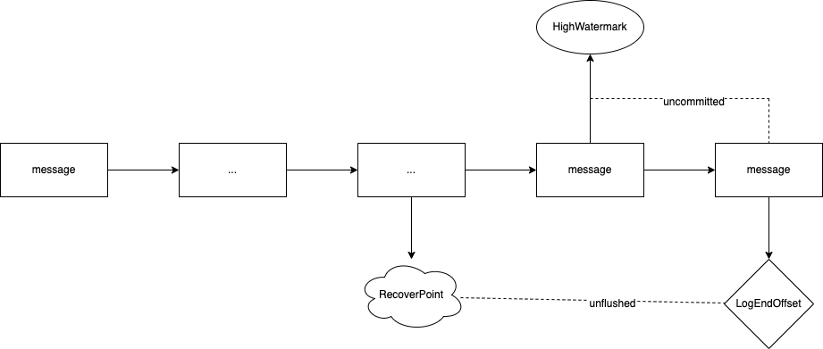

# readme

## 描述

> 《kafka源码解析与实战》阅读笔记。

## 问题记录

### OffsetIndex and FileMessageSet

> kafka 的实际日志由 `OffsetIndex` 和 `FileMessageSet` 两个部分组成，其中 `OffsetIndex` 被映射成了一个 MMap；那么 kafka 怎么保证它和 FileMessageStat 是对得上的呢？

### read(startOffset: Long, maxLength: Int, maxOffset: Option[Long] = None): 

> 为什么 LogManager 在读数据的时候，需要有一个 `maxOffset` 指定可以拉取的最大偏移数？

## 编译

### MavenDeployment

> 使用 `gradle 6.2` 可以直接编译，更高版本的部分插件被移除。

### ScalaCompileOptions.metaClass.useAnt ...

> 在 `build.gradle` 最上方添加
>
> ```java
> ScalaCompileOptions.metaClass.daemonServer = true
> ScalaCompileOptions.metaClass.fork = true
> ScalaCompileOptions.metaClass.useAnt = false
> ScalaCompileOptions.metaClass.useCompileDaemon = false
> ```

### allowInsecureProtocol

> gradle 要求用户使用私有库时显示的声明，所以在 buildscript.gradle 中增加配置
>
> ```json
> repositories {
>   repositories {
>     // For license plugin.
>     maven {
>       url = 'http://dl.bintray.com/content/netflixoss/external-gradle-plugins/'
>       allowInsecureProtocol = true
>     }
>   }
> }
> ```

## Broker 概述

### 3.1 Broker 的启动

#### bash

```bash
exec $base_dir/kafka-run-class.sh $EXTRA_ARGS kafka.Kafka "$@"
```

#### kafka.Kafka

```scala
object Kafka extends Logging {

  def main(args: Array[String]): Unit = {
    if (args.length != 1) {
      println("USAGE: java [options] %s server.properties".format(classOf[KafkaServer].getSimpleName()))
      System.exit(1)
    }
  
    try {
      val props = Utils.loadProps(args(0))
      val serverConfig = new KafkaConfig(props)
      KafkaMetricsReporter.startReporters(serverConfig.props)
      val kafkaServerStartable = new KafkaServerStartable(serverConfig)

      // attach shutdown handler to catch control-c
      Runtime.getRuntime().addShutdownHook(new Thread() {
        override def run() = {
          kafkaServerStartable.shutdown
        }
      })

      kafkaServerStartable.startup
      kafkaServerStartable.awaitShutdown
    }
    catch {
      case e: Throwable => fatal(e)
    }
    System.exit(0)
  }
}
```

#### KafkaServer#startup()

```scala
  /**
   * Start up API for bringing up a single instance of the Kafka server.
   * Instantiates the LogManager, the SocketServer and the request handlers - KafkaRequestHandlers
   */
  def startup() {
    try {
      info("starting")
      brokerState.newState(Starting)
      isShuttingDown = new AtomicBoolean(false)
      shutdownLatch = new CountDownLatch(1)

      /* start scheduler */
      kafkaScheduler.startup()
    
      /* setup zookeeper */
      zkClient = initZk()

      /* start log manager */
      logManager = createLogManager(zkClient, brokerState)
      logManager.startup()

      socketServer = new SocketServer(config.brokerId,
                                      config.hostName,
                                      config.port,
                                      config.numNetworkThreads,
                                      config.queuedMaxRequests,
                                      config.socketSendBufferBytes,
                                      config.socketReceiveBufferBytes,
                                      config.socketRequestMaxBytes,
                                      config.maxConnectionsPerIp,
                                      config.connectionsMaxIdleMs,
                                      config.maxConnectionsPerIpOverrides)
      socketServer.startup()

      replicaManager = new ReplicaManager(config, time, zkClient, kafkaScheduler, logManager, isShuttingDown)

      /* start offset manager */
      offsetManager = createOffsetManager()

      kafkaController = new KafkaController(config, zkClient, brokerState)
    
      /* start processing requests */
      apis = new KafkaApis(socketServer.requestChannel, replicaManager, offsetManager, zkClient, config.brokerId, config, kafkaController)
      requestHandlerPool = new KafkaRequestHandlerPool(config.brokerId, socketServer.requestChannel, apis, config.numIoThreads)
      brokerState.newState(RunningAsBroker)
   
      Mx4jLoader.maybeLoad()

      replicaManager.startup()

      kafkaController.startup()
    
      topicConfigManager = new TopicConfigManager(zkClient, logManager)
      topicConfigManager.startup()
    
      /* tell everyone we are alive */
      kafkaHealthcheck = new KafkaHealthcheck(config.brokerId, config.advertisedHostName, config.advertisedPort, config.zkSessionTimeoutMs, zkClient)
      kafkaHealthcheck.startup()

    
      registerStats()
      startupComplete.set(true)
      info("started")
    }
    catch {
      case e: Throwable =>
        fatal("Fatal error during KafkaServer startup. Prepare to shutdown", e)
        shutdown()
        throw e
    }
  }
```

| components          | desc                                                         |
| ------------------- | ------------------------------------------------------------ |
| SocketServer        | An NIO socket server, The threading model is : <br /><br />1 Acceptor thread that handles new connections <br />N Processor threads that each have their own selector and read requests from sockets <br />M Handler threads that handle requests and produce responses back to the processor threads for writing. |
| KafkaRequestHandler | A thread that answers kafka requests.                        |
| LogManager          | The entry point to the kafka log management subsystem. The log manager is responsible for log creation, retrieval, and cleaning. All read and write operations are delegated to the individual log instances.<br/>The log manager maintains logs in one or more directories. New logs are created in the data directory with the fewest logs. No attempt is made to move partitions after the fact or balance based on size or I/O rate.<br/>A background thread handles log retention by periodically truncating excess log segments |
| ReplicaManager      |                                                              |
| OffsetManagerConfig | Configuration settings for in-built offset management        |
| KafkaScheduler      | A scheduler based on java.util.concurrent.ScheduledThreadPoolExecutor<br/>It has a pool of kafka-scheduler- threads that do the actual work. |
| KafkaApis           | Logic to handle the various Kafka requests                   |
| KafkaHealthcheck    | This class registers the broker in zookeeper to allow other brokers and consumers to detect failures. It uses an ephemeral znode with the path: /brokers/[0...N] --> advertisedHost:advertisedPort<br/>Right now our definition of health is fairly naive. If we register in zk we are healthy, otherwise we are dead. |
| TopicConfigManager  | This class initiates and carries out topic config changes.<br/>It works as follows.<br/>Config is stored under the path `/brokers/topics/<topic_name>/config` This znode stores the topic-overrides for this topic (but no defaults) in properties format. To avoid watching all topics for changes instead we have a notification path `/brokers/config_changes` The TopicConfigManager has a child watch on this path. To update a topic config we first update the topic config properties. Then we create a new sequential znode under the change path which contains the name of the topic that was updated, say /brokers/config_changes/config_change_13321 This is just a notification--the actual config change is stored only once under the /brokers/topics/ /config path. This will fire a watcher on all brokers. This watcher works as follows. It reads all the config change notifications. It keeps track of the highest config change suffix number it has applied previously. For any previously applied change it finds it checks if this notification is larger than a static expiration time (say 10mins) and if so it deletes this notification. For any new changes it reads the new configuration, combines it with the defaults, and updates the log config for all logs for that topic (if any) that it has. Note that config is always read from the config path in zk, the notification is just a trigger to do so. So if a broker is down and misses a change that is fine--when it restarts it will be loading the full config anyway. Note also that if there are two consecutive config changes it is possible that only the last one will be applied (since by the time the broker reads the config the both changes may have been made). In this case the broker would needlessly refresh the config twice, but that is harmless. On restart the config manager re-processes all notifications. This will usually be wasted work, but avoids any race conditions on startup where a change might be missed between the initial config load and registering for change notifications. |
| KafkaController     |                                                              |

### 4. Broker 的基本模块

#### 4.1 SocketServer

```scala
class SocketServer(val brokerId: Int,
                   val host: String,
                   val port: Int,
                   val numProcessorThreads: Int,
                   val maxQueuedRequests: Int,
                   val sendBufferSize: Int,
                   val recvBufferSize: Int,
                   val maxRequestSize: Int = Int.MaxValue,
                   val maxConnectionsPerIp: Int = Int.MaxValue,
                   val connectionsMaxIdleMs: Long,
                   val maxConnectionsPerIpOverrides: Map[String, Int] ) extends Logging with KafkaMetricsGroup {
  // ...
  private val processors = new Array[Processor](numProcessorThreads)
  @volatile private var acceptor: Acceptor = null
  val requestChannel = new RequestChannel(numProcessorThreads, maxQueuedRequests)

  /**
   * Start the socket server
   */
  def startup() {

  }

  /**
   * Shutdown the socket server
   */
  def shutdown() = {

  }
}
```

#### Acceptor

```scala
  /**
   * Accept loop that checks for new connection attempts
   */
  def run() {
    // NIO 注册时间接收连接请求
    serverChannel.register(selector, SelectionKey.OP_ACCEPT)
    startupComplete()
    var currentProcessor = 0
    while(isRunning) {
      // 查看新增的连接请求
      val ready = selector.select(500)
      if(ready > 0) {
        val keys = selector.selectedKeys()
        val iter = keys.iterator()
        while(iter.hasNext && isRunning) {
          var key: SelectionKey = null
          try {
            key = iter.next
            iter.remove()
            if(key.isAcceptable) {
               // 基于轮序获取一个处理线程
               accept(key, processors(currentProcessor))
            } else
               throw new IllegalStateException("Unrecognized key state for acceptor thread.")

            // round robin to the next processor thread
            currentProcessor = (currentProcessor + 1) % processors.length
          } catch {
            case e: Throwable => error("Error while accepting connection", e)
          }
        }
      }
    }
    // 退出 kafka，清理资源
    debug("Closing server socket and selector.")
    swallowError(serverChannel.close())
    swallowError(selector.close())
    shutdownComplete()
  }
```

#### Processor

> `newConnections` 保存了由 `Acceptor` 线程转移过来的 `SocketChannel` 对象。
>
> 1. 在 `configureNewConnections()` 方法中，我们针对 `SocketChannel` 对象注册了 `OP_READ` 方法以接收客户端的请求；
> 2. 在 `processNewResponses()` 方法中，我们从 `RequestChannnel` 中获取对应客户端请求的响应产生对应的事件；
> 3. 在 `selector.select(300)` 返回的连接中监听事件：
>    1. 如果是 `OP_READ`，说明是新的 request，将请求添加到 RequestChannel 中；
>    2. 如果是 `OP_WRITE`，说明需要通过 `RequestChannel.Response` 写入，可能是各种返回值
>    3. 如果是 valid，说明连接已经关闭。

```scala
/**
 * Thread that processes all requests from a single connection. There are N of these running in parallel
 * each of which has its own selectors
 */
private[kafka] class Processor(val id: Int,
                               val time: Time,
                               val maxRequestSize: Int,
                               val aggregateIdleMeter: Meter,
                               val idleMeter: Meter,
                               val totalProcessorThreads: Int,
                               val requestChannel: RequestChannel,
                               connectionQuotas: ConnectionQuotas,
                               val connectionsMaxIdleMs: Long) extends AbstractServerThread(connectionQuotas) {

  private val newConnections = new ConcurrentLinkedQueue[SocketChannel]()
  private val connectionsMaxIdleNanos = connectionsMaxIdleMs * 1000 * 1000
  private var currentTimeNanos = SystemTime.nanoseconds
  private val lruConnections = new util.LinkedHashMap[SelectionKey, Long]
  private var nextIdleCloseCheckTime = currentTimeNanos + connectionsMaxIdleNanos

  override def run() {
    startupComplete()
    while(isRunning) {
      // setup any new connections that have been queued up
      // 在 accept 方法中，会把所有的 connection 放到一个队列中
      configureNewConnections()
      // 从 RequestChannel 中获取响应并根据 ResponseAction 类型返回
      processNewResponses()
      val startSelectTime = SystemTime.nanoseconds
      val ready = selector.select(300)
      currentTimeNanos = SystemTime.nanoseconds
      val idleTime = currentTimeNanos - startSelectTime
      // 标记工作线程 selector 阻塞时间
      idleMeter.mark(idleTime)
      // We use a single meter for aggregate idle percentage for the thread pool.
      // Since meter is calculated as total_recorded_value / time_window and
      // time_window is independent of the number of threads, each recorded idle
      // time should be discounted by # threads.
      aggregateIdleMeter.mark(idleTime / totalProcessorThreads)

      trace("Processor id " + id + " selection time = " + idleTime + " ns")
      if(ready > 0) {
        val keys = selector.selectedKeys()
        val iter = keys.iterator()
        while(iter.hasNext && isRunning) {
          var key: SelectionKey = null
          try {
            key = iter.next
            iter.remove()
            if(key.isReadable)
              read(key)
            else if(key.isWritable)
              write(key)
            else if(!key.isValid)
              close(key)
            else
              throw new IllegalStateException("Unrecognized key state for processor thread.")
          } catch {
            case e: EOFException => {
              info("Closing socket connection to %s.".format(channelFor(key).socket.getInetAddress))
              close(key)
            } case e: InvalidRequestException => {
              info("Closing socket connection to %s due to invalid request: %s".format(channelFor(key).socket.getInetAddress, e.getMessage))
              close(key)
            } case e: Throwable => {
              error("Closing socket for " + channelFor(key).socket.getInetAddress + " because of error", e)
              close(key)
            }
          }
        }
      }
      maybeCloseOldestConnection
    }
    debug("Closing selector.")
    closeAll()
    swallowError(selector.close())
    shutdownComplete()
  }

  /**
   * Close the given key and associated socket
   */
  override def close(key: SelectionKey): Unit = {
    lruConnections.remove(key)
    super.close(key)
  }

  private def processNewResponses() {
    // requestChannel 的类型是 RequestChannel，他在 sendRequest 阶段
    // 添加了 RequestChannel.Request(processor = id, requestKey = key, buffer = receive.buffer, startTimeMs = time.milliseconds, remoteAddress = address)
    // 到队列
    var curr = requestChannel.receiveResponse(id)
    while(curr != null) {
      val key = curr.request.requestKey.asInstanceOf[SelectionKey]
      try {
        curr.responseAction match {
          case RequestChannel.NoOpAction => {
            // There is no response to send to the client, we need to read more pipelined requests
            // that are sitting in the server's socket buffer
            curr.request.updateRequestMetrics
            trace("Socket server received empty response to send, registering for read: " + curr)
            key.interestOps(SelectionKey.OP_READ)
            key.attach(null)
          }
          case RequestChannel.SendAction => {
            trace("Socket server received response to send, registering for write: " + curr)
            key.interestOps(SelectionKey.OP_WRITE)
            key.attach(curr)
          }
          case RequestChannel.CloseConnectionAction => {
            curr.request.updateRequestMetrics
            trace("Closing socket connection actively according to the response code.")
            close(key)
          }
          case responseCode => throw new KafkaException("No mapping found for response code " + responseCode)
        }
      } catch {
        case e: CancelledKeyException => {
          debug("Ignoring response for closed socket.")
          close(key)
        }
      } finally {
        curr = requestChannel.receiveResponse(id)
      }
    }
  }

  /**
   * Queue up a new connection for reading
   */
  def accept(socketChannel: SocketChannel) {
    newConnections.add(socketChannel)
    wakeup()
  }

  /**
   * Register any new connections that have been queued up
   */
  private def configureNewConnections() {
    while(newConnections.size() > 0) {
      val channel = newConnections.poll()
      debug("Processor " + id + " listening to new connection from " + channel.socket.getRemoteSocketAddress)
      // 注意，这个 selector 是 Processor 自己的 selector
      channel.register(selector, SelectionKey.OP_READ)
    }
  }

  /*
   * Process reads from ready sockets
   */
  def read(key: SelectionKey) {
  }

  /*
   * Process writes to ready sockets
   */
  def write(key: SelectionKey) {

  }
}
```

> `maybeCloseOldestConnection` 在每次循环中都会处理一下 LRU 的连接，并且清理空闲时间过久的链接。

```scala
  private def maybeCloseOldestConnection {
    if(currentTimeNanos > nextIdleCloseCheckTime) {
      if(lruConnections.isEmpty) {
        nextIdleCloseCheckTime = currentTimeNanos + connectionsMaxIdleNanos
      } else {
        val oldestConnectionEntry = lruConnections.entrySet.iterator().next()
        val connectionLastActiveTime = oldestConnectionEntry.getValue
        nextIdleCloseCheckTime = connectionLastActiveTime + connectionsMaxIdleNanos
        if(currentTimeNanos > nextIdleCloseCheckTime) {
          val key: SelectionKey = oldestConnectionEntry.getKey
          trace("About to close the idle connection from " + key.channel.asInstanceOf[SocketChannel].socket.getRemoteSocketAddress
            + " due to being idle for " + (currentTimeNanos - connectionLastActiveTime) / 1000 / 1000 + " millis")
          close(key)
        }
      }
    }
  }
```

#### RequestChannel

>`RequestChannel` 内部包含两个阻塞队列，用于解耦 `SocketServer` 和 `KafkaApis`：
>
>- SocketServer 收到请求后放到 requestQueue 中
>- KafkaApis 从 requestQueue 中获取请求，并生成相应，写入到 responseQueue 中

```scala
class RequestChannel(val numProcessors: Int, val queueSize: Int) extends KafkaMetricsGroup {
  private var responseListeners: List[(Int) => Unit] = Nil
  private val requestQueue = new ArrayBlockingQueue[RequestChannel.Request](queueSize)
  private val responseQueues = new Array[BlockingQueue[RequestChannel.Response]](numProcessors)
  for(i <- 0 until numProcessors)
    responseQueues(i) = new LinkedBlockingQueue[RequestChannel.Response]()
}
```

### 4.2 KafkaRequestHandlerPool

>`KafkaRequestHandlerPool` 单纯的对 `KafkaRequestHandler` 进行了一个包装，将 KafkaRequestHandler 作为一个 daemon thread。

```scala
class KafkaRequestHandlerPool(val brokerId: Int,
                              val requestChannel: RequestChannel,
                              val apis: KafkaApis,
                              numThreads: Int) extends Logging with KafkaMetricsGroup {
  // runnable 是 KafkaRequestHandler，而 threads 包含了 runnable 的守护线程
  val threads = new Array[Thread](numThreads)
  val runnables = new Array[KafkaRequestHandler](numThreads)
  for(i <- 0 until numThreads) {
    runnables(i) = new KafkaRequestHandler(i, brokerId, aggregateIdleMeter, numThreads, requestChannel, apis)
    threads(i) = Utils.daemonThread("kafka-request-handler-" + i, runnables(i))
    threads(i).start()
  }

  def shutdown() {

  }
}
```

### 4.3 KafkaApis

#### 4.3.1 LogManager

> LogManager 负责提供kafka的 topic 日志的读取和写入功能，负责 **读取和写入位于 broker 上的所有分区的副本数据**；
>
> LogManager 管理是以 broker 为维度，而不是以 topic 或者 partition 作为维度。也就是，LogManager 只会管理 **它所在的 broker 上的所有 partition**。

##### 4.3.1.1 Kafka 的日志组成

> `kafka` 的日志本质上是一个 append-only 的文件，同时具有 `topic + partition` 的属性，所以 `LogManager` 将实际的日志抽象成了一个 `TopicAndPartitition` -> `Log` 的结构。

```scala
@threadsafe
class LogManager(val logDirs: Array[File],
                 val topicConfigs: Map[String, LogConfig],
                 val defaultConfig: LogConfig,
                 val cleanerConfig: CleanerConfig,
                 ioThreads: Int,
                 val flushCheckMs: Long,
                 val flushCheckpointMs: Long,
                 val retentionCheckMs: Long,
                 scheduler: Scheduler,
                 val brokerState: BrokerState,
                 private val time: Time) extends Logging {

  private val logs = new Pool[TopicAndPartition, Log]()
}
```

> 1. `Log` 的实现是基于 `ConcurrentNavigableMap[Long, LogSegment]`，因为每一个 `topic + partition` 对应一个 `log`，而一个 `log` 对应多个 `LogSegment`；
> 2. Log 的实现是基于跳跃表，使用跳跃表的原因是，可以比较简单的基于 `subMap` 来修改引用的 LogSegment 范围；

```scala
@threadsafe
class Log(val dir: File,
          @volatile var config: LogConfig,
          @volatile var recoveryPoint: Long = 0L,
          scheduler: Scheduler,
          time: Time = SystemTime) extends Logging with KafkaMetricsGroup {

  /* the actual segments of the log */
  private val segments: ConcurrentNavigableMap[java.lang.Long, LogSegment] = new ConcurrentSkipListMap[java.lang.Long, LogSegment]
  
}
```



> LogSegment ：**Each segment has two components: a log and an index.**

```scala
 /**
 * A segment of the log. Each segment has two components: a log and an index. The log is a FileMessageSet containing
 * the actual messages. The index is an OffsetIndex that maps from logical offsets to physical file positions. Each 
 * segment has a base offset which is an offset <= the least offset of any message in this segment and > any offset in
 * any previous segment.
 * 
 * A segment with a base offset of [base_offset] would be stored in two files, a [base_offset].index and a [base_offset].log file. 
 * 
 * @param log The message set containing log entries
 * @param index The offset index
 * @param baseOffset A lower bound on the offsets in this segment
 * @param indexIntervalBytes The approximate number of bytes between entries in the index
 * @param time The time instance
 */
@nonthreadsafe
class LogSegment(val log: FileMessageSet, 
                 val index: OffsetIndex, 
                 val baseOffset: Long, 
                 // 索引粒度，代表多少字节之后生成一条索引
                 val indexIntervalBytes: Int,
                 val rollJitterMs: Long,
                 time: Time) extends Logging {


}
```

> 1. 一个 Kafka 包含了多个 topic
> 2. 一个 topic 包含了多个 partition
> 3. 一个 LogManager 管理一台 broker 上的所有 `Log`
> 4. 由 <topic, partition> 可以定位到一个唯一的 `Log`
> 5. 一个 `Log` 包含了多个不同的 `LogSegment`
> 6. 一个 `LogSegment` 包含了 `FileMessageSet` 和 `OffsetIndex` 分别用于数据存储以及索引；
> 7. `OffsetIndex` 包含了一个 baseOffset，并且每经过 indexIntervalBytes 字节会建立一个索引；例如在下面的例子中，`3, 497` 指明了 **offset 为 368769 + 3 的 message 在 OffsetIndex 对应的 FileMessageSet 的第 497 个字节** 



##### 4.3.1.2 kafka 的消息读取

```scala
  /**
   * Read messages from the log
   *
   * @param startOffset The offset to begin reading at
   * @param maxLength The maximum number of bytes to read
   * @param maxOffset -The offset to read up to, exclusive. (i.e. the first offset NOT included in the resulting message set).
   * 
   * @throws OffsetOutOfRangeException If startOffset is beyond the log end offset or before the base offset of the first segment.
   * @return The fetch data information including fetch starting offset metadata and messages read
   */
  def read(startOffset: Long, maxLength: Int, maxOffset: Option[Long] = None): FetchDataInfo = {
    trace("Reading %d bytes from offset %d in log %s of length %d bytes".format(maxLength, startOffset, name, size))

    // check if the offset is valid and in range
    val next = nextOffsetMetadata.messageOffset
    // 如果已经是当前最大的 offset，那么无数据读取
    if(startOffset == next)
      return FetchDataInfo(nextOffsetMetadata, MessageSet.Empty)

    // 查找具体在哪个 LogSegment，这就是为什么 segments 的底层实现是一个跳跃表
    var entry = segments.floorEntry(startOffset)
      
    // attempt to read beyond the log end offset is an error
    if(startOffset > next || entry == null)
      throw new OffsetOutOfRangeException("Request for offset %d but we only have log segments in the range %d to %d.".format(startOffset, segments.firstKey, next))

    // 尝试从 LogSegment 中读取数据，如果当前 LogSegment 没有我们要读的数据
    // 就找到下一个 entry 尝试读取数据，直到读到数据或者没有最新的 LogSegment
    while(entry != null) {
      // entry.getValue 是我们刚才基于 startOffset 找到的 LogSegment
      val fetchInfo = entry.getValue.read(startOffset, maxOffset, maxLength)
      if(fetchInfo == null) {
        entry = segments.higherEntry(entry.getKey)
      } else {
        return fetchInfo
      }
    }
    
    // 我们已经查找到最后的 Segment，但是我们还是无法读取到数据，虽然给定的 startOffset 是在我们 LogSegment 的范围中。
    // 当所有偏移量大于起始偏移量的消息都被删除时，就会发生这种情况。
    FetchDataInfo(nextOffsetMetadata, MessageSet.Empty)
  }
```

> LogSegment 的 read 方法，包含了三个参数：
>
> 1. `startOffset` 日志的 offset
> 2. `maxOffset` 最大读取多少条消息，**maxOffset 最大的作用是，可以用来实现 `watermark`，比如我们读数据的时候可能是读的 partition 的 leader 或者 slaver，在一些策略下我们可能不允许对 offset 进行限制。**
> 3. `maxSize` 最大读取多少 byte
>
> 这个方法主要是执行以下操作：
>
> 1. 根据 `startOffset` 查找 OffsetIndex 得到 OffsetPosition，这样我们知道日志应该从 FileMessageSet 的哪里开始读；
> 2. 根据 `maxOffset` 和 `maxSize` 判断我们所能读取的最大数据长度；

```scala
  /**
   * 从 LogSegment 读取第一条满足 offset >= startOffset 的消息。
   * 消息不会超过 maxSize 指定的 bytes，并且会在 maxOffset 之前结束（如果指定了 maxOffset 的话）
   *
   * @param startOffset A lower bound on the first offset to include in the message set we read
   * @param maxSize The maximum number of bytes to include in the message set we read
   * @param maxOffset An optional maximum offset for the message set we read
   * 
   * @return The fetched data and the offset metadata of the first message whose offset is >= startOffset,
   *         or null if the startOffset is larger than the largest offset in this log
   */
  @threadsafe
  def read(startOffset: Long, maxOffset: Option[Long], maxSize: Int): FetchDataInfo = {
    if(maxSize < 0)
      throw new IllegalArgumentException("Invalid max size for log read (%d)".format(maxSize))

    val logSize = log.sizeInBytes() // this may change, need to save a consistent copy
    // 通过查找 OffsetIndex 来查找 OffsetPosition，这里包含了消息的 offset 以及在对应的 LogSegment 的字节偏移量
    val startPosition = translateOffset(startOffset)

    // if the start position is already off the end of the log, return null
    if(startPosition == null)
      return null

    // LogOffsetMetadata 包含了消息的 offset，LogSegment 的 baseOffset，以及在 LogSegment 的字节偏移量
    val offsetMetadata = new LogOffsetMetadata(startOffset, this.baseOffset, startPosition.position)

    // if the size is zero, still return a log segment but with zero size
    if(maxSize == 0)
      return FetchDataInfo(offsetMetadata, MessageSet.Empty)

    // 计算可以读取的最大长度，这个由 maxOffset，maxSize 共同限定。
    // 例如，我们开启了某些策略的时候，虽然部分日志已经写入到 LogSegment，但是仍然不允许他们被消费，这个时候我们需要对 maxOffset 进行限制。
    // 如果没有指定 maxOffset，那么我们可以直接使用 maxSize 作为 length
    // 如果指定了 maxOffset，那么我们需要找到 maxOffset 对应的日志的 OffsetPosition
    // 那么进而可以计算得到我们需要读取的数据长度了。
    val length =
      maxOffset match {
        case None =>
          maxSize
        case Some(offset) => {
          if(offset < startOffset)
            throw new IllegalArgumentException("Attempt to read with a maximum offset (%d) less than the start offset (%d).".format(offset, startOffset))
          val mapping = translateOffset(offset, startPosition.position)
          val endPosition =
            if(mapping == null)
              logSize // the max offset is off the end of the log, use the end of the file
            else
              mapping.position
          min(endPosition - startPosition.position, maxSize)
        }
      }
    FetchDataInfo(offsetMetadata, log.read(startPosition.position, length))
  }
```

> `translateOffset`：接收两个参数
>
> 1. `offset` 消息在 partition 的 offset，等于 LogSegment 的 baseOffset + relativeOffset；
> 2. `startingFilePosition` 是一个优化项，在某些情况下我们已经知道了我们搜索的 offset 一定是在 LogSegment 的某个 position 之后，就可以通过这个选项来指定偏移量来减少查询次数。
>
> 搜索并返回 offset 对应的 OffsetPosition。

```scala
  /**
   * Find the physical file position for the first message with offset >= the requested offset.
   * 
   * The lowerBound argument is an optimization that can be used if we already know a valid starting position
   * in the file higher than the greatest-lower-bound from the index.
   * 
   * @param offset The offset we want to translate
   * @param startingFilePosition A lower bound on the file position from which to begin the search. This is purely an optimization and
   * when omitted, the search will begin at the position in the offset index.
   * 
   * @return The position in the log storing the message with the least offset >= the requested offset or null if no message meets this criteria.
   */
  @threadsafe
  private[log] def translateOffset(offset: Long, startingFilePosition: Int = 0): OffsetPosition = {
    // 通过offset在 OffsetIndex 中查找第一条 offset >= targetOffset 的消息。
    val mapping = index.lookup(offset)
    // 从 startingFilePosition 指定的文件位置开始搜索，查找某条消息的物理位置，该消息是最后一条 offset >= targetOffset 的消息，并返回该消息的物理位置
    log.searchFor(offset, max(mapping.position, startingFilePosition))
  }

```

>`translateOffset` 分为两个阶段：
>
>1. 二分查找；
>2. 查找文件物理位置。

>translateOffset 二分查找：这里需要关注的是 `relativeOffset` 和 `physical` 两个方法
>
>```scala
>  /* return the nth offset relative to the base offset */
>  private def relativeOffset(buffer: ByteBuffer, n: Int): Int = buffer.getInt(n * 8)
>  
>  /* return the nth physical position */
>  private def physical(buffer: ByteBuffer, n: Int): Int = buffer.getInt(n * 8 + 4)
>```
>
>再回忆一下，OffsetIndex 的数据结构：**[offset0, position0, offset1, position1,...]**，就知道为什么是这样获取相对offset以及物理position了。
>
>**需要注意的是，lookup 方法返回的并不一定是我们查找的那条日志的offset与position，因为 OffsetIndex 是稀疏索引**

```scala
  /**
   * Find the largest offset less than or equal to the given targetOffset 
   * and return a pair holding this offset and it's corresponding physical file position.
   * 
   * @param targetOffset The offset to look up.
   * 
   * @return The offset found and the corresponding file position for this offset. 
   * If the target offset is smaller than the least entry in the index (or the index is empty),
   * the pair (baseOffset, 0) is returned.
   */
  def lookup(targetOffset: Long): OffsetPosition = {
    maybeLock(lock) {
      val idx = mmap.duplicate
      val slot = indexSlotFor(idx, targetOffset)
      if(slot == -1)
        return OffsetPosition(baseOffset, 0)
      else
        return OffsetPosition(baseOffset + relativeOffset(idx, slot), physical(idx, slot))
      }
  }

  /**
   * Find the slot in which the largest offset less than or equal to the given
   * target offset is stored.
   * 
   * @param idx The index buffer
   * @param targetOffset The offset to look for
   * 
   * @return The slot found or -1 if the least entry in the index is larger than the target offset or the index is empty
   */
  private def indexSlotFor(idx: ByteBuffer, targetOffset: Long): Int = {
    
    // we only store the difference from the base offset so calculate that
    val relOffset = targetOffset - baseOffset
    
    // check if the index is empty
    if(entries == 0)
      return -1
    
    // check if the target offset is smaller than the least offset
    if(relativeOffset(idx, 0) > relOffset)
      return -1
      
    // binary search for the entry
    var lo = 0
    var hi = entries-1
    while(lo < hi) {
      val mid = ceil(hi/2.0 + lo/2.0).toInt
      val found = relativeOffset(idx, mid)
      if(found == relOffset)
        return mid
      else if(found < relOffset)
        lo = mid
      else
        hi = mid - 1
    }
    lo
  }

  /* return the nth offset relative to the base offset */
  private def relativeOffset(buffer: ByteBuffer, n: Int): Int = buffer.getInt(n * 8)
  
  /* return the nth physical position */
  private def physical(buffer: ByteBuffer, n: Int): Int = buffer.getInt(n * 8 + 4)
```

> `OffsetIndex`：OffsetIndex 内部包含了一个 MappedByteBuffer，用于索引文件。因为使用 MappedByteBuffer 所以会很占内存。

##### 4.3.1.3 LogManager 的启动

> 在 `LogManager` 下，有一个文件 `recovery-point-offset-checkpoint`，这个文件保存了 `topic/partition=>offsets` 的映射关系。它记录了所有已经 flush 到硬盘的偏移量，这样在我们遇到崩溃重启时不需要从最开始的位置 recovery。
>
> 以 `data_distribution_data_mining` 这个 topic 为例子，在某一台 broker 下存放了三个分区：
>
> ```
> data_distribution_data_mining-0
> data_distribution_data_mining-15
> data_distribution_data_mining-19
> ```
>
> 而实际的 recovery-point-offset-checkpoint 中保存了如下信息
>
> ```
> data_distribution_data_mining 0 xxx
> data_distribution_data_mining 15 yyy
> data_distribution_data_mining 19 zzz
> ```
>
> 表明 topic 的分区 `0`,`15`,`19` 三个分区对应的 offset 是 xxx, yyy, zzz。

###### 初始化 logs

> 在这一步，主要是初始化 `Log`

```scala
/**
 * The entry point to the kafka log management subsystem. The log manager is responsible for log creation, retrieval, and cleaning.
 * All read and write operations are delegated to the individual log instances.
 * 
 * The log manager maintains logs in one or more directories. New logs are created in the data directory
 * with the fewest logs. No attempt is made to move partitions after the fact or balance based on
 * size or I/O rate.
 * 
 * A background thread handles log retention by periodically truncating excess log segments.
 */
@threadsafe
class LogManager(val logDirs: Array[File],
                 val topicConfigs: Map[String, LogConfig],
                 val defaultConfig: LogConfig,
                 val cleanerConfig: CleanerConfig,
                 ioThreads: Int,
                 val flushCheckMs: Long,
                 val flushCheckpointMs: Long,
                 val retentionCheckMs: Long,
                 scheduler: Scheduler,
                 val brokerState: BrokerState,
                 private val time: Time) extends Logging {

  
  val RecoveryPointCheckpointFile = "recovery-point-offset-checkpoint"
  val LockFile = ".lock"
  val InitialTaskDelayMs = 30*1000
  private val logCreationOrDeletionLock = new Object
  // 初始化 Log
  private val logs = new Pool[TopicAndPartition, Log]()

  createAndValidateLogDirs(logDirs)
  private val dirLocks = lockLogDirs(logDirs)
  private val recoveryPointCheckpoints = logDirs.map(dir => (dir, new OffsetCheckpoint(new File(dir, RecoveryPointCheckpointFile)))).toMap
  loadLogs()
}
```

###### 在 `startup` 中开启后台定时线程

> 1. cleanupLogs 清理过期日志；
> 2. flushDirtyLogs 刷新内存中的数据到硬盘；
> 3. checkpointRecoveryPointOffsets 将检查点写入到文件防止在启动的时候恢复整个日志；
> 4. 启动 `cleaner`（cleaner 是一个 `LogCleaner` 对象，用于清理 Key 重复的数据）：对于一个 message 分为 <Topic, Key, Message> 三个部分，当 `<Topic, Key>` 相同的消息出现多次的时候，如果开启了 cleaner，针对 `<Topic, Key>` 相同的消息，只会保留最后一条。

```scala
  /**
   *  Start the background threads to flush logs and do log cleanup
   */
  def startup() {
    /* Schedule the cleanup task to delete old logs */
    if(scheduler != null) {
      info("Starting log cleanup with a period of %d ms.".format(retentionCheckMs))
      scheduler.schedule("kafka-log-retention", 
                         cleanupLogs, 
                         delay = InitialTaskDelayMs, 
                         period = retentionCheckMs, 
                         TimeUnit.MILLISECONDS)
      info("Starting log flusher with a default period of %d ms.".format(flushCheckMs))
      scheduler.schedule("kafka-log-flusher", 
                         flushDirtyLogs, 
                         delay = InitialTaskDelayMs, 
                         period = flushCheckMs, 
                         TimeUnit.MILLISECONDS)
      scheduler.schedule("kafka-recovery-point-checkpoint",
                         checkpointRecoveryPointOffsets,
                         delay = InitialTaskDelayMs,
                         period = flushCheckpointMs,
                         TimeUnit.MILLISECONDS)
    }
    if(cleanerConfig.enableCleaner)
      cleaner.startup()
  }
```

#### 4.3.2 ReplicaManager

> ReplicManager 负责针对 topic 的分区副本数据的同步功能，ReplicManager 主要利用 `ReplicaFetcherThread` 和 `HighWatermark` 来实现数据同步管理。
>
> 简单来说，在 `AbstractFetcherThread` 中保存了 `partitionMap`，同时有一个线程一直通过读取 `partitionMap` 并组装 `FetchRequest` 向 `leader` 请求数据。

##### HighWatermark、LogEndOffset

> kafka 的日志包含了两个不同的偏移量，分别是 `HighWatemark` 和 `LogEndOffset`；
>
> - HighWatermark：在leader中代表了所有的ISR中Replica的 last commited messages 的最小值，这代表小于这个 offset 的值所有的 ISR 都已经通过 `FetchRequest` 获取到；在 follower 中，他只代表了他的 offset。
> - LogEndOffset：对于本地 replica 代表了文件的 offset，对于 remote replicas，这个值由 follower fetch 更新。在每次 `FetchRequest` 时，follower 会上报自己的 LogEndOffset。



```scala
  // the high watermark offset value, in non-leader replicas only its message offsets are kept
  @volatile private[this] var highWatermarkMetadata: LogOffsetMetadata = new LogOffsetMetadata(initialHighWatermarkValue)
  // the log end offset value, kept in all replicas;
  // for local replica it is the log's end offset, for remote replicas its value is only updated by follower fetch
  @volatile private[this] var logEndOffsetMetadata: LogOffsetMetadata = LogOffsetMetadata.UnknownOffsetMetadata
```

##### Partition

> `controllerEpoch` 会在 `makeFollower` 和 `makeLeader` 中被修改，这意味着在某一个时刻，针对于某个 `epoch` 的投票达成了一致。

```scala
class Partition(val topic: String,
                val partitionId: Int,
                time: Time,
                replicaManager: ReplicaManager) extends Logging with KafkaMetricsGroup {
  private val localBrokerId = replicaManager.config.brokerId
  private val logManager = replicaManager.logManager
  private val zkClient = replicaManager.zkClient
  // AR
  private val assignedReplicaMap = new Pool[Int, Replica]
  // The read lock is only required when multiple reads are executed and needs to be in a consistent manner
  private val leaderIsrUpdateLock = new ReentrantReadWriteLock()
  private var zkVersion: Int = LeaderAndIsr.initialZKVersion
  @volatile private var leaderEpoch: Int = LeaderAndIsr.initialLeaderEpoch - 1
  @volatile var leaderReplicaIdOpt: Option[Int] = None
  // ISR
  @volatile var inSyncReplicas: Set[Replica] = Set.empty[Replica]
  /* Epoch of the controller that last changed the leader. This needs to be initialized correctly upon broker startup.
   * One way of doing that is through the controller's start replica state change command. When a new broker starts up
   * the controller sends it a start replica command containing the leader for each partition that the broker hosts.
   * In addition to the leader, the controller can also send the epoch of the controller that elected the leader for
   * each partition. */
  private var controllerEpoch: Int = KafkaController.InitialControllerEpoch - 1

}
```

##### Replica

```scala
/**
 * @param brokerId 所在的 broker ID
 * @param partition 所在的分区
 * @param initialHighWatermarkValue 初始的 HighWatermark
 * @param log 对应的日志
 */
class Replica(val brokerId: Int,
              val partition: Partition,
              time: Time = SystemTime,
              initialHighWatermarkValue: Long = 0L,
              val log: Option[Log] = None) extends Logging {
  // the high watermark offset value, in non-leader replicas only its message offsets are kept
  @volatile private[this] var highWatermarkMetadata: LogOffsetMetadata = new LogOffsetMetadata(initialHighWatermarkValue)
  // the log end offset value, kept in all replicas;
  // for local replica it is the log's end offset, for remote replicas its value is only updated by follower fetch
  @volatile private[this] var logEndOffsetMetadata: LogOffsetMetadata = LogOffsetMetadata.UnknownOffsetMetadata
  // the time when log offset is updated
  private[this] val logEndOffsetUpdateTimeMsValue = new AtomicLong(time.milliseconds)

  val topic = partition.topic
  val partitionId = partition.partitionId

}
```

##### processPartitionData

```scala
  /**
   * process fetched data
   * @param topicAndPartition FetchResponse 中返回的 <TopicAndPartition>
   * @param fetchOffset       broke 上当前 <TopicAndPartition> 的 offset
   * @param partitionData     FetchResponse 返回的 <FetchResponsePartitionData>
   */
  def processPartitionData(topicAndPartition: TopicAndPartition, fetchOffset: Long, partitionData: FetchResponsePartitionData) {
    try {
      val topic = topicAndPartition.topic
      val partitionId = topicAndPartition.partition
      // 获取所有副本信息
      val replica = replicaMgr.getReplica(topic, partitionId).get
      val messageSet = partitionData.messages.asInstanceOf[ByteBufferMessageSet]

      // fetchOffset 是当前 <partitionMap> 中的 offset
      // logEndOffset 有两种
      // for local replica it is the log's end offset, for remote replicas its value is only updated by follower fetch
      if (fetchOffset != replica.logEndOffset.messageOffset)
        throw new RuntimeException("Offset mismatch: fetched offset = %d, log end offset = %d.".format(fetchOffset, replica.logEndOffset.messageOffset))
      trace("Follower %d has replica log end offset %d for partition %s. Received %d messages and leader hw %d"
            .format(replica.brokerId, replica.logEndOffset.messageOffset, topicAndPartition, messageSet.sizeInBytes, partitionData.hw))
      // 将日志写入对应的 LogSegment
      replica.log.get.append(messageSet, assignOffsets = false)
      trace("Follower %d has replica log end offset %d after appending %d bytes of messages for partition %s"
            .format(replica.brokerId, replica.logEndOffset.messageOffset, messageSet.sizeInBytes, topicAndPartition))
      // 设置 HighWatermark 为 logEndOffset 与 <FetchResponsePartitionData> 中 HighWatermark 的最小值
      // 这个会影响 kafka 消费和生产行为
      // 例如，在部分生产行为下，只有当消息被所有的副本都拉取备份之后才会被认为已经正常写入。
      val followerHighWatermark = replica.logEndOffset.messageOffset.min(partitionData.hw)
      // for the follower replica, we do not need to keep
      // its segment base offset the physical position,
      // these values will be computed upon making the leader
      replica.highWatermark = new LogOffsetMetadata(followerHighWatermark)
      trace("Follower %d set replica high watermark for partition [%s,%d] to %s"
            .format(replica.brokerId, topic, partitionId, followerHighWatermark))
    } catch {
      case e: KafkaStorageException =>
        fatal("Disk error while replicating data.", e)
        Runtime.getRuntime.halt(1)
    }
  }
```

##### 4.3.2.1 becomeLeaderOrFollower

```scala
  /**
   * broker 接受 controller 的 LeaderAndIsrRequest 请求并判断自己是成为 leader 还是 follower
   *
   * @param leaderAndISRRequest 来自 broker 的 <LeaderAndIsrRequest>
   * @param offsetManager       <OffsetManager>
   * @return
   */
  def becomeLeaderOrFollower(leaderAndISRRequest: LeaderAndIsrRequest,
                             offsetManager: OffsetManager): (collection.Map[(String, Int), Short], Short) = {
    replicaStateChangeLock synchronized {
      
      val responseMap = new collection.mutable.HashMap[(String, Int), Short]
      // 如果 epoch 小于 controller 的 epoch，那么说明用户已经收到了一个更新的 request，不接受该提案
      if(leaderAndISRRequest.controllerEpoch < controllerEpoch) {
        leaderAndISRRequest.partitionStateInfos.foreach { case ((topic, partition), stateInfo) =>
        stateChangeLogger.warn(("Broker %d ignoring LeaderAndIsr request from controller %d with correlation id %d since " +
          "its controller epoch %d is old. Latest known controller epoch is %d").format(localBrokerId, leaderAndISRRequest.controllerId,
          leaderAndISRRequest.correlationId, leaderAndISRRequest.controllerEpoch, controllerEpoch))
        }
        (responseMap, ErrorMapping.StaleControllerEpochCode)
      } else {
        val controllerId = leaderAndISRRequest.controllerId
        val correlationId = leaderAndISRRequest.correlationId
        // 修改 controllerEpoch
        controllerEpoch = leaderAndISRRequest.controllerEpoch

        // First check partition's leader epoch
        val partitionState = new HashMap[Partition, PartitionStateInfo]()
        leaderAndISRRequest.partitionStateInfos.foreach {
          case ((topic, partitionId), partitionStateInfo) =>
            val partition = getOrCreatePartition(topic, partitionId)
            val partitionLeaderEpoch = partition.getLeaderEpoch()
            // 如果leader epoch有效，则记录做出领导决策的控制器的epoch。
            // This is useful while updating the isr to maintain the decision maker controller's epoch in the zookeeper path
            if (partitionLeaderEpoch < partitionStateInfo.leaderIsrAndControllerEpoch.leaderAndIsr.leaderEpoch) {
              if (partitionStateInfo.allReplicas.contains(config.brokerId))
                partitionState.put(partition, partitionStateInfo)
              else {
                stateChangeLogger.warn(("Broker %d ignoring LeaderAndIsr request from controller %d with correlation id %d " +
                  "epoch %d for partition [%s,%d] as itself is not in assigned replica list %s")
                  .format(localBrokerId, controllerId, correlationId, leaderAndISRRequest.controllerEpoch,
                    topic, partition.partitionId, partitionStateInfo.allReplicas.mkString(",")))
              }
            } else {
              // Otherwise record the error code in response
              stateChangeLogger.warn(("Broker %d ignoring LeaderAndIsr request from controller %d with correlation id %d " +
                "epoch %d for partition [%s,%d] since its associated leader epoch %d is old. Current leader epoch is %d")
                .format(localBrokerId, controllerId, correlationId, leaderAndISRRequest.controllerEpoch,
                  topic, partition.partitionId, partitionStateInfo.leaderIsrAndControllerEpoch.leaderAndIsr.leaderEpoch, partitionLeaderEpoch))
              responseMap.put((topic, partitionId), ErrorMapping.StaleLeaderEpochCode)
            }
        }

        // 对于 controller 返回的 LeaderAndIsrRequest，如果 partitionStateInfo 中的 leader 等于该broker 的 id
        // 那么说明这个分区是 leader 分区
        val partitionsTobeLeader = partitionState
          .filter { case (partition, partitionStateInfo) => partitionStateInfo.leaderIsrAndControllerEpoch.leaderAndIsr.leader == config.brokerId}
        // 否则成为 follower
        val partitionsToBeFollower = (partitionState -- partitionsTobeLeader.keys)

        // 创建 leader
        if (partitionsTobeLeader.nonEmpty) {
          makeLeaders(controllerId, controllerEpoch, partitionsTobeLeader, leaderAndISRRequest.correlationId, responseMap, offsetManager)
        }
        // 创建 follower
        if (partitionsToBeFollower.nonEmpty)
          makeFollowers(controllerId, controllerEpoch, partitionsToBeFollower, leaderAndISRRequest.leaders, leaderAndISRRequest.correlationId, responseMap, offsetManager)

        // we initialize highWatermark thread after the first leaderIsrRequest. This ensures that all the partitions
        // have been completely populated before starting the checkpointing there by avoiding weird race conditions
        if (!hwThreadInitialized) {
          // 开启 HighWatermark-checkpoint 线程，该线程负责将 HighWatermark 刷新到 replication-offset-checkpoint 文件
          startHighWaterMarksCheckPointThread()
          hwThreadInitialized = true
        }
        replicaFetcherManager.shutdownIdleFetcherThreads()
        (responseMap, ErrorMapping.NoError)
      }
    }
  }
```

> makeLeaders

```scala
  /*
   * Make the current broker to become leader for a given set of partitions by:
   *
   * 1. Stop fetchers for these partitions
   * 2. Update the partition metadata in cache
   * 3. Add these partitions to the leader partitions set
   *
   * If an unexpected error is thrown in this function, it will be propagated to KafkaApis where
   * the error message will be set on each partition since we do not know which partition caused it
   *  TODO: the above may need to be fixed later
   */
  private def makeLeaders(controllerId: Int, epoch: Int,
                          partitionsTobeLeader: Map[Partition, PartitionStateInfo],
                          correlationId: Int, responseMap: mutable.Map[(String, Int), Short],
                          offsetManager: OffsetManager) = {
    // 生成返回值，这个值会被包装到 <LeaderAndIsrResponse> 后返回给 controller
    for (partition <- partitionsTobeLeader.keys)
      responseMap.put((partition.topic, partition.partitionId), ErrorMapping.NoError)

    try {
      // First stop fetchers for all the partitions
      replicaFetcherManager.removeFetcherForPartitions(partitionsTobeLeader.keySet.map(new TopicAndPartition(_)))
      // Update the partition information to be the leader
      partitionsTobeLeader.foreach{ case (partition, partitionStateInfo) =>
        partition.makeLeader(controllerId, partitionStateInfo, correlationId, offsetManager)}

    } catch {
        // Re-throw the exception for it to be caught in KafkaApis
        throw e
    }
    }
  }
```

> makeLeaer

```scala
  /**
   * Make the local replica the leader by resetting LogEndOffset for remote replicas (there could be old LogEndOffset from the time when this broker was the leader last time)
   *  and setting the new leader and ISR
   */
  def makeLeader(controllerId: Int,
                 partitionStateInfo: PartitionStateInfo, correlationId: Int,
                 offsetManager: OffsetManager): Boolean = {
    inWriteLock(leaderIsrUpdateLock) {
      val allReplicas = partitionStateInfo.allReplicas
      val leaderIsrAndControllerEpoch = partitionStateInfo.leaderIsrAndControllerEpoch
      val leaderAndIsr = leaderIsrAndControllerEpoch.leaderAndIsr
      // record the epoch of the controller that made the leadership decision. This is useful while updating the isr
      // to maintain the decision maker controller's epoch in the zookeeper path
      controllerEpoch = leaderIsrAndControllerEpoch.controllerEpoch
      // add replicas that are new
      // 生成 Assign Replicas 信息
      allReplicas.foreach(replica => getOrCreateReplica(replica))
      val newInSyncReplicas = leaderAndIsr.isr.map(r => getOrCreateReplica(r)).toSet
      // remove assigned replicas that have been removed by the controller
      (assignedReplicas().map(_.brokerId) -- allReplicas).foreach(removeReplica(_))
      inSyncReplicas = newInSyncReplicas
      leaderEpoch = leaderAndIsr.leaderEpoch
      zkVersion = leaderAndIsr.zkVersion
      leaderReplicaIdOpt = Some(localBrokerId)
      // construct the high watermark metadata for the new leader replica
      val newLeaderReplica = getReplica().get
      newLeaderReplica.convertHWToLocalOffsetMetadata()
      // reset log end offset for remote replicas
      assignedReplicas.foreach(r => if (r.brokerId != localBrokerId) r.logEndOffset = LogOffsetMetadata.UnknownOffsetMetadata)
      // we may need to increment high watermark since ISR could be down to 1
      maybeIncrementLeaderHW(newLeaderReplica)
      if (topic == OffsetManager.OffsetsTopicName)
        offsetManager.loadOffsetsFromLog(partitionId)
      true
    }
  }
```

> makeFollowers

```scala
  /*
   * Make the current broker to become follower for a given set of partitions by:
   *
   * 1. Remove these partitions from the leader partitions set.
   * 2. Mark the replicas as followers so that no more data can be added from the producer clients.
   * 3. Stop fetchers for these partitions so that no more data can be added by the replica fetcher threads.
   * 4. Truncate the log and checkpoint offsets for these partitions.
   * 5. If the broker is not shutting down, add the fetcher to the new leaders.
   *
   * The ordering of doing these steps make sure that the replicas in transition will not
   * take any more messages before checkpointing offsets so that all messages before the checkpoint
   * are guaranteed to be flushed to disks
   *
   * If an unexpected error is thrown in this function, it will be propagated to KafkaApis where
   * the error message will be set on each partition since we do not know which partition caused it
   */
  private def makeFollowers(controllerId: Int, epoch: Int, partitionState: Map[Partition, PartitionStateInfo],
                            leaders: Set[Broker], correlationId: Int, responseMap: mutable.Map[(String, Int), Short],
                            offsetManager: OffsetManager) {
    for (partition <- partitionState.keys)
      responseMap.put((partition.topic, partition.partitionId), ErrorMapping.NoError)

    try {

      var partitionsToMakeFollower: Set[Partition] = Set()

      // TODO: Delete leaders from LeaderAndIsrRequest in 0.8.1
      partitionState.foreach{ case (partition, partitionStateInfo) =>
        val leaderIsrAndControllerEpoch = partitionStateInfo.leaderIsrAndControllerEpoch
        val newLeaderBrokerId = leaderIsrAndControllerEpoch.leaderAndIsr.leader
        leaders.find(_.id == newLeaderBrokerId) match {
          // Only change partition state when the leader is available
          case Some(leaderBroker) =>
            if (partition.makeFollower(controllerId, partitionStateInfo, correlationId, offsetManager))
              partitionsToMakeFollower += partition
            else
              stateChangeLogger.info("state change info")
          case None =>
            // The leader broker should always be present in the leaderAndIsrRequest.
            // If not, we should record the error message and abort the transition process for this partition
            stateChangeLogger.error(("Broker %d received LeaderAndIsrRequest with correlation id %d from controller" +
              " %d epoch %d for partition [%s,%d] but cannot become follower since the new leader %d is unavailable.")
              .format(localBrokerId, correlationId, controllerId, leaderIsrAndControllerEpoch.controllerEpoch,
              partition.topic, partition.partitionId, newLeaderBrokerId))
            // Create the local replica even if the leader is unavailable. This is required to ensure that we include
            // the partition's high watermark in the checkpoint file (see KAFKA-1647)
            partition.getOrCreateReplica()
        }
      }

      // 停止旧的 ReplicaFetcherThread，因为 leader 可能发生了变化，可以看到在后面的代码中，我们通过
      // replicaFetcherManager.addFetcherForPartitions 拉起了新的 ReplicaFetcherThread
      replicaFetcherManager.removeFetcherForPartitions(partitionsToMakeFollower.map(new TopicAndPartition(_)))
      // 为了保证数据一执行，需要将Replica的数据截断至 HighWatermark 处
      logManager.truncateTo(partitionsToMakeFollower.map(partition => (new TopicAndPartition(partition), partition.getOrCreateReplica().highWatermark.messageOffset)).toMap)

      if (isShuttingDown.get()) {
        partitionsToMakeFollower.foreach { partition =>
          stateChangeLogger.trace(("Broker %d skipped the adding-fetcher step of the become-follower state change with correlation id %d from " +
            "controller %d epoch %d for partition [%s,%d] since it is shutting down").format(localBrokerId, correlationId,
            controllerId, epoch, partition.topic, partition.partitionId))
        }
      }
      else {
        // we do not need to check if the leader exists again since this has been done at the beginning of this process
        val partitionsToMakeFollowerWithLeaderAndOffset = partitionsToMakeFollower.map(partition =>
          new TopicAndPartition(partition) -> BrokerAndInitialOffset(
            leaders.find(_.id == partition.leaderReplicaIdOpt.get).get,
            partition.getReplica().get.logEndOffset.messageOffset)).toMap
        replicaFetcherManager.addFetcherForPartitions(partitionsToMakeFollowerWithLeaderAndOffset)
      }
    } catch {
      case e: Throwable =>
        throw e
    }
  }
```

> makeFollower

```scala
  /**
   *  Make the local replica the follower by setting the new leader and ISR to empty
   *  If the leader replica id does not change, return false to indicate the replica manager
   */
  def makeFollower(controllerId: Int,
                   partitionStateInfo: PartitionStateInfo,
                   correlationId: Int, offsetManager: OffsetManager): Boolean = {
    inWriteLock(leaderIsrUpdateLock) {
      val allReplicas = partitionStateInfo.allReplicas
      val leaderIsrAndControllerEpoch = partitionStateInfo.leaderIsrAndControllerEpoch
      val leaderAndIsr = leaderIsrAndControllerEpoch.leaderAndIsr
      val newLeaderBrokerId: Int = leaderAndIsr.leader
      // record the epoch of the controller that made the leadership decision. This is useful while updating the isr
      // to maintain the decision maker controller's epoch in the zookeeper path
      controllerEpoch = leaderIsrAndControllerEpoch.controllerEpoch
      // add replicas that are new
      allReplicas.foreach(r => getOrCreateReplica(r))
      // remove assigned replicas that have been removed by the controller
      (assignedReplicas().map(_.brokerId) -- allReplicas).foreach(removeReplica(_))
      inSyncReplicas = Set.empty[Replica]
      leaderEpoch = leaderAndIsr.leaderEpoch
      zkVersion = leaderAndIsr.zkVersion

      leaderReplicaIdOpt.foreach { leaderReplica =>
        if (topic == OffsetManager.OffsetsTopicName &&
           /* if we are making a leader->follower transition */
           leaderReplica == localBrokerId)
          offsetManager.clearOffsetsInPartition(partitionId)
      }

      if (leaderReplicaIdOpt.isDefined && leaderReplicaIdOpt.get == newLeaderBrokerId) {
        false
      }
      else {
        leaderReplicaIdOpt = Some(newLeaderBrokerId)
        true
      }
    }
  }
```

##### 4.3.2.2 stopReplicas

```scala
  def stopReplicas(stopReplicaRequest: StopReplicaRequest): (mutable.Map[TopicAndPartition, Short], Short) = {
    replicaStateChangeLock synchronized {
      val responseMap = new collection.mutable.HashMap[TopicAndPartition, Short]
      if(stopReplicaRequest.controllerEpoch < controllerEpoch) {
        (responseMap, ErrorMapping.StaleControllerEpochCode)
      } else {
        controllerEpoch = stopReplicaRequest.controllerEpoch
        // First stop fetchers for all partitions, then stop the corresponding replicas
        replicaFetcherManager.removeFetcherForPartitions(stopReplicaRequest.partitions.map(r => TopicAndPartition(r.topic, r.partition)))
        // 再根据 deletePartitions 判断是否需要删除分区
        for(topicAndPartition <- stopReplicaRequest.partitions){
          val errorCode = stopReplica(topicAndPartition.topic, topicAndPartition.partition, stopReplicaRequest.deletePartitions)
          responseMap.put(topicAndPartition, errorCode)
        }
        (responseMap, ErrorMapping.NoError)
      }
    }
  }
```

##### 4.3.2.3 maybeShrinkIsr

```scala
  def maybeShrinkIsr(replicaMaxLagTimeMs: Long,  replicaMaxLagMessages: Long) {
    inWriteLock(leaderIsrUpdateLock) {
      // 如果是 leader 则删除那些没有同步的 ISR
      leaderReplicaIfLocal() match {
        case Some(leaderReplica) =>
          val outOfSyncReplicas = getOutOfSyncReplicas(leaderReplica, replicaMaxLagTimeMs, replicaMaxLagMessages)
          if(outOfSyncReplicas.size > 0) {
            val newInSyncReplicas = inSyncReplicas -- outOfSyncReplicas
            assert(newInSyncReplicas.size > 0)
            info("Shrinking ISR for partition [%s,%d] from %s to %s".format(topic, partitionId,
              inSyncReplicas.map(_.brokerId).mkString(","), newInSyncReplicas.map(_.brokerId).mkString(",")))
            // update ISR in zk and in cache
            updateIsr(newInSyncReplicas)
            // we may need to increment high watermark since ISR could be down to 1
            maybeIncrementLeaderHW(leaderReplica)
            replicaManager.isrShrinkRate.mark()
          }
        case None => // do nothing if no longer leader
      }
    }
  }
```

> 为了判断 Replica 是否正常，我们需要通过两个参数来确定
>
> - `replica.lag.time.max.ms` 规定了同步的最大时间间隔
> - `replica.lag.max.messages` 规定了同步的最大 offset

```scala
  def getOutOfSyncReplicas(leaderReplica: Replica, keepInSyncTimeMs: Long, keepInSyncMessages: Long): Set[Replica] = {
    /**
     * there are two cases that need to be handled here -
     * 1. Stuck followers: If the leo of the replica hasn't been updated for keepInSyncTimeMs ms,
     *                     the follower is stuck and should be removed from the ISR
     * 2. Slow followers: If the leo of the slowest follower is behind the leo of the leader by keepInSyncMessages, the
     *                     follower is not catching up and should be removed from the ISR
     **/
    val leaderLogEndOffset = leaderReplica.logEndOffset
    val candidateReplicas = inSyncReplicas - leaderReplica
    // Case 1 above
    val stuckReplicas = candidateReplicas.filter(r => (time.milliseconds - r.logEndOffsetUpdateTimeMs) > keepInSyncTimeMs)
    if(stuckReplicas.nonEmpty)
      debug("Stuck replicas for partition [%s,%d] are %s".format(topic, partitionId, stuckReplicas.map(_.brokerId).mkString(",")))
    // Case 2 above
    val slowReplicas = candidateReplicas.filter(r =>
      r.logEndOffset.messageOffset >= 0 &&
      leaderLogEndOffset.messageOffset - r.logEndOffset.messageOffset > keepInSyncMessages)
    if(slowReplicas.nonEmpty)
      debug("Slow replicas for partition [%s,%d] are %s".format(topic, partitionId, slowReplicas.map(_.brokerId).mkString(",")))
    stuckReplicas ++ slowReplicas
  }
```

#### 4.3.3 OffsetManager

##### 涉及到的类

> OffsetManager 主要提供以下功能：
>
> 1. 缓存最新的偏移量（注意关键词，**缓存**，**最新**），缓存在 `offsetsCache` 中；
> 2. 提供偏移量的查询；
> 3. Compact，保留最新的偏移量以控制 `__consumer_offset` 的大小。

> - OffsetManagerConfig
> - GroupTopicPartition
> - OffsetAndMetadata

```scala
class OffsetManager(val config: OffsetManagerConfig,
                    replicaManager: ReplicaManager,
                    zkClient: ZkClient,
                    scheduler: Scheduler) extends Logging with KafkaMetricsGroup {

  /* offsets and metadata cache */
  private val offsetsCache = new Pool[GroupTopicPartition, OffsetAndMetadata]
  private val followerTransitionLock = new Object

  private val loadingPartitions: mutable.Set[Int] = mutable.Set()

  scheduler.schedule(name = "offsets-cache-compactor",
                     fun = compact,
                     period = config.offsetsRetentionCheckIntervalMs,
                     unit = TimeUnit.MILLISECONDS)

}
```

#### 4.3.4 KafkaScheduler

```scala
/**
 * A scheduler based on java.util.concurrent.ScheduledThreadPoolExecutor
 * 
 * It has a pool of kafka-scheduler- threads that do the actual work.
 * 
 * @param threads The number of threads in the thread pool
 * @param threadNamePrefix The name to use for scheduler threads. This prefix will have a number appended to it.
 * @param daemon If true the scheduler threads will be "daemon" threads and will not block jvm shutdown.
 */
@threadsafe
class KafkaScheduler(val threads: Int, 
                     val threadNamePrefix: String = "kafka-scheduler-", 
                     daemon: Boolean = true) extends Scheduler with Logging {
  @volatile private var executor: ScheduledThreadPoolExecutor = null
  private val schedulerThreadId = new AtomicInteger(0)
  
  override def startup() {
    debug("Initializing task scheduler.")
    this synchronized {
      if(executor != null)
        throw new IllegalStateException("This scheduler has already been started!")
      executor = new ScheduledThreadPoolExecutor(threads)
      // 退出时取消所有超时任务，包括正在执行和等待的
      executor.setContinueExistingPeriodicTasksAfterShutdownPolicy(false)
      executor.setExecuteExistingDelayedTasksAfterShutdownPolicy(false)
      // 现场工厂类
      executor.setThreadFactory(new ThreadFactory() {
                                  def newThread(runnable: Runnable): Thread = 
                                    Utils.newThread(threadNamePrefix + schedulerThreadId.getAndIncrement(), runnable, daemon)
                                })
    }
  }
}
```

```scala
  def schedule(name: String, fun: ()=>Unit, delay: Long, period: Long, unit: TimeUnit) = {
    debug("Scheduling task %s with initial delay %d ms and period %d ms."
        .format(name, TimeUnit.MILLISECONDS.convert(delay, unit), TimeUnit.MILLISECONDS.convert(period, unit)))
    ensureStarted
    // 生成线程任务
    val runnable = Utils.runnable {
      try {
        trace("Beginning execution of scheduled task '%s'.".format(name))
        fun()
      } catch {
        case t: Throwable => error("Uncaught exception in scheduled task '" + name +"'", t)
      } finally {
        trace("Completed execution of scheduled task '%s'.".format(name))
      }
    }
    if(period >= 0)
      executor.scheduleAtFixedRate(runnable, delay, period, unit)
    else
      executor.schedule(runnable, delay, unit)
  }
```


