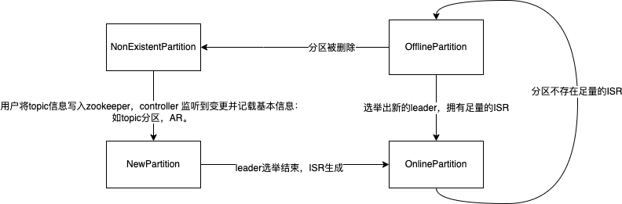
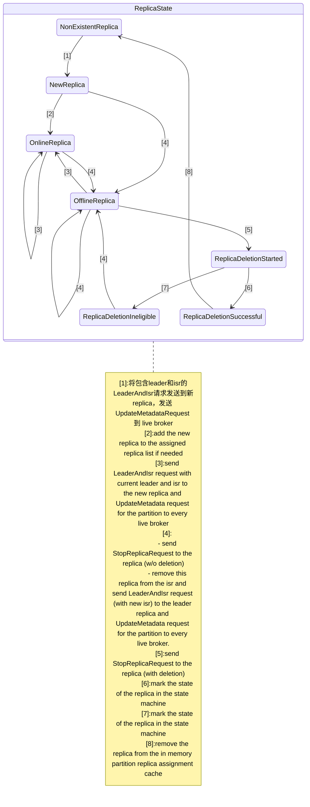

# broker 的控制管理模块

> 本章介绍kafka的controller
>
> 1. controller 选举
> 2. 初始化
> 3. 维护分区状态和副本状态的机制
> 4. 内部的监听器
> 5. 负载均衡机制
> 6. topic 删除机制
> 7. 内部的通信原理

## 5.1 KafkaController选举

> controller 的选举比较简单，每个broker在 startup 中都会启动 `KafkaController`
>
> ```scala
>   def startup() {
>     // ...
>     kafkaController = new KafkaController(config, zkClient, brokerState)
>     // ...
>   }
> ```
>
> 在启动的时候，会到 zookeeper 的 `/controller` 路径尝试注册一个 `ephemeral node`，注册成功的 broker 则成为整个集群的唯一一台 `leader controller`，而其他注册失败的 broker 则开始监听这个 ephemeral node 的状态，当 leader controller 掉线时，重新发起上述流程选举出新的 leader controller。
>
> ```bash
> get /controller
> # {"version":1,"brokerid":0,"timestamp":"1652877672721"}
> ```

### LeaderElector

```scala
/**
 * This trait defines a leader elector If the existing leader is dead, this class will handle automatic
 * re-election and if it succeeds, it invokes the leader state change callback
 */
trait LeaderElector extends Logging {
  def startup

  def amILeader : Boolean

  def elect: Boolean

  def close
}
```

### ZookeeperLeaderElector

> ZookeeperLeaderElector 的所有参数：
>
> - controllerContext 为 Controller 上下文，包含了 topic 的元数据以及集群的元数据信息；
> - electionPath 是路径，默认为 `/controller`；
> - onBecomingLeader 是选举成为 leader 时的回调函数；
> - onResigningAsLeader 当 leader controller 变成非 leader 时的回调函数，当成为非 leader 的时候我们需要清理内部的数据结构；
> - brokerId 是当前 brokerId；

```scala
/**
 * This class handles zookeeper based leader election based on an ephemeral path. The election module does not handle
 * session expiration, instead it assumes the caller will handle it by probably try to re-elect again. If the existing
 * leader is dead, this class will handle automatic re-election and if it succeeds, it invokes the leader state change
 * callback
 */
class ZookeeperLeaderElector(controllerContext: ControllerContext,
                             electionPath: String,
                             onBecomingLeader: () => Unit,
                             onResigningAsLeader: () => Unit,
                             brokerId: Int)
  extends LeaderElector with Logging {
  // 初始化 leaderId
  var leaderId: Int = -1
  // create the election path in ZK, if one does not exist
  val index: Int = electionPath.lastIndexOf("/")
  if (index > 0)
    makeSurePersistentPathExists(controllerContext.zkClient, electionPath.substring(0, index))
  // leader 变化时的回调函数，包含了两个回调函数
  // handleDataChange  : 当 electionPath 路径上的节点数据被修改时，修改 leaderId；
  // handleDataDeleted : 当 electionPath 路径上的节点数据被删除（说明leader失效），进入leader选举流程。
  val leaderChangeListener = new LeaderChangeListener

  /**
   * startup 在 KafkaController#startup 中调用：
   * 1. 首先在 electionPath 上注册回调函数；
   * 2. 随后进入选举流程。
   */
  def startup: Unit = {
    inLock(controllerContext.controllerLock) {
      controllerContext.zkClient.subscribeDataChanges(electionPath, leaderChangeListener)
      elect
    }
  }

  /**
   * 从electionPath读取leader相关信息，如果已经有broker注册为leader返回leaderId，否则返回 -1
   * @return
   */
  private def getControllerID: Int = {
    readDataMaybeNull(controllerContext.zkClient, electionPath)._1 match {
       case Some(controller) => KafkaController.parseControllerId(controller)
       case None => -1
    }
  }

  /**
   * controller 选举流程
   * @return 成为leader返回true，否则返回false
   */
  def elect: Boolean = {
    val timestamp = SystemTime.milliseconds.toString
    val electString = Json.encode(Map("version" -> 1, "brokerId" -> brokerId, "timestamp" -> timestamp))
   
   leaderId = getControllerID
    /* 
     * 我们可能在startup或者handleDeleted ZK回调函数中参与选举，由于潜在的竞争条件，当我们到达这里时，controller 选举可能已经结束了。
     * 如果此代理已经是控制器，则此检查将防止以下 createEphemeralPath 方法进入无限循环。
     */
    if(leaderId != -1) {
       debug("Broker %d has been elected as leader, so stopping the election process.".format(leaderId))
       return amILeader
    }

    // 尝试将自身信息注册到 electionPath 节点，如果成功则当选leader，失败则进入leader竞选失败流程，作为follower初始化leader相关信息。
    try {
      // 在 electionPath 上尝试选举leader（创建 ephemeral node 并且写入数据 electString）
      // 如果当前 electionPath 对应的值为 brokerId 的话会重试
      createEphemeralPathExpectConflictHandleZKBug(controllerContext.zkClient, electionPath, electString, brokerId,
        (controllerString : String, leaderId : Any) => KafkaController.parseControllerId(controllerString) == leaderId.asInstanceOf[Int],
        controllerContext.zkSessionTimeout)
      info(brokerId + " successfully elected as leader")
      // 修改 leaderId
      leaderId = brokerId
      // 进入回调函数
      onBecomingLeader()
    } catch {
      case e: ZkNodeExistsException =>
        // If someone else has written the path, then
        leaderId = getControllerID 

        if (leaderId != -1)
          debug("Broker %d was elected as leader instead of broker %d".format(leaderId, brokerId))
        else
          warn("A leader has been elected but just resigned, this will result in another round of election")

      case e2: Throwable =>
        error("Error while electing or becoming leader on broker %d".format(brokerId), e2)
        // 如果在选举中碰到其他异常，需要 resign
        resign()
    }
    amILeader
  }

  def close: Unit = {
    leaderId = -1
  }

  def amILeader : Boolean = leaderId == brokerId

  def resign(): Boolean = {
    leaderId = -1
    deletePath(controllerContext.zkClient, electionPath)
  }

  /**
   * We do not have session expiration listen in the ZkElection, but assuming the caller who uses this module will
   * have its own session expiration listener and handler
   */
  class LeaderChangeListener extends IZkDataListener with Logging {
    /**
     * Called when the leader information stored in zookeeper has changed. Record the new leader in memory
     * @throws Exception On any error.
     */
    @throws(classOf[Exception])
    def handleDataChange(dataPath: String, data: Object): Unit = {
      inLock(controllerContext.controllerLock) {
        leaderId = KafkaController.parseControllerId(data.toString)
        info("New leader is %d".format(leaderId))
      }
    }

    /**
     * Called when the leader information stored in zookeeper has been delete. Try to elect as the leader
     * @throws Exception
     *             On any error.
     */
    @throws(classOf[Exception])
    def handleDataDeleted(dataPath: String): Unit = {
      inLock(controllerContext.controllerLock) {
        debug("%s leader change listener fired for path %s to handle data deleted: trying to elect as a leader"
          .format(brokerId, dataPath))
        if(amILeader)
          onResigningAsLeader()
        elect
      }
    }
  }
}
```

## 5.2 KafkaController的初始化

> controller 的初始化由 `onBecomingLeader` 和 `onResigningAsLeader` 两个回调函数来执行，而他们的实际实现是 `onControllerFailover` 和 `onControllerResignation` 。
>
> ```scala
>   private val controllerElector = new ZookeeperLeaderElector(controllerContext, ZkUtils.ControllerPath, onControllerFailover,
>     onControllerResignation, config.brokerId)
> ```

### Leader状态下的KafkaController初始化

> KafkaController#onControllerFailover 方法是初始化 leader 的实际方法，主要流程包括：
>
> 1. 初始化集群内的系统时钟，也就是 controller epoch；
> 2. 在zookeeper的各个path上注册各种监听函数，响应 topic创建、topic删除等各种事件；
> 3. 初始化controller上下文，即集群内的元数据信息，比如 liveBrokers 等；
> 4. 初始化并启动Replica状态机，Partition状态机；
> 5. 切换状态为 `RunningAsController`
> 6. 处理集群初始化之前用户下发的 `PartitionReassignment` 和 `PreferredReplicaElection` 请求；
> 7. 同步元数据给集群的 controller follower；
> 8. 根据配置启动负载均衡线程、topic 删除线程。

```scala
  /**
   * This callback is invoked by the zookeeper leader elector on electing the current broker as the new controller.
   * It does the following things on the become-controller state change -
   * 1. Register controller epoch changed listener
   * 2. Increments the controller epoch
   * 3. Initializes the controller's context object that holds cache objects for current topics, live brokers and
   *    leaders for all existing partitions.
   * 4. Starts the controller's channel manager
   * 5. Starts the replica state machine
   * 6. Starts the partition state machine
   * If it encounters any unexpected exception/error while becoming controller, it resigns as the current controller.
   * This ensures another controller election will be triggered and there will always be an actively serving controller
   */
  def onControllerFailover(): Unit = {
    // 判断controller的状态，当 KafkaServer#shutdown 调用时，会设置 isRunning = false
    if(isRunning) {
      info("Broker %d starting become controller state transition".format(config.brokerId))
      // 从zk中读取epoch和epochZkVersion到ControllerContext
      readControllerEpochFromZookeeper()
      // 更新zk中的epoch
      incrementControllerEpoch(zkClient)
      // 在 /admin/reassign_partitions 注册监听器，监听 partition 重新分配的事件
      registerReassignedPartitionsListener()
      // 在 /admin/preferred_replica_election 注册监听器，监听 replica 选举事件
      registerPreferredReplicaElectionListener()
      // 初始化 partition 状态机并注册监听器
      partitionStateMachine.registerListeners()
      // 初始化 replica 状态机并注册监听器
      replicaStateMachine.registerListeners()
      // 初始化ControllerContext
      initializeControllerContext()
      // 启动 replica 状态机
      replicaStateMachine.startup()
      // 启动 partition 状态机
      partitionStateMachine.startup()
      // register the partition change listeners for all existing topics on failover
      controllerContext.allTopics.foreach(topic => partitionStateMachine.registerPartitionChangeListener(topic))
      info("Broker %d is ready to serve as the new controller with epoch %d".format(config.brokerId, epoch))
      brokerState.newState(RunningAsController)
      // 处理集群初始化之前用户下发的 `PartitionReassignment` 和 `PreferredReplicaElection` 请求；
      maybeTriggerPartitionReassignment()
      maybeTriggerPreferredReplicaElection()
      /* send partition leadership info to all live brokers */
      sendUpdateMetadataRequest(controllerContext.liveOrShuttingDownBrokerIds.toSeq)
      // 启动kafka负载均衡机制
      if (config.autoLeaderRebalanceEnable) {
        info("starting the partition rebalance scheduler")
        autoRebalanceScheduler.startup()
        autoRebalanceScheduler.schedule("partition-rebalance-thread", checkAndTriggerPartitionRebalance,
          5, config.leaderImbalanceCheckIntervalSeconds, TimeUnit.SECONDS)
      }
      // 启动TopicDeletionManager
      deleteTopicManager.start()
    }
    else
      info("Controller has been shut down, aborting startup/failover")
  }
```

### Standby状态下的KafkaController初始化

> KafkaController#onControllerResignation 方法是初始化follower的实际方法，主要流程包括：
>
> 1. 取消针对目录 `/admin/reassign_partitions` 和 `/admin/preferred_replica_election` 的监听，这个由 controller 负责；
> 2. 关闭topic删除线程和负载均衡线程；
> 3. 取消针对于 `/broker/topics/[topic]/[partition]/state` 的监听；
> 4. 关闭并清除Replica状态机，Partition状态机；
> 5. 关闭和其他 KafkaController 的通信链路，因为只有controller向broker发送请求，broker只能被动等待controller的请求；
> 6. 重置集群内部时钟；
> 7. 切换状态为 RunningAsBroker；

```scala
  /**
   * This callback is invoked by the zookeeper leader elector when the current broker resigns as the controller. This is
   * required to clean up internal controller data structures
   */
  def onControllerResignation(): Unit = {
    // de-register listeners
    deregisterReassignedPartitionsListener()
    deregisterPreferredReplicaElectionListener()

    // shutdown delete topic manager
    if (deleteTopicManager != null)
      deleteTopicManager.shutdown()

    // shutdown leader rebalance scheduler
    if (config.autoLeaderRebalanceEnable)
      autoRebalanceScheduler.shutdown()

    inLock(controllerContext.controllerLock) {
      // de-register partition ISR listener for on-going partition reassignment task
      deregisterReassignedPartitionsIsrChangeListeners()
      // shutdown partition state machine
      partitionStateMachine.shutdown()
      // shutdown replica state machine
      replicaStateMachine.shutdown()
      // shutdown controller channel manager
      if(controllerContext.controllerChannelManager != null) {
        controllerContext.controllerChannelManager.shutdown()
        controllerContext.controllerChannelManager = null
      }
      // reset controller context
      controllerContext.epoch=0
      controllerContext.epochZkVersion=0
      brokerState.newState(RunningAsBroker)
    }
  }
```

## 5.3 Topic 的分区状态转换机制

> topic 的分区状态由 `PartitionStateMachine` 模块负责，通过监听 `/brokers/topics` 和 `admin/delete_topics` 来实现监听topic的创建与删除。

### 5.3.1 分区状态的分类

> This class represents the state machine for partitions. It defines the states that a partition can be in, and transitions to move the partition to another legal state. The different states that a partition can be in are - 
>
> 1. `NonExistentPartition`: This state indicates that the partition was either never created or was created and then deleted. Valid previous state, if one exists, is OfflinePartition 
> 2. `NewPartition` : After creation, the partition is in the NewPartition state. In this state, the partition should have replicas assigned to it, but no leader/isr yet. Valid previous states are NonExistentPartition
> 3. `OnlinePartition` : Once a leader is elected for a partition, it is in the OnlinePartition state. Valid previous states are NewPartition/OfflinePartition
> 4. `OfflinePartition` : If, after successful leader election, the leader for partition dies, then the partition moves to the OfflinePartition state. Valid previous states are NewPartition/OnlinePartition

```scala
class PartitionStateMachine(controller: KafkaController) extends Logging {
    private val partitionState: mutable.Map[TopicAndPartition, PartitionState] = mutable.Map.empty
}
```

### 5.3.2 分区状态的转换

```scala
  /**
   * This API exercises the partition's state machine. It ensures that every state transition happens from a legal
   * previous state to the target state. Valid state transitions are:
   * NonExistentPartition -> NewPartition:
   * --load assigned replicas from ZK to controller cache
   *
   * NewPartition -> OnlinePartition
   * --assign first live replica as the leader and all live replicas as the isr; write leader and isr to ZK for this partition
   * --send LeaderAndIsr request to every live replica and UpdateMetadata request to every live broker
   *
   * OnlinePartition,OfflinePartition -> OnlinePartition
   * --select new leader and isr for this partition and a set of replicas to receive the LeaderAndIsr request, and write leader and isr to ZK
   * --for this partition, send LeaderAndIsr request to every receiving replica and UpdateMetadata request to every live broker
   *
   * NewPartition,OnlinePartition,OfflinePartition -> OfflinePartition
   * --nothing other than marking partition state as Offline
   *
   * OfflinePartition -> NonExistentPartition
   * --nothing other than marking the partition state as NonExistentPartition
   * @param topic       The topic of the partition for which the state transition is invoked
   * @param partition   The partition for which the state transition is invoked
   * @param targetState The end state that the partition should be moved to
   */
  private def handleStateChange(topic: String, partition: Int, targetState: PartitionState,
                                leaderSelector: PartitionLeaderSelector,
                                callbacks: Callbacks): Unit = {

  }
```

> 下面的图简单说明了一些状态转换，但是不包含全部的状态转换。



> publilc 函数，这个方法可以看到在哪些情况下我们会发生partition的状态变换：
>
> - KafkaController#shutdownBroker
> - KafkaController#onBrokerFailure
> - KafkaController#onNewPartitionCreation
> - KafkaController#onPreferredReplicaElection
> - KafkaController#moveReassignedPartitionLeaderIfRequired
> - TopicDeletionManager#completeDeleteTopic

```scala
  /**
   * This API is invoked by the partition change zookeeper listener
   * @param partitions   The list of partitions that need to be transitioned to the target state
   * @param targetState  The state that the partitions should be moved to
   */
  def handleStateChanges(partitions: Set[TopicAndPartition], targetState: PartitionState,
                         leaderSelector: PartitionLeaderSelector = noOpPartitionLeaderSelector,
                         callbacks: Callbacks = (new CallbackBuilder).build): Unit = {
    info("Invoking state change to %s for partitions %s".format(targetState, partitions.mkString(",")))
    try {
      brokerRequestBatch.newBatch()
      partitions.foreach { topicAndPartition =>
        handleStateChange(topicAndPartition.topic, topicAndPartition.partition, targetState, leaderSelector, callbacks)
      }
      brokerRequestBatch.sendRequestsToBrokers(controller.epoch, controllerContext.correlationId.getAndIncrement)
    }catch {
      case e: Throwable => error("Error while moving some partitions to %s state".format(targetState), e)
      // TODO: It is not enough to bail out and log an error, it is important to trigger state changes for those partitions
    }
  }
```

#### 5.3.2.1 NonExistentPartition -> NewPartition

> NonExistenPartition转换到NewPartition比较简单，仅仅是持久化topic在zk目录上的各个分区AR列表到KafkaController内存，然后置分区状态为`NewPartition`。

```scala
      targetState match {
        case NewPartition =>
          // 确认前置状态是否合法
          assertValidPreviousStates(topicAndPartition, List(NonExistentPartition), NewPartition)
          // 读取 zk 中 /brokers/topics/[topic] 目录下持久化的 <TopicAndPartition> -> Replicas 并缓存到 controllerContext.partitionReplicaAssignment
          // 这个是在 topic 创建的时候生成的。
          assignReplicasToPartitions(topic, partition)
          partitionState.put(topicAndPartition, NewPartition)
          val assignedReplicas = controllerContext.partitionReplicaAssignment(topicAndPartition).mkString(",")
          stateChangeLogger.trace("Controller %d epoch %d changed partition %s state from %s to %s with assigned replicas %s"
                                    .format(controllerId, controller.epoch, topicAndPartition, currState, targetState,
                                            assignedReplicas))
          // post: partition has been assigned replicas
      }
```

> 数据需要缓存到 KafkaController 中

```scala
  /**
   * Invoked on the NonExistentPartition->NewPartition state transition to update the controller's cache with the
   * partition's replica assignment.
   * @param topic     The topic of the partition whose replica assignment is to be cached
   * @param partition The partition whose replica assignment is to be cached
   */
  private def assignReplicasToPartitions(topic: String, partition: Int): Unit = {
    val assignedReplicas = ZkUtils.getReplicasForPartition(controllerContext.zkClient, topic, partition)
    controllerContext.partitionReplicaAssignment += TopicAndPartition(topic, partition) -> assignedReplicas
  }
```

#### 5.3.2.2 NewPartition、OnlinePartition、OfflinePartition -> OnlinePartition

> 状态转换：
>
> - **NewPartition -> OnlinePartition**利用分区的AR列表初始化leader和ISR
> - **OnlinePartition -> OnlinePartition** 利用 `PartitionLeaderSelector` 选举leader并初始化ISR
> - **OfflinePartition -> OnlinePartition** 利用 `PartitionLeaderSelector` 选举leader并初始化ISR
>
> **NewPartition -> OnlinePartition** 不需要选举leader，因为此时topic刚创建，所有的replica都是没有数据的，我们只需要取任意一个replica作为leader，此时其他的replica自动成为ISR，便完成了 OnlinePartition 初始化。
>
> **OfflinePartition -> OnlinePartition**主要发生在所有的replica下线然后有部分replica上线时，此时 leader 和 ISR的选择需要考虑初始的ISR、AR以及当前liveBrokers之间的关系：优先选择ISR里的第一个replica，否则选择AR里的第一个liveBroker；
>
> **OnlinePartition -> OnlinePartition**主要发生在当前集群出现leader负载不均衡的情况，可能某一台broker的负载非常高，我们希望先将某一个replica的leader迁移到负载较低的机器；
>
> **由于不同的场景下，**

```scala
        case OnlinePartition =>
          // 不能直接从 NonExistentPartition 转换为 OnlinePartition
          assertValidPreviousStates(topicAndPartition, List(NewPartition, OnlinePartition, OfflinePartition), OnlinePartition)
          partitionState(topicAndPartition) match {
            case NewPartition =>
              // 如果前置状态是 NewPartition，我们无需进行选举
              // 因为此时所有的replica都是ISR，并且可以从ISR中任意的选择一个replica作为leader
              // initialize leader and isr path for new partition
              initializeLeaderAndIsrForPartition(topicAndPartition)
            case OfflinePartition =>
              // 如果前置状态是 OfflinePartition 或者 OnlinePartition 则必须进行选举来得到合适的leader
              electLeaderForPartition(topic, partition, leaderSelector)
            case OnlinePartition => // invoked when the leader needs to be re-elected
              electLeaderForPartition(topic, partition, leaderSelector)
            case _ => // should never come here since illegal previous states are checked above
          }
          // 修改partitionState为 OnlinePartition
          partitionState.put(topicAndPartition, OnlinePartition)
```

##### PartitionStateMachine#initializeLeaderAndIsrForPartition

> `PartitionStateMachine#initializeLeaderAndIsrForPartition` Invoked on the NewPartition->OnlinePartition state change. When a partition is in the New state, it does not have a leader and isr path in zookeeper. Once the partition moves to the OnlinePartition state, it's leader and isr path gets initialized and it never goes back to the NewPartition state. From here, it can only go to the OfflinePartition state.
>
> 这里会给 broker 下发 `LeaderAndIsrRequest` ，broker 接收到请求之后，broker 会进入 `becomeLeader` 或者 `becomeFollower` 的流程。

```scala
  private def initializeLeaderAndIsrForPartition(topicAndPartition: TopicAndPartition): Unit = {
    // 获取<TopicAndPartition> 对应 Seq<Replica>
    val replicaAssignment = controllerContext.partitionReplicaAssignment(topicAndPartition)
    // 获取存活的 AR
    val liveAssignedReplicas = replicaAssignment.filter(r => controllerContext.liveBrokerIds.contains(r))
    liveAssignedReplicas.size match {
      // 0 说明没有存活的AR
      case 0 =>
        val failMsg = ("encountered error during state change of partition %s from New to Online, assigned replicas are [%s], " +
                       "live brokers are [%s]. No assigned replica is alive.")
                         .format(topicAndPartition, replicaAssignment.mkString(","), controllerContext.liveBrokerIds)
        stateChangeLogger.error("Controller %d epoch %d ".format(controllerId, controller.epoch) + failMsg)
        throw new StateChangeFailedException(failMsg)
      case _ =>
        debug("Live assigned replicas for partition %s are: [%s]".format(topicAndPartition, liveAssignedReplicas))
        // 选择第一个AR作为leader
        val leader = liveAssignedReplicas.head
        val leaderIsrAndControllerEpoch = new LeaderIsrAndControllerEpoch(new LeaderAndIsr(leader, liveAssignedReplicas.toList),
          controller.epoch)
        debug("Initializing leader and isr for partition %s to %s".format(topicAndPartition, leaderIsrAndControllerEpoch))
        try {
          // 持久化PartitionState的节点信息，类似于：
          // /brokers/topics/test/partitions/0/state -> {"controller_epoch":1,"leader":0,"version":1,"leader_epoch":0,"isr":[0]}
          ZkUtils.createPersistentPath(controllerContext.zkClient,
            ZkUtils.getTopicPartitionLeaderAndIsrPath(topicAndPartition.topic, topicAndPartition.partition),
            ZkUtils.leaderAndIsrZkData(leaderIsrAndControllerEpoch.leaderAndIsr, controller.epoch))
          // NOTE: the above write can fail only if the current controller lost its zk session and the new controller
          // took over and initialized this partition. This can happen if the current controller went into a long
          // GC pause
          // 更新 KafkaController 内存
          controllerContext.partitionLeadershipInfo.put(topicAndPartition, leaderIsrAndControllerEpoch)
          // 增加 LeaderAndIsrRequest 和 UpdateMetadataRequest 下发到 broker
          brokerRequestBatch.addLeaderAndIsrRequestForBrokers(liveAssignedReplicas, topicAndPartition.topic,
            topicAndPartition.partition, leaderIsrAndControllerEpoch, replicaAssignment)
        } catch {
          case e: ZkNodeExistsException =>
            // read the controller epoch
            val leaderIsrAndEpoch = ReplicationUtils.getLeaderIsrAndEpochForPartition(zkClient, topicAndPartition.topic,
              topicAndPartition.partition).get
            val failMsg = ("encountered error while changing partition %s's state from New to Online since LeaderAndIsr path already " +
                           "exists with value %s and controller epoch %d")
                             .format(topicAndPartition, leaderIsrAndEpoch.leaderAndIsr.toString(), leaderIsrAndEpoch.controllerEpoch)
            stateChangeLogger.error("Controller %d epoch %d ".format(controllerId, controller.epoch) + failMsg)
            throw new StateChangeFailedException(failMsg)
        }
    }
  }
```

##### PartitionStateMachine#electLeaderForPartition

> Invoked on the OfflinePartition,OnlinePartition->OnlinePartition state change. It invokes the leader election API to elect a leader for the input offline partition
>
> 需要注意的是，`initializeLeaderAndIsrForPartition` 和 `electLeaderForPartition` 整体的流程都是一致的：
>
> 1. 选举得出最新的 leader，ISR；
> 2. 下发 LeaderAndIsrRequest 和 UpdateMedataRequest 到下游 broker；

```scala
  def electLeaderForPartition(topic: String, partition: Int, leaderSelector: PartitionLeaderSelector): Unit = {
    val topicAndPartition = TopicAndPartition(topic, partition)
    // handle leader election for the partitions whose leader is no longer alive
    stateChangeLogger.trace("Controller %d epoch %d started leader election for partition %s"
                              .format(controllerId, controller.epoch, topicAndPartition))
    try {
      var zookeeperPathUpdateSucceeded: Boolean = false
      var newLeaderAndIsr: LeaderAndIsr = null
      var replicasForThisPartition: Seq[Int] = Seq.empty[Int]
      while(!zookeeperPathUpdateSucceeded) {
        // 从 /broker/topics/[topic]/partitions/[partition]/state 读取 LeaderIsrAndControllerEpoch
        val currentLeaderIsrAndEpoch = getLeaderIsrAndEpochOrThrowException(topic, partition)
        val currentLeaderAndIsr = currentLeaderIsrAndEpoch.leaderAndIsr
        val controllerEpoch = currentLeaderIsrAndEpoch.controllerEpoch
        // 如果当前zk的epoch大于controller的epoch，说明当前的controller可能已经失效并选举除了新的controller
        // 新的controller已经修改了zk的状态
        if (controllerEpoch > controller.epoch) {
          val failMsg = ("aborted leader election for partition [%s,%d] since the LeaderAndIsr path was " +
                         "already written by another controller. This probably means that the current controller %d went through " +
                         "a soft failure and another controller was elected with epoch %d.")
                           .format(topic, partition, controllerId, controllerEpoch)
          stateChangeLogger.error("Controller %d epoch %d ".format(controllerId, controller.epoch) + failMsg)
          throw new StateChangeFailedException(failMsg)
        }
        // 选举出一个新的leader，这里是一个接口，因为不同的情况有不同的选举策略。
        val (leaderAndIsr, replicas) = leaderSelector.selectLeader(topicAndPartition, currentLeaderAndIsr)
        // 更新 /broker/topics/[topic]/partitions/[partition]/state 中分区状态元数据
        val (updateSucceeded, newVersion) = ReplicationUtils.updateLeaderAndIsr(zkClient, topic, partition,
          leaderAndIsr, controller.epoch, currentLeaderAndIsr.zkVersion)
        newLeaderAndIsr = leaderAndIsr
        newLeaderAndIsr.zkVersion = newVersion
        zookeeperPathUpdateSucceeded = updateSucceeded
        replicasForThisPartition = replicas
      }
      // 选举完之后的流程和 initializeLeaderAndIsrForPartition 是一样的
      // 1. 修改 KafkaController 缓存的 partitionLeadershipInfo
      // 2. 发送 LeaderIsrRequest 和 UpdateMedataRequest 到 broker
      val newLeaderIsrAndControllerEpoch = new LeaderIsrAndControllerEpoch(newLeaderAndIsr, controller.epoch)
      // update the leader cache
      controllerContext.partitionLeadershipInfo.put(TopicAndPartition(topic, partition), newLeaderIsrAndControllerEpoch)
      stateChangeLogger.trace("Controller %d epoch %d elected leader %d for Offline partition %s"
                                .format(controllerId, controller.epoch, newLeaderAndIsr.leader, topicAndPartition))
      val replicas = controllerContext.partitionReplicaAssignment(TopicAndPartition(topic, partition))
      // store new leader and isr info in cache
      brokerRequestBatch.addLeaderAndIsrRequestForBrokers(replicasForThisPartition, topic, partition,
        newLeaderIsrAndControllerEpoch, replicas)
    } catch {
      case lenne: LeaderElectionNotNeededException => // swallow
      case nroe: NoReplicaOnlineException => throw nroe
      case sce: Throwable =>
        val failMsg = "encountered error while electing leader for partition %s due to: %s.".format(topicAndPartition, sce.getMessage)
        stateChangeLogger.error("Controller %d epoch %d ".format(controllerId, controller.epoch) + failMsg)
        throw new StateChangeFailedException(failMsg, sce)
    }
    debug("After leader election, leader cache is updated to %s".format(controllerContext.partitionLeadershipInfo.map(l => (l._1, l._2))))
  }
```

#### 5.3.2.3 NewPartition、OnlinePartition、OfflinePartition -> OfflinePartition

> 仅需要在 KafkaController 中修改partition状态为 OfflinePartition

```scala
        case OfflinePartition =>
          // pre: partition should be in New or Online state
          assertValidPreviousStates(topicAndPartition, List(NewPartition, OnlinePartition, OfflinePartition), OfflinePartition)
          // should be called when the leader for a partition is no longer alive
          stateChangeLogger.trace("Controller %d epoch %d changed partition %s state from %s to %s"
                                    .format(controllerId, controller.epoch, topicAndPartition, currState, targetState))
          partitionState.put(topicAndPartition, OfflinePartition)
```

#### 5.3.2.4 OfflinePartition -> NonExistentPartition

> 仅需要在 KafkaController 中修改partition状态为 NonExistentPartition

```scala
        case NonExistentPartition =>
          // pre: partition should be in Offline state
          assertValidPreviousStates(topicAndPartition, List(OfflinePartition), NonExistentPartition)
          stateChangeLogger.trace("Controller %d epoch %d changed partition %s state from %s to %s"
                                    .format(controllerId, controller.epoch, topicAndPartition, currState, targetState))
          partitionState.put(topicAndPartition, NonExistentPartition)
```

### 5.3.3 ReplicaStateMachine 模块的启动

> 在 `KafkaController#startup` -> `ZookeeperLeaderElector#startup` -> `ZookeeperLeaderElector#elect` -> `onBecomingLeader`中，我们调用了 **成为leader时的回调函数**；
>
> 而 `KafkaController#onControllerFailover` 就是我们传入的回调函数；在这个函数中，我们初始化了 ReplicaStateMachine。
>
> ```scala
>   def onControllerFailover(): Unit = {
>       // 初始化 replica 状态机并注册监听器
>       replicaStateMachine.registerListeners()
>       // 初始化ControllerContext
>       initializeControllerContext()
>       // 启动 replica 状态机
>       replicaStateMachine.startup()
>   }
> ```

#### ReplicaStateMachine#startup

> Invoked on successful controller election. 
>
> First registers a broker change listener since that triggers all state transitions for replicas. Initializes the state of replicas for all partitions by reading from zookeeper. Then triggers the OnlineReplica state change for all replicas.

```scala
  def startup(): Unit = {
    // initialize replica state
    initializeReplicaState()
    // set started flag
    hasStarted.set(true)
    // move all Online replicas to Online
    handleStateChanges(controllerContext.allLiveReplicas(), OnlineReplica)

    info("Started replica state machine with initial state -> " + replicaState.toString())
  }
```

#### ReplicaStateMachine#initializeReplicaState

> Invoked on startup of the replica's state machine to set the initial state for replicas of all existing partitions in `zookeeper`
>
> 这里需要注意的一个问题是，Replica 状态机的 `handleStateChange` 方法中必须满足 `ReplicaDeletionStarted -> ReplicaDeletionIneligible` 这个状态转换过程，而不能从其他的状态转换。
>
> 这是因为，平常的 replica 删除操作应该遵循一下流程：
>
> 1. 修改 replica 状态从 OfflineReplica 到 ReplicaDeletionStarted，同时给 broker 发送 `StopReplicaRequest(deletePartition = true)`；
> 2. 等待broker处理`StopReplicaRequest(deletePartition = true)`请求并删除分区；
> 3. 标记 replica 状态为 ReplicaDeletionSuccessful；
>
> 在这里，由于 **broker 处于失效状态，我们需要判断是重新选择一个follower或者其他的处理方式。**

```scala
  private def initializeReplicaState(): Unit = {
    // <TopicAndPartition> -> Seq[Int]，保存了 <TopicAndPartition> 对应的所有AR
    for((topicPartition, assignedReplicas) <- controllerContext.partitionReplicaAssignment) {
      val topic = topicPartition.topic
      val partition = topicPartition.partition
      // replicaId 是某个 <TopicAndPartition> 的 replica 的 id
      assignedReplicas.foreach { replicaId =>
        val partitionAndReplica = PartitionAndReplica(topic, partition, replicaId)
        // 如果某一个 PartitionAndReplica 所在的 broker 是存活的则初始化为 OnlineReplica，否则初始化为 ReplicaDeletionIneligible
        if (controllerContext.liveBrokerIds.contains(replicaId)) {
          replicaState.put(partitionAndReplica, OnlineReplica)
        } else {
          replicaState.put(partitionAndReplica, ReplicaDeletionIneligible)
        }
      }
    }
  }
```

#### ReplicaStateMachine#handleStateChanges

> This API is invoked by the broker change controller callbacks and the startup API of the state machine

```scala
  /**
   * This API is invoked by the broker change controller callbacks and the startup API of the state machine
   * @param replicas     The list of replicas (brokers) that need to be transitioned to the target state
   * @param targetState  The state that the replicas should be moved to
   * The controller's allLeaders cache should have been updated before this
   */
  def handleStateChanges(replicas: Set[PartitionAndReplica], targetState: ReplicaState,
                         callbacks: Callbacks = (new CallbackBuilder).build): Unit = {
    if(replicas.nonEmpty) {
      info("Invoking state change to %s for replicas %s".format(targetState, replicas.mkString(",")))
      try {
        brokerRequestBatch.newBatch()
        // 将所有的 replica 修改到 targetState
        replicas.foreach(r => handleStateChange(r, targetState, callbacks))
        // 发送 LeaderAndIsrRequest、UpdateMetadataRequest、StopReplicaRequest 到 broker
        brokerRequestBatch.sendRequestsToBrokers(controller.epoch, controllerContext.correlationId.getAndIncrement)
      }catch {
        case e: Throwable => error("Error while moving some replicas to %s state".format(targetState), e)
      }
    }
  }
```

#### ReplicaStateMachine#handleStateChange

> 此方法会确保 replica 从一个合法的状态变换到另外一个状态，我们的 replica 存在的状态包括：
>
> - NonExistentReplica
> - NewReplica
> - OnlineReplica
> - OfflineReplica
> - ReplicaDeletionStarted
> - ReplicaDeletionSuccessful
> - ReplicaDeletionIneligible

>1. 将包含leader和isr的LeaderAndIsr请求发送到新replica，发送 UpdateMetadataRequest 到 live broker
>1. add the new replica to the assigned replica list if needed
>1. send LeaderAndIsr request with current leader and isr to the new replica and UpdateMetadata request for the partition to every live broker
>4. - send StopReplicaRequest to the replica (w/o deletion)
>   - remove this replica from the isr and send LeaderAndIsr request (with new isr) to the leader replica and UpdateMetadata request for the partition to every live broker.
>1. send StopReplicaRequest to the replica (with deletion)
>1. mark the state of the replica in the state machine
>1. mark the state of the replica in the state machine
>1. remove the replica from the in memory partition replica assignment cache


> NonExistentReplica -> NewReplica

```scala
        case NewReplica => {
          assertValidPreviousStates(partitionAndReplica, List(NonExistentReplica), targetState)
          // 启动replica作为它分区的当前leader的follower
          val leaderIsrAndControllerEpochOpt = ReplicationUtils.getLeaderIsrAndEpochForPartition(zkClient, topic, partition)
          leaderIsrAndControllerEpochOpt match {
            // 由于是从 NonExistentReplica 变为 NewReplica，所以此时应该没有 leader
            // 如果当前 replica 是 leader 则直接抛出异常，否则发送 LeaderAndIsrRequest
            case Some(leaderIsrAndControllerEpoch) =>
              if (leaderIsrAndControllerEpoch.leaderAndIsr.leader == replicaId)
                throw new StateChangeFailedException("Replica %d for partition %s cannot be moved to NewReplica"
                  .format(replicaId, topicAndPartition) + "state as it is being requested to become leader")
              brokerRequestBatch.addLeaderAndIsrRequestForBrokers(List(replicaId),
                topic, partition, leaderIsrAndControllerEpoch,
                replicaAssignment)
            case None => // new leader request will be sent to this replica when one gets elected
          }
          replicaState.put(partitionAndReplica, NewReplica)
          stateChangeLogger.trace("Controller %d epoch %d changed state of replica %d for partition %s from %s to %s"
            .format(controllerId, controller.epoch, replicaId, topicAndPartition, currState,
              targetState))
        }
```

> `OfflineReplica` -> ReplicaDeletionStarted

```scala
        case ReplicaDeletionStarted => {
          // 标记 OfflineReplica 为 ReplicaDeletionStarted 并发送 StopReplicaRequest 到 broker
          assertValidPreviousStates(partitionAndReplica, List(OfflineReplica), targetState)
          replicaState.put(partitionAndReplica, ReplicaDeletionStarted)
          brokerRequestBatch.addStopReplicaRequestForBrokers(List(replicaId), topic, partition, deletePartition = true,
            callbacks.stopReplicaResponseCallback)
          stateChangeLogger.trace("Controller %d epoch %d changed state of replica %d for partition %s from %s to %s"
            .format(controllerId, controller.epoch, replicaId, topicAndPartition, currState, targetState))
        }
```

> `ReplicaDeletionStarted` -> `ReplicaDeletionIneligible`

```scala
        case ReplicaDeletionIneligible => {
          // 仅仅标记replica为ReplicaDeletionIneligible
          assertValidPreviousStates(partitionAndReplica, List(ReplicaDeletionStarted), targetState)
          replicaState.put(partitionAndReplica, ReplicaDeletionIneligible)
          stateChangeLogger.trace("Controller %d epoch %d changed state of replica %d for partition %s from %s to %s"
            .format(controllerId, controller.epoch, replicaId, topicAndPartition, currState, targetState))
        }
```

> `ReplicaDeletionStarted` -> `ReplicaDeletionSuccessful`

```scala
        case ReplicaDeletionSuccessful => {
          // 仅仅标记replica为ReplicaDeletionSuccessful
          assertValidPreviousStates(partitionAndReplica, List(ReplicaDeletionStarted), targetState)
          replicaState.put(partitionAndReplica, ReplicaDeletionSuccessful)
          stateChangeLogger.trace("Controller %d epoch %d changed state of replica %d for partition %s from %s to %s"
            .format(controllerId, controller.epoch, replicaId, topicAndPartition, currState, targetState))
        }
```

> ReplicaDeletionSuccessful -> NonExistentReplica

```scala
        case NonExistentReplica => {
          assertValidPreviousStates(partitionAndReplica, List(ReplicaDeletionSuccessful), targetState)
          // 删除 replica 在 AR 的信息
          val currentAssignedReplicas = controllerContext.partitionReplicaAssignment(topicAndPartition)
          controllerContext.partitionReplicaAssignment.put(topicAndPartition, currentAssignedReplicas.filterNot(_ == replicaId))
          // 删除 replica 的 replicaState 信息
          replicaState.remove(partitionAndReplica)
          stateChangeLogger.trace("Controller %d epoch %d changed state of replica %d for partition %s from %s to %s"
            .format(controllerId, controller.epoch, replicaId, topicAndPartition, currState, targetState))
        }
```

> `NewReplica, OnlineReplica, OfflineReplica, ReplicaDeletionIneligible` -> `OnlineReplica`

```scala
        case OnlineReplica => {
          assertValidPreviousStates(partitionAndReplica,
            List(NewReplica, OnlineReplica, OfflineReplica, ReplicaDeletionIneligible), targetState)
          replicaState(partitionAndReplica) match {
            case NewReplica =>
              // add this replica to the assigned replicas list for its partition
              val currentAssignedReplicas = controllerContext.partitionReplicaAssignment(topicAndPartition)
              if (!currentAssignedReplicas.contains(replicaId))
                controllerContext.partitionReplicaAssignment.put(topicAndPartition, currentAssignedReplicas :+ replicaId)
            case _ =>
              // check if the leader for this partition ever existed
              controllerContext.partitionLeadershipInfo.get(topicAndPartition) match {
                case Some(leaderIsrAndControllerEpoch) =>
                  brokerRequestBatch.addLeaderAndIsrRequestForBrokers(List(replicaId), topic, partition, leaderIsrAndControllerEpoch,
                    replicaAssignment)
                  replicaState.put(partitionAndReplica, OnlineReplica)
                case None => // that means the partition was never in OnlinePartition state, this means the broker never
                // started a log for that partition and does not have a high watermark value for this partition
              }
          }
          replicaState.put(partitionAndReplica, OnlineReplica)
        }
```

## 5.4 topic 分区 leader 选举策略

> `PartitionLeaderSelector` 根据 <TopicAndPartition> 和当前 Leader、当前ISR选举出新的 Leader、新的 ISR、新的 AR。
>
> **Replicas to receive LeaderAndIsr request = live assigned replicas**

```scala
trait PartitionLeaderSelector {

  /**
   * @param topicAndPartition          The topic and partition whose leader needs to be elected
   * @param currentLeaderAndIsr        The current leader and isr of input partition read from zookeeper
   * @throws NoReplicaOnlineException If no replica in the assigned replicas list is alive
   * @return The leader and isr request, with the newly selected leader and isr, and the set of replicas to receive
   * the LeaderAndIsrRequest.
   */
  def selectLeader(topicAndPartition: TopicAndPartition, currentLeaderAndIsr: LeaderAndIsr): (LeaderAndIsr, Seq[Int])
}
```

### 5.4.1 NoOpLeaderSelector

> 返回当前的 leader、ISR、AR

```scala
/**
 * Essentially does nothing. Returns the current leader and ISR, and the current
 * set of replicas assigned to a given topic/partition.
 */
class NoOpLeaderSelector(controllerContext: ControllerContext) extends PartitionLeaderSelector with Logging {

  this.logIdent = "[NoOpLeaderSelector]: "

  def selectLeader(topicAndPartition: TopicAndPartition, currentLeaderAndIsr: LeaderAndIsr): (LeaderAndIsr, Seq[Int]) = {
    warn("I should never have been asked to perform leader election, returning the current LeaderAndIsr and replica assignment.")
    (currentLeaderAndIsr, controllerContext.partitionReplicaAssignment(topicAndPartition))
  }
}
```

### 5.4.2 OfflinePartitionLeaderSelector

> KafkaController 尝试将 PartitionState 从 `OfflinePartition` 或者 `NewPartition` 切换到 `OnlinePartition` 时会使用此策略。
>
> 1. 筛选出 ISR 和 AR；
> 2. 如果有 ISR，在ISR中选择第一个，选举结束；
> 3. 如果没有ISR，根据 `unclean.leader.election.enable` 配置决定是否允许在AR中进行选举：
>    1. true 则选择AR中的第一个；
>    2. false 则选举失败；
> 4. 如果既没有ISR也没有AR，选举失败；

```scala
class OfflinePartitionLeaderSelector(controllerContext: ControllerContext, config: KafkaConfig)
  extends PartitionLeaderSelector with Logging {
  this.logIdent = "[OfflinePartitionLeaderSelector]: "

  def selectLeader(topicAndPartition: TopicAndPartition, currentLeaderAndIsr: LeaderAndIsr): (LeaderAndIsr, Seq[Int]) = {
    controllerContext.partitionReplicaAssignment.get(topicAndPartition) match {
      case Some(assignedReplicas) =>
        // live AR
        val liveAssignedReplicas = assignedReplicas.filter(r => controllerContext.liveBrokerIds.contains(r))
        // live ISR
        val liveBrokersInIsr = currentLeaderAndIsr.isr.filter(r => controllerContext.liveBrokerIds.contains(r))
        val currentLeaderEpoch = currentLeaderAndIsr.leaderEpoch
        val currentLeaderIsrZkPathVersion = currentLeaderAndIsr.zkVersion
        val newLeaderAndIsr = liveBrokersInIsr.isEmpty match {
          // live ISR 为空
          case true =>
            // 如果不允许从 AR 中选举那么直接抛出异常
            if (!LogConfig.fromProps(config.props.props, AdminUtils.fetchTopicConfig(controllerContext.zkClient,
              topicAndPartition.topic)).uncleanLeaderElectionEnable) {
              throw new NoReplicaOnlineException(("No broker in ISR for partition " +
                "%s is alive. Live brokers are: [%s],".format(topicAndPartition, controllerContext.liveBrokerIds)) +
                " ISR brokers are: [%s]".format(currentLeaderAndIsr.isr.mkString(",")))
            }

            debug("No broker in ISR is alive for %s. Pick the leader from the alive assigned replicas: %s"
              .format(topicAndPartition, liveAssignedReplicas.mkString(",")))

            liveAssignedReplicas.isEmpty match {
              case true =>
                // AR 也为空则抛出异常
                throw new NoReplicaOnlineException(("No replica for partition " +
                  "%s is alive. Live brokers are: [%s],".format(topicAndPartition, controllerContext.liveBrokerIds)) +
                  " Assigned replicas are: [%s]".format(assignedReplicas))
              case false =>
                // 从 AR 中选择第一个作为新的 leader、ISR
                // 注意，我们这里返回的 ISR 里面只有 AR 的第一个
                ControllerStats.uncleanLeaderElectionRate.mark()
                val newLeader = liveAssignedReplicas.head
                warn("No broker in ISR is alive for %s. Elect leader %d from live brokers %s. There's potential data loss."
                  .format(topicAndPartition, newLeader, liveAssignedReplicas.mkString(",")))
                new LeaderAndIsr(newLeader, currentLeaderEpoch + 1, List(newLeader), currentLeaderIsrZkPathVersion + 1)
            }

          // live ISR 不为空，
          case false =>
            val liveReplicasInIsr = liveAssignedReplicas.filter(r => liveBrokersInIsr.contains(r))
            val newLeader = liveReplicasInIsr.head
            debug("Some broker in ISR is alive for %s. Select %d from ISR %s to be the leader."
              .format(topicAndPartition, newLeader, liveBrokersInIsr.mkString(",")))
            // 得到选举结果
            new LeaderAndIsr(newLeader, currentLeaderEpoch + 1, liveBrokersInIsr.toList, currentLeaderIsrZkPathVersion + 1)
        }
        info("Selected new leader and ISR %s for offline partition %s".format(newLeaderAndIsr.toString(), topicAndPartition))
        (newLeaderAndIsr, liveAssignedReplicas)
      case None =>
        throw new NoReplicaOnlineException("Partition %s doesn't have replicas assigned to it".format(topicAndPartition))
    }
  }
}
```

### 5.4.3 ReassignedPartitionLeaderSelector

> 如果topic partition和AR不够均匀，修改 `/admin/reassign_partitions` 可以发起重新分配分区请求，进而回调该方法进行新的 leader 选举，选举的方式是：
>
> 1. 获取指定的AR；
> 2. 针对指定的AR，在线的broker和当前的ISR求交集；
> 3. 如果交集不为空，则第一个 replica 为新的leader，否则选举失败；
>
> 注意，在这里我们获取的指定AR，也就是 `ControllerContext#partitionsBeingReassigned`，可能是通过以下几个链路修改的：
>
> 1. 初始化
>    - `KafkaController#onControllerFailover` -> `KafkaController#initializeControllerContext` -> `KafkaController#initializePartitionReassignment`
> 2. 变更
>    - ``KafkaController#onControllerFailover` -> `KafkaController#maybeTriggerPartitionReassignment` -> `KafkaController#initiateReassignReplicasForTopicPartition`
>    - `PartitionsReassignedListener#handleDataChange` -> `KafkaController#initiateReassignReplicasForTopicPartition`
>
> 

> - New leader = a live in-sync reassigned replica
>
> - New isr = current isr
> - Replicas to receive LeaderAndIsr request = reassigned replicas

```scala
/**
 * New leader = a live in-sync reassigned replica
 * New isr = current isr
 * Replicas to receive LeaderAndIsr request = reassigned replicas
 */
class ReassignedPartitionLeaderSelector(controllerContext: ControllerContext) extends PartitionLeaderSelector with Logging {
  this.logIdent = "[ReassignedPartitionLeaderSelector]: "

  /**
   * The reassigned replicas are already in the ISR when selectLeader is called.
   */
  def selectLeader(topicAndPartition: TopicAndPartition, currentLeaderAndIsr: LeaderAndIsr): (LeaderAndIsr, Seq[Int]) = {
    // 获取指定AR列表
    val reassignedInSyncReplicas = controllerContext.partitionsBeingReassigned(topicAndPartition).newReplicas
    val currentLeaderEpoch = currentLeaderAndIsr.leaderEpoch
    val currentLeaderIsrZkPathVersion = currentLeaderAndIsr.zkVersion
    // 在指定AR列表中获取满足 live 和 ISR 的列表
    val aliveReassignedInSyncReplicas = reassignedInSyncReplicas.filter(r => controllerContext.liveBrokerIds.contains(r) &&
                                                                             currentLeaderAndIsr.isr.contains(r))
    val newLeaderOpt = aliveReassignedInSyncReplicas.headOption
    newLeaderOpt match {
      // 如果列表不为空使用第一个作为新的leader
      case Some(newLeader) => (new LeaderAndIsr(newLeader, currentLeaderEpoch + 1, currentLeaderAndIsr.isr,
        currentLeaderIsrZkPathVersion + 1), reassignedInSyncReplicas)
      case None =>
        reassignedInSyncReplicas.size match {
          case 0 =>
            throw new NoReplicaOnlineException("List of reassigned replicas for partition " +
              " %s is empty. Current leader and ISR: [%s]".format(topicAndPartition, currentLeaderAndIsr))
          case _ =>
            throw new NoReplicaOnlineException("None of the reassigned replicas for partition " +
              "%s are in-sync with the leader. Current leader and ISR: [%s]".format(topicAndPartition, currentLeaderAndIsr))
        }
    }
  }
}
```

### 5.4.4 PreferredReplicaPartitionLeaderSelector

> 如果leader replica不均匀，可以自动或者手动的来进行partition的leader选举，此时会使用该策略；在 `/admin/preferred_replica_election` 目录下，选举的大概流程为：
>
> 1. 选择当前的AR；
> 2. 选择同时满足：alive、In-Sync、不是当前 leader 则被选举为新的 leader；
> 3. 其他情况抛出异常。

> - New leader = preferred (first assigned) replica (if in isr and alive);
> - New isr = current isr;
> - Replicas to receive LeaderAndIsr request = assigned replicas

```scala
class PreferredReplicaPartitionLeaderSelector(controllerContext: ControllerContext) extends PartitionLeaderSelector
with Logging {
  this.logIdent = "[PreferredReplicaPartitionLeaderSelector]: "

  def selectLeader(topicAndPartition: TopicAndPartition, currentLeaderAndIsr: LeaderAndIsr): (LeaderAndIsr, Seq[Int]) = {
    // 获取AR
    val assignedReplicas = controllerContext.partitionReplicaAssignment(topicAndPartition)
    // 从AR中选择第一个
    val preferredReplica = assignedReplicas.head
    // 检查 preferred replica 是否是当前的 leader
    val currentLeader = controllerContext.partitionLeadershipInfo(topicAndPartition).leaderAndIsr.leader
    // 如果 preferred replica 是当前 leader 则抛出异常。
    if (currentLeader == preferredReplica) {
      throw new LeaderElectionNotNeededException("Preferred replica %d is already the current leader for partition %s"
                                                   .format(preferredReplica, topicAndPartition))
    } else {
      info("Current leader %d for partition %s is not the preferred replica.".format(currentLeader, topicAndPartition) +
        " Triggering preferred replica leader election")
      // 如果 preferred replica 满足 alive 以及是一个 ISR，则被选举为新的leader
      if (controllerContext.liveBrokerIds.contains(preferredReplica) && currentLeaderAndIsr.isr.contains(preferredReplica)) {
        (new LeaderAndIsr(preferredReplica, currentLeaderAndIsr.leaderEpoch + 1, currentLeaderAndIsr.isr,
          currentLeaderAndIsr.zkVersion + 1), assignedReplicas)
      } else {
        throw new StateChangeFailedException("Preferred replica %d for partition ".format(preferredReplica) +
          "%s is either not alive or not in the isr. Current leader and ISR: [%s]".format(topicAndPartition, currentLeaderAndIsr))
      }
    }
  }
}
```

### 5.4.5 ControlledShutdownLeaderSelector

> broker 下线时，会使用该策略来选举新的 leader：
>
> 1. 获取分区ISR；
> 2. 提出ISR中离线的replica；
> 3. 如果新的ISR列表不为空，则选择第一个replica作为leader；

```scala
/**
 * New leader = replica in isr that's not being shutdown;
 * New isr = current isr - shutdown replica;
 * Replicas to receive LeaderAndIsr request = live assigned replicas
 */
class ControlledShutdownLeaderSelector(controllerContext: ControllerContext)
        extends PartitionLeaderSelector
        with Logging {

  this.logIdent = "[ControlledShutdownLeaderSelector]: "

  def selectLeader(topicAndPartition: TopicAndPartition, currentLeaderAndIsr: LeaderAndIsr): (LeaderAndIsr, Seq[Int]) = {
    val currentLeaderEpoch = currentLeaderAndIsr.leaderEpoch
    val currentLeaderIsrZkPathVersion = currentLeaderAndIsr.zkVersion

    val currentLeader = currentLeaderAndIsr.leader

    // 获取AR
    val assignedReplicas = controllerContext.partitionReplicaAssignment(topicAndPartition)
    // 获取存活的 brokerIds
    val liveOrShuttingDownBrokerIds = controllerContext.liveOrShuttingDownBrokerIds
    // 获取 live AR
    val liveAssignedReplicas = assignedReplicas.filter(r => liveOrShuttingDownBrokerIds.contains(r))

    // 只保留在live broker上的isr
    val newIsr = currentLeaderAndIsr.isr.filter(brokerId => !controllerContext.shuttingDownBrokerIds.contains(brokerId))
    // 选择live isr的第一条
    val newLeaderOpt = newIsr.headOption
    newLeaderOpt match {
      case Some(newLeader) =>
        debug("Partition %s : current leader = %d, new leader = %d"
              .format(topicAndPartition, currentLeader, newLeader))
        (LeaderAndIsr(newLeader, currentLeaderEpoch + 1, newIsr, currentLeaderIsrZkPathVersion + 1),
         liveAssignedReplicas)
      case None =>
        throw new StateChangeFailedException(("No other replicas in ISR %s for %s besides" +
          " shutting down brokers %s").format(currentLeaderAndIsr.isr.mkString(","), topicAndPartition, controllerContext.shuttingDownBrokerIds.mkString(",")))
    }
  }
}
```


