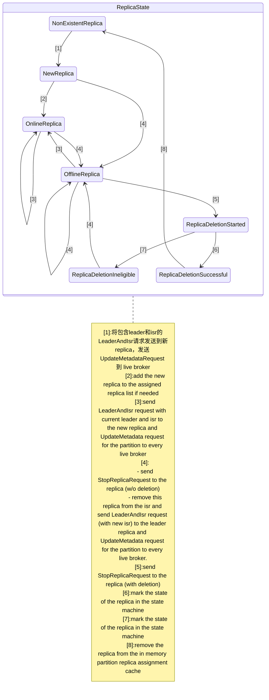
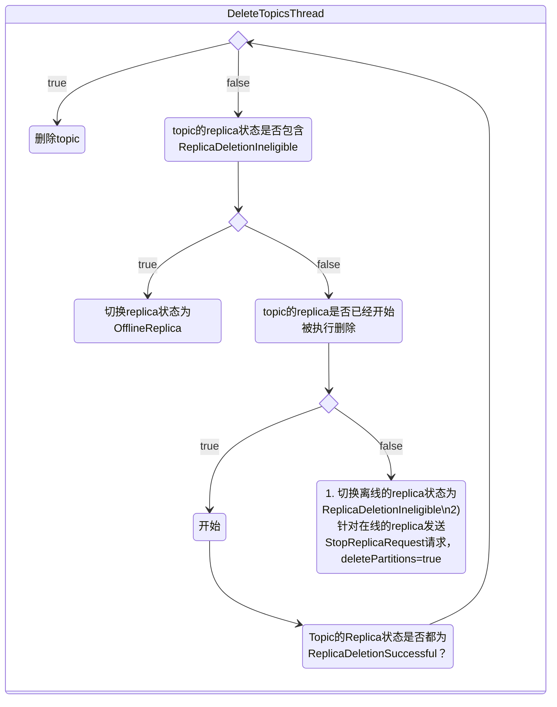
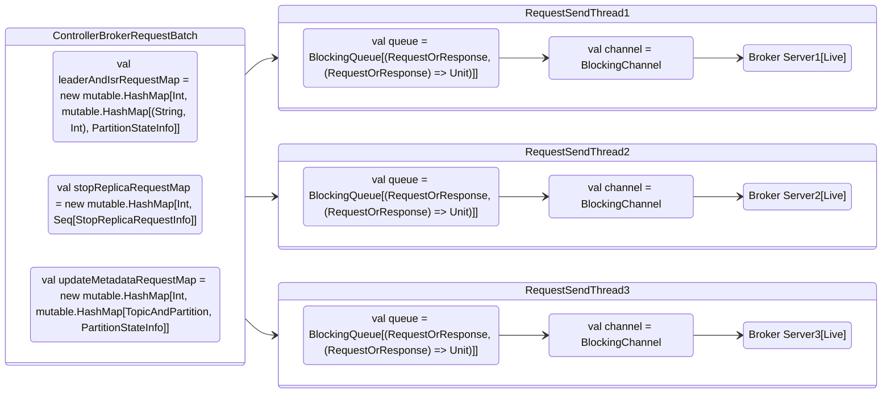

# broker 的控制管理模块

> 本章介绍kafka的controller
>
> 1. controller 选举
> 2. 初始化
> 3. 维护分区状态和副本状态的机制
> 4. 内部的监听器
> 5. 负载均衡机制
> 6. topic 删除机制
> 7. 内部的通信原理

## 5.1 KafkaController选举

> controller 的选举比较简单，每个broker在 startup 中都会启动 `KafkaController`
>
> ```scala
>   def startup() {
>     // ...
>     kafkaController = new KafkaController(config, zkClient, brokerState)
>     // ...
>   }
> ```
>
> 在启动的时候，会到 zookeeper 的 `/controller` 路径尝试注册一个 `ephemeral node`，注册成功的 broker 则成为整个集群的唯一一台 `leader controller`，而其他注册失败的 broker 则开始监听这个 ephemeral node 的状态，当 leader controller 掉线时，重新发起上述流程选举出新的 leader controller。
>
> ```bash
> get /controller
> # {"version":1,"brokerid":0,"timestamp":"1652877672721"}
> ```

### LeaderElector

```scala
/**
 * This trait defines a leader elector If the existing leader is dead, this class will handle automatic
 * re-election and if it succeeds, it invokes the leader state change callback
 */
trait LeaderElector extends Logging {
  def startup

  def amILeader : Boolean

  def elect: Boolean

  def close
}
```

### ZookeeperLeaderElector

> ZookeeperLeaderElector 的所有参数：
>
> - controllerContext 为 Controller 上下文，包含了 topic 的元数据以及集群的元数据信息；
> - electionPath 是路径，默认为 `/controller`；
> - onBecomingLeader 是选举成为 leader 时的回调函数；
> - onResigningAsLeader 当 leader controller 变成非 leader 时的回调函数，当成为非 leader 的时候我们需要清理内部的数据结构；
> - brokerId 是当前 brokerId；

```scala
/**
 * This class handles zookeeper based leader election based on an ephemeral path. The election module does not handle
 * session expiration, instead it assumes the caller will handle it by probably try to re-elect again. If the existing
 * leader is dead, this class will handle automatic re-election and if it succeeds, it invokes the leader state change
 * callback
 */
class ZookeeperLeaderElector(controllerContext: ControllerContext,
                             electionPath: String,
                             onBecomingLeader: () => Unit,
                             onResigningAsLeader: () => Unit,
                             brokerId: Int)
  extends LeaderElector with Logging {
  // 初始化 leaderId
  var leaderId: Int = -1
  // create the election path in ZK, if one does not exist
  val index: Int = electionPath.lastIndexOf("/")
  if (index > 0)
    makeSurePersistentPathExists(controllerContext.zkClient, electionPath.substring(0, index))
  // leader 变化时的回调函数，包含了两个回调函数
  // handleDataChange  : 当 electionPath 路径上的节点数据被修改时，修改 leaderId；
  // handleDataDeleted : 当 electionPath 路径上的节点数据被删除（说明leader失效），进入leader选举流程。
  val leaderChangeListener = new LeaderChangeListener

  /**
   * startup 在 KafkaController#startup 中调用：
   * 1. 首先在 electionPath 上注册回调函数；
   * 2. 随后进入选举流程。
   */
  def startup: Unit = {
    inLock(controllerContext.controllerLock) {
      controllerContext.zkClient.subscribeDataChanges(electionPath, leaderChangeListener)
      elect
    }
  }

  /**
   * 从electionPath读取leader相关信息，如果已经有broker注册为leader返回leaderId，否则返回 -1
   * @return
   */
  private def getControllerID: Int = {
    readDataMaybeNull(controllerContext.zkClient, electionPath)._1 match {
       case Some(controller) => KafkaController.parseControllerId(controller)
       case None => -1
    }
  }

  /**
   * controller 选举流程
   * @return 成为leader返回true，否则返回false
   */
  def elect: Boolean = {
    val timestamp = SystemTime.milliseconds.toString
    val electString = Json.encode(Map("version" -> 1, "brokerId" -> brokerId, "timestamp" -> timestamp))
   
   leaderId = getControllerID
    /* 
     * 我们可能在startup或者handleDeleted ZK回调函数中参与选举，由于潜在的竞争条件，当我们到达这里时，controller 选举可能已经结束了。
     * 如果此代理已经是控制器，则此检查将防止以下 createEphemeralPath 方法进入无限循环。
     */
    if(leaderId != -1) {
       debug("Broker %d has been elected as leader, so stopping the election process.".format(leaderId))
       return amILeader
    }

    // 尝试将自身信息注册到 electionPath 节点，如果成功则当选leader，失败则进入leader竞选失败流程，作为follower初始化leader相关信息。
    try {
      // 在 electionPath 上尝试选举leader（创建 ephemeral node 并且写入数据 electString）
      // 如果当前 electionPath 对应的值为 brokerId 的话会重试
      createEphemeralPathExpectConflictHandleZKBug(controllerContext.zkClient, electionPath, electString, brokerId,
        (controllerString : String, leaderId : Any) => KafkaController.parseControllerId(controllerString) == leaderId.asInstanceOf[Int],
        controllerContext.zkSessionTimeout)
      info(brokerId + " successfully elected as leader")
      // 修改 leaderId
      leaderId = brokerId
      // 进入回调函数
      onBecomingLeader()
    } catch {
      case e: ZkNodeExistsException =>
        // If someone else has written the path, then
        leaderId = getControllerID 

        if (leaderId != -1)
          debug("Broker %d was elected as leader instead of broker %d".format(leaderId, brokerId))
        else
          warn("A leader has been elected but just resigned, this will result in another round of election")

      case e2: Throwable =>
        error("Error while electing or becoming leader on broker %d".format(brokerId), e2)
        // 如果在选举中碰到其他异常，需要 resign
        resign()
    }
    amILeader
  }

  def close: Unit = {
    leaderId = -1
  }

  def amILeader : Boolean = leaderId == brokerId

  def resign(): Boolean = {
    leaderId = -1
    deletePath(controllerContext.zkClient, electionPath)
  }

  /**
   * We do not have session expiration listen in the ZkElection, but assuming the caller who uses this module will
   * have its own session expiration listener and handler
   */
  class LeaderChangeListener extends IZkDataListener with Logging {
    /**
     * Called when the leader information stored in zookeeper has changed. Record the new leader in memory
     * @throws Exception On any error.
     */
    @throws(classOf[Exception])
    def handleDataChange(dataPath: String, data: Object): Unit = {
      inLock(controllerContext.controllerLock) {
        leaderId = KafkaController.parseControllerId(data.toString)
        info("New leader is %d".format(leaderId))
      }
    }

    /**
     * Called when the leader information stored in zookeeper has been delete. Try to elect as the leader
     * @throws Exception
     *             On any error.
     */
    @throws(classOf[Exception])
    def handleDataDeleted(dataPath: String): Unit = {
      inLock(controllerContext.controllerLock) {
        debug("%s leader change listener fired for path %s to handle data deleted: trying to elect as a leader"
          .format(brokerId, dataPath))
        if(amILeader)
          onResigningAsLeader()
        elect
      }
    }
  }
}
```

## 5.2 KafkaController的初始化

> controller 的初始化由 `onBecomingLeader` 和 `onResigningAsLeader` 两个回调函数来执行，而他们的实际实现是 `onControllerFailover` 和 `onControllerResignation` 。
>
> ```scala
>   private val controllerElector = new ZookeeperLeaderElector(controllerContext, ZkUtils.ControllerPath, onControllerFailover,
>     onControllerResignation, config.brokerId)
> ```

### Leader状态下的KafkaController初始化

> KafkaController#onControllerFailover 方法是初始化 leader 的实际方法，主要流程包括：
>
> 1. 初始化集群内的系统时钟，也就是 controller epoch；
> 2. 在zookeeper的各个path上注册各种监听函数，响应 topic创建、topic删除等各种事件；
> 3. 初始化controller上下文，即集群内的元数据信息，比如 liveBrokers 等；
> 4. 初始化并启动Replica状态机，Partition状态机；
> 5. 切换状态为 `RunningAsController`
> 6. 处理集群初始化之前用户下发的 `PartitionReassignment` 和 `PreferredReplicaElection` 请求；
> 7. 同步元数据给集群的 controller follower；
> 8. 根据配置启动负载均衡线程、topic 删除线程。

```scala
  /**
   * This callback is invoked by the zookeeper leader elector on electing the current broker as the new controller.
   * It does the following things on the become-controller state change -
   * 1. Register controller epoch changed listener
   * 2. Increments the controller epoch
   * 3. Initializes the controller's context object that holds cache objects for current topics, live brokers and
   *    leaders for all existing partitions.
   * 4. Starts the controller's channel manager
   * 5. Starts the replica state machine
   * 6. Starts the partition state machine
   * If it encounters any unexpected exception/error while becoming controller, it resigns as the current controller.
   * This ensures another controller election will be triggered and there will always be an actively serving controller
   */
  def onControllerFailover(): Unit = {
    // 判断controller的状态，当 KafkaServer#shutdown 调用时，会设置 isRunning = false
    if(isRunning) {
      info("Broker %d starting become controller state transition".format(config.brokerId))
      // 从zk中读取epoch和epochZkVersion到ControllerContext
      readControllerEpochFromZookeeper()
      // 更新zk中的epoch
      incrementControllerEpoch(zkClient)
      // 在 /admin/reassign_partitions 注册监听器，监听 partition 重新分配的事件
      registerReassignedPartitionsListener()
      // 在 /admin/preferred_replica_election 注册监听器，监听 replica 选举事件
      registerPreferredReplicaElectionListener()
      // 初始化 partition 状态机并注册监听器
      partitionStateMachine.registerListeners()
      // 初始化 replica 状态机并注册监听器
      replicaStateMachine.registerListeners()
      // 初始化ControllerContext
      initializeControllerContext()
      // 启动 replica 状态机
      replicaStateMachine.startup()
      // 启动 partition 状态机
      partitionStateMachine.startup()
      // register the partition change listeners for all existing topics on failover
      controllerContext.allTopics.foreach(topic => partitionStateMachine.registerPartitionChangeListener(topic))
      info("Broker %d is ready to serve as the new controller with epoch %d".format(config.brokerId, epoch))
      brokerState.newState(RunningAsController)
      // 处理集群初始化之前用户下发的 `PartitionReassignment` 和 `PreferredReplicaElection` 请求；
      maybeTriggerPartitionReassignment()
      maybeTriggerPreferredReplicaElection()
      /* send partition leadership info to all live brokers */
      sendUpdateMetadataRequest(controllerContext.liveOrShuttingDownBrokerIds.toSeq)
      // 启动kafka负载均衡机制
      if (config.autoLeaderRebalanceEnable) {
        info("starting the partition rebalance scheduler")
        autoRebalanceScheduler.startup()
        autoRebalanceScheduler.schedule("partition-rebalance-thread", checkAndTriggerPartitionRebalance,
          5, config.leaderImbalanceCheckIntervalSeconds, TimeUnit.SECONDS)
      }
      // 启动TopicDeletionManager
      deleteTopicManager.start()
    }
    else
      info("Controller has been shut down, aborting startup/failover")
  }
```

### Standby状态下的KafkaController初始化

> KafkaController#onControllerResignation 方法是初始化follower的实际方法，主要流程包括：
>
> 1. 取消针对目录 `/admin/reassign_partitions` 和 `/admin/preferred_replica_election` 的监听，这个由 controller 负责；
> 2. 关闭topic删除线程和负载均衡线程；
> 3. 取消针对于 `/broker/topics/[topic]/[partition]/state` 的监听；
> 4. 关闭并清除Replica状态机，Partition状态机；
> 5. 关闭和其他 KafkaController 的通信链路，因为只有controller向broker发送请求，broker只能被动等待controller的请求；
> 6. 重置集群内部时钟；
> 7. 切换状态为 RunningAsBroker；

```scala
  /**
   * This callback is invoked by the zookeeper leader elector when the current broker resigns as the controller. This is
   * required to clean up internal controller data structures
   */
  def onControllerResignation(): Unit = {
    // de-register listeners
    deregisterReassignedPartitionsListener()
    deregisterPreferredReplicaElectionListener()

    // shutdown delete topic manager
    if (deleteTopicManager != null)
      deleteTopicManager.shutdown()

    // shutdown leader rebalance scheduler
    if (config.autoLeaderRebalanceEnable)
      autoRebalanceScheduler.shutdown()

    inLock(controllerContext.controllerLock) {
      // de-register partition ISR listener for on-going partition reassignment task
      deregisterReassignedPartitionsIsrChangeListeners()
      // shutdown partition state machine
      partitionStateMachine.shutdown()
      // shutdown replica state machine
      replicaStateMachine.shutdown()
      // shutdown controller channel manager
      if(controllerContext.controllerChannelManager != null) {
        controllerContext.controllerChannelManager.shutdown()
        controllerContext.controllerChannelManager = null
      }
      // reset controller context
      controllerContext.epoch=0
      controllerContext.epochZkVersion=0
      brokerState.newState(RunningAsBroker)
    }
  }
```

## 5.3 Topic 的分区状态转换机制

> topic 的分区状态由 `PartitionStateMachine` 模块负责，通过监听 `/brokers/topics` 和 `admin/delete_topics` 来实现监听topic的创建与删除。

### 5.3.1 分区状态的分类

> This class represents the state machine for partitions. It defines the states that a partition can be in, and transitions to move the partition to another legal state. The different states that a partition can be in are - 
>
> 1. `NonExistentPartition`: This state indicates that the partition was either never created or was created and then deleted. Valid previous state, if one exists, is OfflinePartition 
> 2. `NewPartition` : After creation, the partition is in the NewPartition state. In this state, the partition should have replicas assigned to it, but no leader/isr yet. Valid previous states are NonExistentPartition
> 3. `OnlinePartition` : Once a leader is elected for a partition, it is in the OnlinePartition state. Valid previous states are NewPartition/OfflinePartition
> 4. `OfflinePartition` : If, after successful leader election, the leader for partition dies, then the partition moves to the OfflinePartition state. Valid previous states are NewPartition/OnlinePartition

```scala
class PartitionStateMachine(controller: KafkaController) extends Logging {
    private val partitionState: mutable.Map[TopicAndPartition, PartitionState] = mutable.Map.empty
}
```

### 5.3.2 分区状态的转换

```scala
  /**
   * This API exercises the partition's state machine. It ensures that every state transition happens from a legal
   * previous state to the target state. Valid state transitions are:
   * NonExistentPartition -> NewPartition:
   * --load assigned replicas from ZK to controller cache
   *
   * NewPartition -> OnlinePartition
   * --assign first live replica as the leader and all live replicas as the isr; write leader and isr to ZK for this partition
   * --send LeaderAndIsr request to every live replica and UpdateMetadata request to every live broker
   *
   * OnlinePartition,OfflinePartition -> OnlinePartition
   * --select new leader and isr for this partition and a set of replicas to receive the LeaderAndIsr request, and write leader and isr to ZK
   * --for this partition, send LeaderAndIsr request to every receiving replica and UpdateMetadata request to every live broker
   *
   * NewPartition,OnlinePartition,OfflinePartition -> OfflinePartition
   * --nothing other than marking partition state as Offline
   *
   * OfflinePartition -> NonExistentPartition
   * --nothing other than marking the partition state as NonExistentPartition
   * @param topic       The topic of the partition for which the state transition is invoked
   * @param partition   The partition for which the state transition is invoked
   * @param targetState The end state that the partition should be moved to
   */
  private def handleStateChange(topic: String, partition: Int, targetState: PartitionState,
                                leaderSelector: PartitionLeaderSelector,
                                callbacks: Callbacks): Unit = {

  }
```

> 下面的图简单说明了一些状态转换，但是不包含全部的状态转换。


> publilc 函数，这个方法可以看到在哪些情况下我们会发生partition的状态变换：
>
> - KafkaController#shutdownBroker
> - KafkaController#onBrokerFailure
> - KafkaController#onNewPartitionCreation
> - KafkaController#onPreferredReplicaElection
> - KafkaController#moveReassignedPartitionLeaderIfRequired
> - TopicDeletionManager#completeDeleteTopic

```scala
  /**
   * This API is invoked by the partition change zookeeper listener
   * @param partitions   The list of partitions that need to be transitioned to the target state
   * @param targetState  The state that the partitions should be moved to
   */
  def handleStateChanges(partitions: Set[TopicAndPartition], targetState: PartitionState,
                         leaderSelector: PartitionLeaderSelector = noOpPartitionLeaderSelector,
                         callbacks: Callbacks = (new CallbackBuilder).build): Unit = {
    info("Invoking state change to %s for partitions %s".format(targetState, partitions.mkString(",")))
    try {
      brokerRequestBatch.newBatch()
      partitions.foreach { topicAndPartition =>
        handleStateChange(topicAndPartition.topic, topicAndPartition.partition, targetState, leaderSelector, callbacks)
      }
      brokerRequestBatch.sendRequestsToBrokers(controller.epoch, controllerContext.correlationId.getAndIncrement)
    }catch {
      case e: Throwable => error("Error while moving some partitions to %s state".format(targetState), e)
      // TODO: It is not enough to bail out and log an error, it is important to trigger state changes for those partitions
    }
  }
```

#### 5.3.2.1 NonExistentPartition -> NewPartition

> NonExistenPartition转换到NewPartition比较简单，仅仅是持久化topic在zk目录上的各个分区AR列表到KafkaController内存，然后置分区状态为`NewPartition`。

```scala
      targetState match {
        case NewPartition =>
          // 确认前置状态是否合法
          assertValidPreviousStates(topicAndPartition, List(NonExistentPartition), NewPartition)
          // 读取 zk 中 /brokers/topics/[topic] 目录下持久化的 <TopicAndPartition> -> Replicas 并缓存到 controllerContext.partitionReplicaAssignment
          // 这个是在 topic 创建的时候生成的。
          assignReplicasToPartitions(topic, partition)
          partitionState.put(topicAndPartition, NewPartition)
          val assignedReplicas = controllerContext.partitionReplicaAssignment(topicAndPartition).mkString(",")
          stateChangeLogger.trace("Controller %d epoch %d changed partition %s state from %s to %s with assigned replicas %s"
                                    .format(controllerId, controller.epoch, topicAndPartition, currState, targetState,
                                            assignedReplicas))
          // post: partition has been assigned replicas
      }
```

> 数据需要缓存到 KafkaController 中

```scala
  /**
   * Invoked on the NonExistentPartition->NewPartition state transition to update the controller's cache with the
   * partition's replica assignment.
   * @param topic     The topic of the partition whose replica assignment is to be cached
   * @param partition The partition whose replica assignment is to be cached
   */
  private def assignReplicasToPartitions(topic: String, partition: Int): Unit = {
    val assignedReplicas = ZkUtils.getReplicasForPartition(controllerContext.zkClient, topic, partition)
    controllerContext.partitionReplicaAssignment += TopicAndPartition(topic, partition) -> assignedReplicas
  }
```

#### 5.3.2.2 NewPartition、OnlinePartition、OfflinePartition -> OnlinePartition

> 状态转换：
>
> - **NewPartition -> OnlinePartition**利用分区的AR列表初始化leader和ISR
> - **OnlinePartition -> OnlinePartition** 利用 `PartitionLeaderSelector` 选举leader并初始化ISR
> - **OfflinePartition -> OnlinePartition** 利用 `PartitionLeaderSelector` 选举leader并初始化ISR
>
> **NewPartition -> OnlinePartition** 不需要选举leader，因为此时topic刚创建，所有的replica都是没有数据的，我们只需要取任意一个replica作为leader，此时其他的replica自动成为ISR，便完成了 OnlinePartition 初始化。
>
> **OfflinePartition -> OnlinePartition**主要发生在所有的replica下线然后有部分replica上线时，此时 leader 和 ISR的选择需要考虑初始的ISR、AR以及当前liveBrokers之间的关系：优先选择ISR里的第一个replica，否则选择AR里的第一个liveBroker；
>
> **OnlinePartition -> OnlinePartition**主要发生在当前集群出现leader负载不均衡的情况，可能某一台broker的负载非常高，我们希望先将某一个replica的leader迁移到负载较低的机器；
>
> **由于不同的场景下，**

```scala
        case OnlinePartition =>
          // 不能直接从 NonExistentPartition 转换为 OnlinePartition
          assertValidPreviousStates(topicAndPartition, List(NewPartition, OnlinePartition, OfflinePartition), OnlinePartition)
          partitionState(topicAndPartition) match {
            case NewPartition =>
              // 如果前置状态是 NewPartition，我们无需进行选举
              // 因为此时所有的replica都是ISR，并且可以从ISR中任意的选择一个replica作为leader
              // initialize leader and isr path for new partition
              initializeLeaderAndIsrForPartition(topicAndPartition)
            case OfflinePartition =>
              // 如果前置状态是 OfflinePartition 或者 OnlinePartition 则必须进行选举来得到合适的leader
              electLeaderForPartition(topic, partition, leaderSelector)
            case OnlinePartition => // invoked when the leader needs to be re-elected
              electLeaderForPartition(topic, partition, leaderSelector)
            case _ => // should never come here since illegal previous states are checked above
          }
          // 修改partitionState为 OnlinePartition
          partitionState.put(topicAndPartition, OnlinePartition)
```

##### PartitionStateMachine#initializeLeaderAndIsrForPartition

> `PartitionStateMachine#initializeLeaderAndIsrForPartition` Invoked on the NewPartition->OnlinePartition state change. When a partition is in the New state, it does not have a leader and isr path in zookeeper. Once the partition moves to the OnlinePartition state, it's leader and isr path gets initialized and it never goes back to the NewPartition state. From here, it can only go to the OfflinePartition state.
>
> 这里会给 broker 下发 `LeaderAndIsrRequest` ，broker 接收到请求之后，broker 会进入 `becomeLeader` 或者 `becomeFollower` 的流程。

```scala
  private def initializeLeaderAndIsrForPartition(topicAndPartition: TopicAndPartition): Unit = {
    // 获取<TopicAndPartition> 对应 Seq<Replica>
    val replicaAssignment = controllerContext.partitionReplicaAssignment(topicAndPartition)
    // 获取存活的 AR
    val liveAssignedReplicas = replicaAssignment.filter(r => controllerContext.liveBrokerIds.contains(r))
    liveAssignedReplicas.size match {
      // 0 说明没有存活的AR
      case 0 =>
        val failMsg = ("encountered error during state change of partition %s from New to Online, assigned replicas are [%s], " +
                       "live brokers are [%s]. No assigned replica is alive.")
                         .format(topicAndPartition, replicaAssignment.mkString(","), controllerContext.liveBrokerIds)
        stateChangeLogger.error("Controller %d epoch %d ".format(controllerId, controller.epoch) + failMsg)
        throw new StateChangeFailedException(failMsg)
      case _ =>
        debug("Live assigned replicas for partition %s are: [%s]".format(topicAndPartition, liveAssignedReplicas))
        // 选择第一个AR作为leader
        val leader = liveAssignedReplicas.head
        val leaderIsrAndControllerEpoch = new LeaderIsrAndControllerEpoch(new LeaderAndIsr(leader, liveAssignedReplicas.toList),
          controller.epoch)
        debug("Initializing leader and isr for partition %s to %s".format(topicAndPartition, leaderIsrAndControllerEpoch))
        try {
          // 持久化PartitionState的节点信息，类似于：
          // /brokers/topics/test/partitions/0/state -> {"controller_epoch":1,"leader":0,"version":1,"leader_epoch":0,"isr":[0]}
          ZkUtils.createPersistentPath(controllerContext.zkClient,
            ZkUtils.getTopicPartitionLeaderAndIsrPath(topicAndPartition.topic, topicAndPartition.partition),
            ZkUtils.leaderAndIsrZkData(leaderIsrAndControllerEpoch.leaderAndIsr, controller.epoch))
          // NOTE: the above write can fail only if the current controller lost its zk session and the new controller
          // took over and initialized this partition. This can happen if the current controller went into a long
          // GC pause
          // 更新 KafkaController 内存
          controllerContext.partitionLeadershipInfo.put(topicAndPartition, leaderIsrAndControllerEpoch)
          // 增加 LeaderAndIsrRequest 和 UpdateMetadataRequest 下发到 broker
          brokerRequestBatch.addLeaderAndIsrRequestForBrokers(liveAssignedReplicas, topicAndPartition.topic,
            topicAndPartition.partition, leaderIsrAndControllerEpoch, replicaAssignment)
        } catch {
          case e: ZkNodeExistsException =>
            // read the controller epoch
            val leaderIsrAndEpoch = ReplicationUtils.getLeaderIsrAndEpochForPartition(zkClient, topicAndPartition.topic,
              topicAndPartition.partition).get
            val failMsg = ("encountered error while changing partition %s's state from New to Online since LeaderAndIsr path already " +
                           "exists with value %s and controller epoch %d")
                             .format(topicAndPartition, leaderIsrAndEpoch.leaderAndIsr.toString(), leaderIsrAndEpoch.controllerEpoch)
            stateChangeLogger.error("Controller %d epoch %d ".format(controllerId, controller.epoch) + failMsg)
            throw new StateChangeFailedException(failMsg)
        }
    }
  }
```

##### PartitionStateMachine#electLeaderForPartition

> Invoked on the OfflinePartition,OnlinePartition->OnlinePartition state change. It invokes the leader election API to elect a leader for the input offline partition
>
> 需要注意的是，`initializeLeaderAndIsrForPartition` 和 `electLeaderForPartition` 整体的流程都是一致的：
>
> 1. 选举得出最新的 leader，ISR；
> 2. 下发 LeaderAndIsrRequest 和 UpdateMedataRequest 到下游 broker；

```scala
  def electLeaderForPartition(topic: String, partition: Int, leaderSelector: PartitionLeaderSelector): Unit = {
    val topicAndPartition = TopicAndPartition(topic, partition)
    // handle leader election for the partitions whose leader is no longer alive
    stateChangeLogger.trace("Controller %d epoch %d started leader election for partition %s"
                              .format(controllerId, controller.epoch, topicAndPartition))
    try {
      var zookeeperPathUpdateSucceeded: Boolean = false
      var newLeaderAndIsr: LeaderAndIsr = null
      var replicasForThisPartition: Seq[Int] = Seq.empty[Int]
      while(!zookeeperPathUpdateSucceeded) {
        // 从 /broker/topics/[topic]/partitions/[partition]/state 读取 LeaderIsrAndControllerEpoch
        val currentLeaderIsrAndEpoch = getLeaderIsrAndEpochOrThrowException(topic, partition)
        val currentLeaderAndIsr = currentLeaderIsrAndEpoch.leaderAndIsr
        val controllerEpoch = currentLeaderIsrAndEpoch.controllerEpoch
        // 如果当前zk的epoch大于controller的epoch，说明当前的controller可能已经失效并选举除了新的controller
        // 新的controller已经修改了zk的状态
        if (controllerEpoch > controller.epoch) {
          val failMsg = ("aborted leader election for partition [%s,%d] since the LeaderAndIsr path was " +
                         "already written by another controller. This probably means that the current controller %d went through " +
                         "a soft failure and another controller was elected with epoch %d.")
                           .format(topic, partition, controllerId, controllerEpoch)
          stateChangeLogger.error("Controller %d epoch %d ".format(controllerId, controller.epoch) + failMsg)
          throw new StateChangeFailedException(failMsg)
        }
        // 选举出一个新的leader，这里是一个接口，因为不同的情况有不同的选举策略。
        val (leaderAndIsr, replicas) = leaderSelector.selectLeader(topicAndPartition, currentLeaderAndIsr)
        // 更新 /broker/topics/[topic]/partitions/[partition]/state 中分区状态元数据
        val (updateSucceeded, newVersion) = ReplicationUtils.updateLeaderAndIsr(zkClient, topic, partition,
          leaderAndIsr, controller.epoch, currentLeaderAndIsr.zkVersion)
        newLeaderAndIsr = leaderAndIsr
        newLeaderAndIsr.zkVersion = newVersion
        zookeeperPathUpdateSucceeded = updateSucceeded
        replicasForThisPartition = replicas
      }
      // 选举完之后的流程和 initializeLeaderAndIsrForPartition 是一样的
      // 1. 修改 KafkaController 缓存的 partitionLeadershipInfo
      // 2. 发送 LeaderIsrRequest 和 UpdateMedataRequest 到 broker
      val newLeaderIsrAndControllerEpoch = new LeaderIsrAndControllerEpoch(newLeaderAndIsr, controller.epoch)
      // update the leader cache
      controllerContext.partitionLeadershipInfo.put(TopicAndPartition(topic, partition), newLeaderIsrAndControllerEpoch)
      stateChangeLogger.trace("Controller %d epoch %d elected leader %d for Offline partition %s"
                                .format(controllerId, controller.epoch, newLeaderAndIsr.leader, topicAndPartition))
      val replicas = controllerContext.partitionReplicaAssignment(TopicAndPartition(topic, partition))
      // store new leader and isr info in cache
      brokerRequestBatch.addLeaderAndIsrRequestForBrokers(replicasForThisPartition, topic, partition,
        newLeaderIsrAndControllerEpoch, replicas)
    } catch {
      case lenne: LeaderElectionNotNeededException => // swallow
      case nroe: NoReplicaOnlineException => throw nroe
      case sce: Throwable =>
        val failMsg = "encountered error while electing leader for partition %s due to: %s.".format(topicAndPartition, sce.getMessage)
        stateChangeLogger.error("Controller %d epoch %d ".format(controllerId, controller.epoch) + failMsg)
        throw new StateChangeFailedException(failMsg, sce)
    }
    debug("After leader election, leader cache is updated to %s".format(controllerContext.partitionLeadershipInfo.map(l => (l._1, l._2))))
  }
```

#### 5.3.2.3 NewPartition、OnlinePartition、OfflinePartition -> OfflinePartition

> 仅需要在 KafkaController 中修改partition状态为 OfflinePartition

```scala
        case OfflinePartition =>
          // pre: partition should be in New or Online state
          assertValidPreviousStates(topicAndPartition, List(NewPartition, OnlinePartition, OfflinePartition), OfflinePartition)
          // should be called when the leader for a partition is no longer alive
          stateChangeLogger.trace("Controller %d epoch %d changed partition %s state from %s to %s"
                                    .format(controllerId, controller.epoch, topicAndPartition, currState, targetState))
          partitionState.put(topicAndPartition, OfflinePartition)
```

#### 5.3.2.4 OfflinePartition -> NonExistentPartition

> 仅需要在 KafkaController 中修改partition状态为 NonExistentPartition

```scala
        case NonExistentPartition =>
          // pre: partition should be in Offline state
          assertValidPreviousStates(topicAndPartition, List(OfflinePartition), NonExistentPartition)
          stateChangeLogger.trace("Controller %d epoch %d changed partition %s state from %s to %s"
                                    .format(controllerId, controller.epoch, topicAndPartition, currState, targetState))
          partitionState.put(topicAndPartition, NonExistentPartition)
```

### 5.3.3 ReplicaStateMachine 模块的启动

> 在 `KafkaController#startup` -> `ZookeeperLeaderElector#startup` -> `ZookeeperLeaderElector#elect` -> `onBecomingLeader`中，我们调用了 **成为leader时的回调函数**；
>
> 而 `KafkaController#onControllerFailover` 就是我们传入的回调函数；在这个函数中，我们初始化了 ReplicaStateMachine。
>
> ```scala
>   def onControllerFailover(): Unit = {
>       // 初始化 replica 状态机并注册监听器
>       replicaStateMachine.registerListeners()
>       // 初始化ControllerContext
>       initializeControllerContext()
>       // 启动 replica 状态机
>       replicaStateMachine.startup()
>   }
> ```

#### ReplicaStateMachine#startup

> Invoked on successful controller election. 
>
> First registers a broker change listener since that triggers all state transitions for replicas. Initializes the state of replicas for all partitions by reading from zookeeper. Then triggers the OnlineReplica state change for all replicas.

```scala
  def startup(): Unit = {
    // initialize replica state
    initializeReplicaState()
    // set started flag
    hasStarted.set(true)
    // move all Online replicas to Online
    handleStateChanges(controllerContext.allLiveReplicas(), OnlineReplica)

    info("Started replica state machine with initial state -> " + replicaState.toString())
  }
```

#### ReplicaStateMachine#initializeReplicaState

> Invoked on startup of the replica's state machine to set the initial state for replicas of all existing partitions in `zookeeper`
>
> 这里需要注意的一个问题是，Replica 状态机的 `handleStateChange` 方法中必须满足 `ReplicaDeletionStarted -> ReplicaDeletionIneligible` 这个状态转换过程，而不能从其他的状态转换。
>
> 这是因为，平常的 replica 删除操作应该遵循一下流程：
>
> 1. 修改 replica 状态从 OfflineReplica 到 ReplicaDeletionStarted，同时给 broker 发送 `StopReplicaRequest(deletePartition = true)`；
> 2. 等待broker处理`StopReplicaRequest(deletePartition = true)`请求并删除分区；
> 3. 标记 replica 状态为 ReplicaDeletionSuccessful；
>
> 在这里，由于 **broker 处于失效状态，我们需要判断是重新选择一个follower或者其他的处理方式。**

```scala
  private def initializeReplicaState(): Unit = {
    // <TopicAndPartition> -> Seq[Int]，保存了 <TopicAndPartition> 对应的所有AR
    for((topicPartition, assignedReplicas) <- controllerContext.partitionReplicaAssignment) {
      val topic = topicPartition.topic
      val partition = topicPartition.partition
      // replicaId 是某个 <TopicAndPartition> 的 replica 的 id
      assignedReplicas.foreach { replicaId =>
        val partitionAndReplica = PartitionAndReplica(topic, partition, replicaId)
        // 如果某一个 PartitionAndReplica 所在的 broker 是存活的则初始化为 OnlineReplica，否则初始化为 ReplicaDeletionIneligible
        if (controllerContext.liveBrokerIds.contains(replicaId)) {
          replicaState.put(partitionAndReplica, OnlineReplica)
        } else {
          replicaState.put(partitionAndReplica, ReplicaDeletionIneligible)
        }
      }
    }
  }
```

#### ReplicaStateMachine#handleStateChanges

> This API is invoked by the broker change controller callbacks and the startup API of the state machine

```scala
  /**
   * This API is invoked by the broker change controller callbacks and the startup API of the state machine
   * @param replicas     The list of replicas (brokers) that need to be transitioned to the target state
   * @param targetState  The state that the replicas should be moved to
   * The controller's allLeaders cache should have been updated before this
   */
  def handleStateChanges(replicas: Set[PartitionAndReplica], targetState: ReplicaState,
                         callbacks: Callbacks = (new CallbackBuilder).build): Unit = {
    if(replicas.nonEmpty) {
      info("Invoking state change to %s for replicas %s".format(targetState, replicas.mkString(",")))
      try {
        brokerRequestBatch.newBatch()
        // 将所有的 replica 修改到 targetState
        replicas.foreach(r => handleStateChange(r, targetState, callbacks))
        // 发送 LeaderAndIsrRequest、UpdateMetadataRequest、StopReplicaRequest 到 broker
        brokerRequestBatch.sendRequestsToBrokers(controller.epoch, controllerContext.correlationId.getAndIncrement)
      }catch {
        case e: Throwable => error("Error while moving some replicas to %s state".format(targetState), e)
      }
    }
  }
```

## 5.4 topic 分区 leader 选举策略

> `PartitionLeaderSelector` 根据 <TopicAndPartition> 和当前 Leader、当前ISR选举出新的 Leader、新的 ISR、新的 AR。
>
> **Replicas to receive LeaderAndIsr request = live assigned replicas**

```scala
trait PartitionLeaderSelector {

  /**
   * @param topicAndPartition          The topic and partition whose leader needs to be elected
   * @param currentLeaderAndIsr        The current leader and isr of input partition read from zookeeper
   * @throws NoReplicaOnlineException If no replica in the assigned replicas list is alive
   * @return The leader and isr request, with the newly selected leader and isr, and the set of replicas to receive
   * the LeaderAndIsrRequest.
   */
  def selectLeader(topicAndPartition: TopicAndPartition, currentLeaderAndIsr: LeaderAndIsr): (LeaderAndIsr, Seq[Int])
}
```

### 5.4.1 NoOpLeaderSelector

> 返回当前的 leader、ISR、AR

```scala
/**
 * Essentially does nothing. Returns the current leader and ISR, and the current
 * set of replicas assigned to a given topic/partition.
 */
class NoOpLeaderSelector(controllerContext: ControllerContext) extends PartitionLeaderSelector with Logging {

  this.logIdent = "[NoOpLeaderSelector]: "

  def selectLeader(topicAndPartition: TopicAndPartition, currentLeaderAndIsr: LeaderAndIsr): (LeaderAndIsr, Seq[Int]) = {
    warn("I should never have been asked to perform leader election, returning the current LeaderAndIsr and replica assignment.")
    (currentLeaderAndIsr, controllerContext.partitionReplicaAssignment(topicAndPartition))
  }
}
```

### 5.4.2 OfflinePartitionLeaderSelector

> KafkaController 尝试将 PartitionState 从 `OfflinePartition` 或者 `NewPartition` 切换到 `OnlinePartition` 时会使用此策略。
>
> 1. 筛选出 ISR 和 AR；
> 2. 如果有 ISR，在ISR中选择第一个，选举结束；
> 3. 如果没有ISR，根据 `unclean.leader.election.enable` 配置决定是否允许在AR中进行选举：
>    1. true 则选择AR中的第一个；
>    2. false 则选举失败；
> 4. 如果既没有ISR也没有AR，选举失败；

```scala
class OfflinePartitionLeaderSelector(controllerContext: ControllerContext, config: KafkaConfig)
  extends PartitionLeaderSelector with Logging {
  this.logIdent = "[OfflinePartitionLeaderSelector]: "

  def selectLeader(topicAndPartition: TopicAndPartition, currentLeaderAndIsr: LeaderAndIsr): (LeaderAndIsr, Seq[Int]) = {
    controllerContext.partitionReplicaAssignment.get(topicAndPartition) match {
      case Some(assignedReplicas) =>
        // live AR
        val liveAssignedReplicas = assignedReplicas.filter(r => controllerContext.liveBrokerIds.contains(r))
        // live ISR
        val liveBrokersInIsr = currentLeaderAndIsr.isr.filter(r => controllerContext.liveBrokerIds.contains(r))
        val currentLeaderEpoch = currentLeaderAndIsr.leaderEpoch
        val currentLeaderIsrZkPathVersion = currentLeaderAndIsr.zkVersion
        val newLeaderAndIsr = liveBrokersInIsr.isEmpty match {
          // live ISR 为空
          case true =>
            // 如果不允许从 AR 中选举那么直接抛出异常
            if (!LogConfig.fromProps(config.props.props, AdminUtils.fetchTopicConfig(controllerContext.zkClient,
              topicAndPartition.topic)).uncleanLeaderElectionEnable) {
              throw new NoReplicaOnlineException(("No broker in ISR for partition " +
                "%s is alive. Live brokers are: [%s],".format(topicAndPartition, controllerContext.liveBrokerIds)) +
                " ISR brokers are: [%s]".format(currentLeaderAndIsr.isr.mkString(",")))
            }

            debug("No broker in ISR is alive for %s. Pick the leader from the alive assigned replicas: %s"
              .format(topicAndPartition, liveAssignedReplicas.mkString(",")))

            liveAssignedReplicas.isEmpty match {
              case true =>
                // AR 也为空则抛出异常
                throw new NoReplicaOnlineException(("No replica for partition " +
                  "%s is alive. Live brokers are: [%s],".format(topicAndPartition, controllerContext.liveBrokerIds)) +
                  " Assigned replicas are: [%s]".format(assignedReplicas))
              case false =>
                // 从 AR 中选择第一个作为新的 leader、ISR
                // 注意，我们这里返回的 ISR 里面只有 AR 的第一个
                ControllerStats.uncleanLeaderElectionRate.mark()
                val newLeader = liveAssignedReplicas.head
                warn("No broker in ISR is alive for %s. Elect leader %d from live brokers %s. There's potential data loss."
                  .format(topicAndPartition, newLeader, liveAssignedReplicas.mkString(",")))
                new LeaderAndIsr(newLeader, currentLeaderEpoch + 1, List(newLeader), currentLeaderIsrZkPathVersion + 1)
            }

          // live ISR 不为空，
          case false =>
            val liveReplicasInIsr = liveAssignedReplicas.filter(r => liveBrokersInIsr.contains(r))
            val newLeader = liveReplicasInIsr.head
            debug("Some broker in ISR is alive for %s. Select %d from ISR %s to be the leader."
              .format(topicAndPartition, newLeader, liveBrokersInIsr.mkString(",")))
            // 得到选举结果
            new LeaderAndIsr(newLeader, currentLeaderEpoch + 1, liveBrokersInIsr.toList, currentLeaderIsrZkPathVersion + 1)
        }
        info("Selected new leader and ISR %s for offline partition %s".format(newLeaderAndIsr.toString(), topicAndPartition))
        (newLeaderAndIsr, liveAssignedReplicas)
      case None =>
        throw new NoReplicaOnlineException("Partition %s doesn't have replicas assigned to it".format(topicAndPartition))
    }
  }
}
```

### 5.4.3 ReassignedPartitionLeaderSelector

> 如果topic partition和AR不够均匀，修改 `/admin/reassign_partitions` 可以发起重新分配分区请求，进而回调该方法进行新的 leader 选举，选举的方式是：
>
> 1. 获取指定的AR；
> 2. 针对指定的AR，在线的broker和当前的ISR求交集；
> 3. 如果交集不为空，则第一个 replica 为新的leader，否则选举失败；
>
> 注意，在这里我们获取的指定AR，也就是 `ControllerContext#partitionsBeingReassigned`，可能是通过以下几个链路修改的：
>
> 1. 初始化
>    - `KafkaController#onControllerFailover` -> `KafkaController#initializeControllerContext` -> `KafkaController#initializePartitionReassignment`
> 2. 变更
>    - ``KafkaController#onControllerFailover` -> `KafkaController#maybeTriggerPartitionReassignment` -> `KafkaController#initiateReassignReplicasForTopicPartition`
>    - `PartitionsReassignedListener#handleDataChange` -> `KafkaController#initiateReassignReplicasForTopicPartition`
>
> 

> - New leader = a live in-sync reassigned replica
>
> - New isr = current isr
> - Replicas to receive LeaderAndIsr request = reassigned replicas

```scala
/**
 * New leader = a live in-sync reassigned replica
 * New isr = current isr
 * Replicas to receive LeaderAndIsr request = reassigned replicas
 */
class ReassignedPartitionLeaderSelector(controllerContext: ControllerContext) extends PartitionLeaderSelector with Logging {
  this.logIdent = "[ReassignedPartitionLeaderSelector]: "

  /**
   * The reassigned replicas are already in the ISR when selectLeader is called.
   */
  def selectLeader(topicAndPartition: TopicAndPartition, currentLeaderAndIsr: LeaderAndIsr): (LeaderAndIsr, Seq[Int]) = {
    // 获取指定AR列表
    val reassignedInSyncReplicas = controllerContext.partitionsBeingReassigned(topicAndPartition).newReplicas
    val currentLeaderEpoch = currentLeaderAndIsr.leaderEpoch
    val currentLeaderIsrZkPathVersion = currentLeaderAndIsr.zkVersion
    // 在指定AR列表中获取满足 live 和 ISR 的列表
    val aliveReassignedInSyncReplicas = reassignedInSyncReplicas.filter(r => controllerContext.liveBrokerIds.contains(r) &&
                                                                             currentLeaderAndIsr.isr.contains(r))
    val newLeaderOpt = aliveReassignedInSyncReplicas.headOption
    newLeaderOpt match {
      // 如果列表不为空使用第一个作为新的leader
      case Some(newLeader) => (new LeaderAndIsr(newLeader, currentLeaderEpoch + 1, currentLeaderAndIsr.isr,
        currentLeaderIsrZkPathVersion + 1), reassignedInSyncReplicas)
      case None =>
        reassignedInSyncReplicas.size match {
          case 0 =>
            throw new NoReplicaOnlineException("List of reassigned replicas for partition " +
              " %s is empty. Current leader and ISR: [%s]".format(topicAndPartition, currentLeaderAndIsr))
          case _ =>
            throw new NoReplicaOnlineException("None of the reassigned replicas for partition " +
              "%s are in-sync with the leader. Current leader and ISR: [%s]".format(topicAndPartition, currentLeaderAndIsr))
        }
    }
  }
}
```

### 5.4.4 PreferredReplicaPartitionLeaderSelector

> 如果leader replica不均匀，可以自动或者手动的来进行partition的leader选举，此时会使用该策略；在 `/admin/preferred_replica_election` 目录下，选举的大概流程为：
>
> 1. 选择当前的AR；
> 2. 选择同时满足：alive、In-Sync、不是当前 leader 则被选举为新的 leader；
> 3. 其他情况抛出异常。

> - New leader = preferred (first assigned) replica (if in isr and alive);
> - New isr = current isr;
> - Replicas to receive LeaderAndIsr request = assigned replicas

```scala
class PreferredReplicaPartitionLeaderSelector(controllerContext: ControllerContext) extends PartitionLeaderSelector
with Logging {
  this.logIdent = "[PreferredReplicaPartitionLeaderSelector]: "

  def selectLeader(topicAndPartition: TopicAndPartition, currentLeaderAndIsr: LeaderAndIsr): (LeaderAndIsr, Seq[Int]) = {
    // 获取AR
    val assignedReplicas = controllerContext.partitionReplicaAssignment(topicAndPartition)
    // 从AR中选择第一个
    val preferredReplica = assignedReplicas.head
    // 检查 preferred replica 是否是当前的 leader
    val currentLeader = controllerContext.partitionLeadershipInfo(topicAndPartition).leaderAndIsr.leader
    // 如果 preferred replica 是当前 leader 则抛出异常。
    if (currentLeader == preferredReplica) {
      throw new LeaderElectionNotNeededException("Preferred replica %d is already the current leader for partition %s"
                                                   .format(preferredReplica, topicAndPartition))
    } else {
      info("Current leader %d for partition %s is not the preferred replica.".format(currentLeader, topicAndPartition) +
        " Triggering preferred replica leader election")
      // 如果 preferred replica 满足 alive 以及是一个 ISR，则被选举为新的leader
      if (controllerContext.liveBrokerIds.contains(preferredReplica) && currentLeaderAndIsr.isr.contains(preferredReplica)) {
        (new LeaderAndIsr(preferredReplica, currentLeaderAndIsr.leaderEpoch + 1, currentLeaderAndIsr.isr,
          currentLeaderAndIsr.zkVersion + 1), assignedReplicas)
      } else {
        throw new StateChangeFailedException("Preferred replica %d for partition ".format(preferredReplica) +
          "%s is either not alive or not in the isr. Current leader and ISR: [%s]".format(topicAndPartition, currentLeaderAndIsr))
      }
    }
  }
}
```

### 5.4.5 ControlledShutdownLeaderSelector

> broker 下线时，会使用该策略来选举新的 leader：
>
> 1. 获取分区ISR；
> 2. 提出ISR中离线的replica；
> 3. 如果新的ISR列表不为空，则选择第一个replica作为leader；

```scala
/**
 * New leader = replica in isr that's not being shutdown;
 * New isr = current isr - shutdown replica;
 * Replicas to receive LeaderAndIsr request = live assigned replicas
 */
class ControlledShutdownLeaderSelector(controllerContext: ControllerContext)
        extends PartitionLeaderSelector
        with Logging {

  this.logIdent = "[ControlledShutdownLeaderSelector]: "

  def selectLeader(topicAndPartition: TopicAndPartition, currentLeaderAndIsr: LeaderAndIsr): (LeaderAndIsr, Seq[Int]) = {
    val currentLeaderEpoch = currentLeaderAndIsr.leaderEpoch
    val currentLeaderIsrZkPathVersion = currentLeaderAndIsr.zkVersion

    val currentLeader = currentLeaderAndIsr.leader

    // 获取AR
    val assignedReplicas = controllerContext.partitionReplicaAssignment(topicAndPartition)
    // 获取存活的 brokerIds
    val liveOrShuttingDownBrokerIds = controllerContext.liveOrShuttingDownBrokerIds
    // 获取 live AR
    val liveAssignedReplicas = assignedReplicas.filter(r => liveOrShuttingDownBrokerIds.contains(r))

    // 只保留在live broker上的isr
    val newIsr = currentLeaderAndIsr.isr.filter(brokerId => !controllerContext.shuttingDownBrokerIds.contains(brokerId))
    // 选择live isr的第一条
    val newLeaderOpt = newIsr.headOption
    newLeaderOpt match {
      case Some(newLeader) =>
        debug("Partition %s : current leader = %d, new leader = %d"
              .format(topicAndPartition, currentLeader, newLeader))
        (LeaderAndIsr(newLeader, currentLeaderEpoch + 1, newIsr, currentLeaderIsrZkPathVersion + 1),
         liveAssignedReplicas)
      case None =>
        throw new StateChangeFailedException(("No other replicas in ISR %s for %s besides" +
          " shutting down brokers %s").format(currentLeaderAndIsr.isr.mkString(","), topicAndPartition, controllerContext.shuttingDownBrokerIds.mkString(",")))
    }
  }
}
```

## 5.5 topic partition 的 replica 状态转换



### 5.5.1 副本的状态分类

> 副本的状态分类只有 `ReplicaDeletionIneligible` 和 `ReplicaDeletionSuccessful` 比较令人疑惑，这两个分别对应了 broker 错误/正确的响应了controller的删除replica请求之后的状态。

```scala
sealed trait ReplicaState { def state: Byte }
case object NewReplica extends ReplicaState { val state: Byte = 1 }
case object OnlineReplica extends ReplicaState { val state: Byte = 2 }
case object OfflineReplica extends ReplicaState { val state: Byte = 3 }
case object ReplicaDeletionStarted extends ReplicaState { val state: Byte = 4}
case object ReplicaDeletionSuccessful extends ReplicaState { val state: Byte = 5}
case object ReplicaDeletionIneligible extends ReplicaState { val state: Byte = 6}
case object NonExistentReplica extends ReplicaState { val state: Byte = 7 }
```

### 5.5.2 replica 状态的转换

>replica 的状态通过 `ReplicaStateMachine#handleStateChange` 管理。

#### 5.5.2.1 NonExistentReplica -> NewReplica

>send LeaderAndIsr request with current leader and isr to the new replica and UpdateMetadata request for the partition to every live broker

```scala
        case NewReplica => {
          assertValidPreviousStates(partitionAndReplica, List(NonExistentReplica), targetState)
          // 启动replica作为它分区的当前leader的follower
          val leaderIsrAndControllerEpochOpt = ReplicationUtils.getLeaderIsrAndEpochForPartition(zkClient, topic, partition)
          leaderIsrAndControllerEpochOpt match {
            // 由于是从 NonExistentReplica 变为 NewReplica，所以此时应该没有 leader
            // 如果当前 replica 是 leader 则直接抛出异常，否则发送 LeaderAndIsrRequest
            case Some(leaderIsrAndControllerEpoch) =>
              if (leaderIsrAndControllerEpoch.leaderAndIsr.leader == replicaId)
                throw new StateChangeFailedException("Replica %d for partition %s cannot be moved to NewReplica"
                  .format(replicaId, topicAndPartition) + "state as it is being requested to become leader")
              brokerRequestBatch.addLeaderAndIsrRequestForBrokers(List(replicaId),
                topic, partition, leaderIsrAndControllerEpoch,
                replicaAssignment)
            case None => // new leader request will be sent to this replica when one gets elected
          }
          replicaState.put(partitionAndReplica, NewReplica)
          stateChangeLogger.trace("Controller %d epoch %d changed state of replica %d for partition %s from %s to %s"
            .format(controllerId, controller.epoch, replicaId, topicAndPartition, currState,
              targetState))
        }
```

#### 5.5.2.2 NewReplica, OnlineReplica, OfflineReplica, ReplicaDeletionIneligible -> OnlineReplica

> **NewReplica -> OnlineReplica**
>
> -- add the new replica to the assigned replica list if needed
>
> **OnlineReplica,OfflineReplica -> OnlineReplica**
> -- send LeaderAndIsr request with current leader and isr to the new replica and UpdateMetadata request for the partition to every live broker

```scala
        case OnlineReplica => {
          // 检验 PrevStatus
          assertValidPreviousStates(partitionAndReplica,
            List(NewReplica, OnlineReplica, OfflineReplica, ReplicaDeletionIneligible), targetState)
          replicaState(partitionAndReplica) match {
            case NewReplica =>
              // 从 NewReplica -> OnlineReplica 只需要将replicaId添加到ControllerContext即可
              // <TopicAndPartition> -> Seq[Int] -> replicaId
              val currentAssignedReplicas = controllerContext.partitionReplicaAssignment(topicAndPartition)
              if (!currentAssignedReplicas.contains(replicaId))
                controllerContext.partitionReplicaAssignment.put(topicAndPartition, currentAssignedReplicas :+ replicaId)
            case _ =>
              // OnlineReplica, OfflineReplica, ReplicaDeletionIneligible -> OnlineReplica
              controllerContext.partitionLeadershipInfo.get(topicAndPartition) match {
                case Some(leaderIsrAndControllerEpoch) =>
                  // 如果leader存在，向replicaId对应的broker发送LeaderAndIsrRequest
                  brokerRequestBatch.addLeaderAndIsrRequestForBrokers(List(replicaId), topic, partition, leaderIsrAndControllerEpoch,
                    replicaAssignment)
                  // 修改replica状态
                  replicaState.put(partitionAndReplica, OnlineReplica)
                case None =>
                // 如果没有leader，说明partition从来没有进入过OnlinePartition，
                // 也意味着broker从来没有为partition启动一个log，也没有拥有过HighWatermark
              }
          }
          replicaState.put(partitionAndReplica, OnlineReplica)
        }
```

#### 5.5.2.3 NewReplica,OnlineReplica,OfflineReplica,ReplicaDeletionIneligible -> OfflineReplica

>- send StopReplicaRequest to the replica (w/o deletion)
>- remove this replica from the isr and send LeaderAndIsr request (with new isr) to the leader replica and UpdateMetadata request for the partition to every live broker.

```scala
        case OfflineReplica => {
          // 检验PrevState
          assertValidPreviousStates(partitionAndReplica,
            List(NewReplica, OnlineReplica, OfflineReplica, ReplicaDeletionIneligible), targetState)
          // 向replicaId对应的broker发送StopReplicaRequest以便于停止replica向leader fetch数据
          brokerRequestBatch.addStopReplicaRequestForBrokers(List(replicaId), topic, partition, deletePartition = false)
          // 作为一个优化，controller从ISR中删除了死亡的replicas
          // 1. 不存在leader，则 leaderAndIsrIsEmpty = true
          // 2. 存在leader，但是replica是leader，或者说删除了leader之后没有足够的ISR，则 leaderAndIsrIsEmpty = true
          val leaderAndIsrIsEmpty: Boolean =
            controllerContext.partitionLeadershipInfo.get(topicAndPartition) match {
              // 如果replica存在leader
              case Some(_) => {
                // Removes a given partition replica from the ISR;
                // if it is not the current leader and there are sufficient remaining replicas in ISR.
                // 将当前replica从ISR中删除
                controller.removeReplicaFromIsr(topic, partition, replicaId) match {
                  case Some(updatedLeaderIsrAndControllerEpoch) =>
                    // send the shrunk ISR state change request to all the remaining alive replicas of the partition.
                    val currentAssignedReplicas = controllerContext.partitionReplicaAssignment(topicAndPartition)
                    if (!controller.deleteTopicManager.isPartitionToBeDeleted(topicAndPartition)) {
                      brokerRequestBatch.addLeaderAndIsrRequestForBrokers(currentAssignedReplicas.filterNot(_ == replicaId),
                        topic, partition, updatedLeaderIsrAndControllerEpoch, replicaAssignment)
                    }
                    replicaState.put(partitionAndReplica, OfflineReplica)
                    false
                  case None =>
                    true
                }
              }
              case None =>
                true
            }
          if (leaderAndIsrIsEmpty)
            throw new StateChangeFailedException(
              "Failed to change state of replica %d for partition %s since the leader and isr path in zookeeper is empty"
                .format(replicaId, topicAndPartition))
        }
```

#### 5.5.2.4 OfflineReplica -> ReplicaDeletionStarted

> send StopReplicaRequest to the replica (with deletion)

```scala
        case ReplicaDeletionStarted => {
          // 标记 OfflineReplica 为 ReplicaDeletionStarted 并发送 StopReplicaRequest 到 broker
          assertValidPreviousStates(partitionAndReplica, List(OfflineReplica), targetState)
          replicaState.put(partitionAndReplica, ReplicaDeletionStarted)
          brokerRequestBatch.addStopReplicaRequestForBrokers(List(replicaId), topic, partition, deletePartition = true,
            callbacks.stopReplicaResponseCallback)
          stateChangeLogger.trace("Controller %d epoch %d changed state of replica %d for partition %s from %s to %s"
            .format(controllerId, controller.epoch, replicaId, topicAndPartition, currState, targetState))
        }
```

#### 5.5.2.5 ReplicaDeletionStarted -> ReplicaDeletionSuccessful

> mark the state of the replica in the state machine

```scala
        case ReplicaDeletionSuccessful => {
          // 仅仅标记replica为ReplicaDeletionSuccessful
          assertValidPreviousStates(partitionAndReplica, List(ReplicaDeletionStarted), targetState)
          replicaState.put(partitionAndReplica, ReplicaDeletionSuccessful)
          stateChangeLogger.trace("Controller %d epoch %d changed state of replica %d for partition %s from %s to %s"
            .format(controllerId, controller.epoch, replicaId, topicAndPartition, currState, targetState))
        }
```

#### 5.5.2.6 ReplicaDeletionStarted -> ReplicaDeletionIneligible

> mark the state of the replica in the state machine

```scala
        case ReplicaDeletionIneligible => {
          // 仅仅标记replica为ReplicaDeletionIneligible
          assertValidPreviousStates(partitionAndReplica, List(ReplicaDeletionStarted), targetState)
          replicaState.put(partitionAndReplica, ReplicaDeletionIneligible)
          stateChangeLogger.trace("Controller %d epoch %d changed state of replica %d for partition %s from %s to %s"
            .format(controllerId, controller.epoch, replicaId, topicAndPartition, currState, targetState))
        }
```

#### 5.5.2.7 ReplicaDeletionSuccessful -> NonExistentReplica

> remove the replica from the in memory partition replica assignment cache

```scala
        case NonExistentReplica => {
          assertValidPreviousStates(partitionAndReplica, List(ReplicaDeletionSuccessful), targetState)
          // 删除 replica 在 AR 的信息
          val currentAssignedReplicas = controllerContext.partitionReplicaAssignment(topicAndPartition)
          controllerContext.partitionReplicaAssignment.put(topicAndPartition, currentAssignedReplicas.filterNot(_ == replicaId))
          // 删除 replica 的 replicaState 信息
          replicaState.remove(partitionAndReplica)
          stateChangeLogger.trace("Controller %d epoch %d changed state of replica %d for partition %s from %s to %s"
            .format(controllerId, controller.epoch, replicaId, topicAndPartition, currState, targetState))
        }
```

### 5.5.3 ReplicaStateMachine 模块的启动

> `ReplicaStateMachine#startup` 方法只有在 `KafkaController#onControllerFailover` 中调用，也就是说，只有在controller竞选成功的时候。

```scala
  def startup(): Unit = {
    // initialize replica state
    initializeReplicaState()
    // set started flag
    hasStarted.set(true)
    // move all Online replicas to Online
    handleStateChanges(controllerContext.allLiveReplicas(), OnlineReplica)

    info("Started replica state machine with initial state -> " + replicaState.toString())
  }
```

> Invoked on startup of the replica's state machine to set the initial state for replicas of all existing partitions in zookeeper

```scala
  private def initializeReplicaState(): Unit = {
    // <TopicAndPartition> -> Seq[Int]，保存了 <TopicAndPartition> 对应的所有AR
    for((topicPartition, assignedReplicas) <- controllerContext.partitionReplicaAssignment) {
      val topic = topicPartition.topic
      val partition = topicPartition.partition
      // replicaId 是某个 <TopicAndPartition> 的 replica 的 id
      assignedReplicas.foreach { replicaId =>
        val partitionAndReplica = PartitionAndReplica(topic, partition, replicaId)
        // 如果某一个 PartitionAndReplica 所在的 broker 是存活的则初始化为 OnlineReplica，否则初始化为 ReplicaDeletionIneligible
        if (controllerContext.liveBrokerIds.contains(replicaId)) {
          replicaState.put(partitionAndReplica, OnlineReplica)
        } else {
          replicaState.put(partitionAndReplica, ReplicaDeletionIneligible)
        }
      }
    }
  }
```

## 5.6 KafkaController 内部的监听器

> KafkaController 内部的 Listener 用来监听：
>
> - 在线broker
> - topic 列表
> - partition对应的AR
> - 等其他元数据信息
>
> **KafkaController 将这些信息保存在 `ControllerContext` 里。**

```scala
class ControllerContext(val zkClient: ZkClient,
                        val zkSessionTimeout: Int) {
  // 已经shutdown的broker的id集合
  var shuttingDownBrokerIds: mutable.Set[Int] = mutable.Set.empty
  // controller epoch，用来保证数据一致性
  var epoch: Int = KafkaController.InitialControllerEpoch - 1
  // controllerZkVersion，用来保证数据一致性
  var epochZkVersion: Int = KafkaController.InitialControllerEpochZkVersion - 1
  // 用来关联客户端请求和服务端响应
  val correlationId: AtomicInteger = new AtomicInteger(0)
  // 所有的topic
  var allTopics: Set[String] = Set.empty
  // <TopicAndPartition> -> Seq[Int] -> replicaId
  // 保存了 <TopicAndPartition> 对应的所有AR的replicaId
  var partitionReplicaAssignment: mutable.Map[TopicAndPartition, Seq[Int]] = mutable.Map.empty
  // 保存了 <TopicAndPartition> 对应的所有 leader、ISR、controllerEpoch
  var partitionLeadershipInfo: mutable.Map[TopicAndPartition, LeaderIsrAndControllerEpoch] = mutable.Map.empty
  // 所有处于重新分配状态中的 <TopicAndPartition> 列表
  var partitionsBeingReassigned: mutable.Map[TopicAndPartition, ReassignedPartitionsContext] = new mutable.HashMap
  // 所有处于leader重新选举的 <TopicAndPartition> 列表
  var partitionsUndergoingPreferredReplicaElection: mutable.Set[TopicAndPartition] = new mutable.HashSet

  // 处于在线状态的broker列表
  private var liveBrokersUnderlying: Set[Broker] = Set.empty
  // 所有在线状态的broker对应的id列表
  private var liveBrokerIdsUnderlying: Set[Int] = Set.empty
}
```

### 5.6.1 TopicChangeListener

> `PartitionStateMachine` 使用该监听器监听了 `/brokers/topics` 目录下的所有子目录的创建和删除，用来处理topic的创建和删除。
>
> ```bash
> get /brokers/topics/test
> ```
>
> >{"version":1,"partitions":{"0":[0]}}

```scala
  class TopicChangeListener extends IZkChildListener with Logging {
    this.logIdent = "[TopicChangeListener on Controller " + controller.config.brokerId + "]: "

    @throws(classOf[Exception])
    def handleChildChange(parentPath : String, children : java.util.List[String]): Unit = {
      inLock(controllerContext.controllerLock) {
        if (hasStarted.get) {
          try {
            // 将 /brokers/topics 的子目录转换成 set
            val currentChildren = {
              import JavaConversions._
              debug("Topic change listener fired for path %s with children %s".format(parentPath, children.mkString(",")))
              (children: Buffer[String]).toSet
            }
            // 得到新建的topic
            val newTopics = currentChildren -- controllerContext.allTopics
            // 得到删除的topic
            val deletedTopics = controllerContext.allTopics -- currentChildren
            // 修改当前的所有topics
            controllerContext.allTopics = currentChildren

            // 从 /brokers/topics/[topic] 下读取读取partition的replica分配信息，例如：
            // get /brokers/topics/test
            // {"version":1,"partitions":{"0":[0,1,2]}}
            // 那此时我们就得到了 {test, 0} -> [0, 1, 2]
            val addedPartitionReplicaAssignment = ZkUtils.getReplicaAssignmentForTopics(zkClient, newTopics.toSeq)
            // 在RA中删除deletedTopics
            controllerContext.partitionReplicaAssignment = controllerContext.partitionReplicaAssignment.filter(p =>
              !deletedTopics.contains(p._1.topic))
            // 在RA中添加新创建的topics对应的RA
            controllerContext.partitionReplicaAssignment.++=(addedPartitionReplicaAssignment)
            info("New topics: [%s], deleted topics: [%s], new partition replica assignment [%s]".format(newTopics,
              deletedTopics, addedPartitionReplicaAssignment))
            if(newTopics.nonEmpty) {
              // 创建新的topic
              controller.onNewTopicCreation(newTopics, addedPartitionReplicaAssignment.keySet.toSet)
            }
          } catch {
            case e: Throwable => error("Error while handling new topic", e )
          }
        }
      }
    }
  }
```

> 当 `/brokers/topics` 有新的目录创建时，说明有新的 topic 创建，进入topic创建流程。
>
> ```scala
> controller.onNewTopicCreation(newTopics, addedPartitionReplicaAssignment.keySet.toSet)
> ```
>
> This callback is invoked by the partition state machine's topic change listener with the list of new topics and partitions as input. It does the following -
>
> 1. Registers partition change listener. This is not required until KAFKA-347
> 2. Invokes the new partition callback
> 3. Send metadata request with the new topic to all brokers so they allow requests for that topic to be served

```scala
  def onNewTopicCreation(topics: Set[String], newPartitions: Set[TopicAndPartition]): Unit = {
    info("New topic creation callback for %s".format(newPartitions.mkString(",")))
    // subscribe to partition changes
    topics.foreach(topic => partitionStateMachine.registerPartitionChangeListener(topic))
    onNewPartitionCreation(newPartitions)
  }
```

>**partitionStateMachine.registerPartitionChangeListener(topic)**，这里注册了 `AddPartitionsListener` 来监听 partition 的变更。
>
>这里监听的是目录 `/brokers/topics/[topic]`  的数据变化，而不是子节点变换。

```scala
  def registerPartitionChangeListener(topic: String): Unit = {
    addPartitionsListener.put(topic, new AddPartitionsListener(topic))
    zkClient.subscribeDataChanges(ZkUtils.getTopicPath(topic), addPartitionsListener(topic))
  }
```

> **KafkaController#onNewPartitionCreation**
>
> This callback is invoked by the topic change callback with the list of failed brokers as input. It does the following：
>
> 1. Move the newly created partitions to the NewPartition state
> 2. Move the newly created partitions from NewPartition->OnlinePartition state
>
> 该方法会在两个路径下调用：
>
> 1. `TopicChangeListener#handleChildChange` -> `KafkaController#onNewTopicCreation` -> `KafkaController#onNewPartitionCreation`
> 2. `AddPartitionsListener#handleDataChange` -> `KafkaController#onNewPartitionCreation`

```scala
  def onNewPartitionCreation(newPartitions: Set[TopicAndPartition]): Unit = {
    info("New partition creation callback for %s".format(newPartitions.mkString(",")))
    // 将新创建的partitions设置为NewPartition
    // 实际是读取 /brokers/topics/[topic] 中存储的AR分配数据并写入到ControllerContext
    // <TopicAndPartition> -> Seq[Int] -> replicaId
    // 随后修改状态为NewPartition
    partitionStateMachine.handleStateChanges(newPartitions, NewPartition)
    // 将新创建的replica设置为NewReplica
    // 发送包含了 current leader、ISR的LeaderAndIsrRequest给replica，同时给partition所在的所有liveBroker发送UpdateMetadataRequest
    replicaStateMachine.handleStateChanges(controllerContext.replicasForPartition(newPartitions), NewReplica)
    // 将新创建的partitions从NewPartition修改为OnlinePartition
    // 通过 offlinePartitionSelector 选举得到一个leader之后，修改partition状态
    partitionStateMachine.handleStateChanges(newPartitions, OnlinePartition, offlinePartitionSelector)
    // 将新创建的replica从NewReplica修改为OnlineReplica
    // 从 NewReplica -> OnlineReplica 只需要将replicaId添加到ControllerContext即可
    replicaStateMachine.handleStateChanges(controllerContext.replicasForPartition(newPartitions), OnlineReplica)
  }
```

### 5.6.2 AddPartitionsListener

> 在 `/brokers/topics/[topic]` 下监听节点的 data 变化，data 主要是partition数据的信息。当监听到partition创建，会触发 `handleDataChange` 函数。kafka 不支持删除partition。

```scala
  class AddPartitionsListener(topic: String) extends IZkDataListener with Logging {

    this.logIdent = "[AddPartitionsListener on " + controller.config.brokerId + "]: "

    @throws(classOf[Exception])
    def handleDataChange(dataPath : String, data: Object): Unit = {
      inLock(controllerContext.controllerLock) {
        try {
          info("Add Partition triggered " + data.toString + " for path " + dataPath)
          // 读取 /brokers/topics/[topic] 中的数据并解析成 Map[TopicAndPartition, Seq[Int]]
          val partitionReplicaAssignment = ZkUtils.getReplicaAssignmentForTopics(zkClient, List(topic))
          // 如果当前RA已经包含了这个replica，那么直接跳过
          val partitionsToBeAdded = partitionReplicaAssignment.filter(p =>
            !controllerContext.partitionReplicaAssignment.contains(p._1))
          // 如果topic已经被删除了，那么抛出异常
          if(controller.deleteTopicManager.isTopicQueuedUpForDeletion(topic)) {
            error("Skipping adding partitions %s for topic %s since it is currently being deleted"
                  .format(partitionsToBeAdded.map(_._1.partition).mkString(","), topic))
          } else {
            if (partitionsToBeAdded.nonEmpty) {
              info("New partitions to be added %s".format(partitionsToBeAdded))
              // 创建新分区
              controller.onNewPartitionCreation(partitionsToBeAdded.keySet.toSet)
            }
          }
        } catch {
          case e: Throwable => error("Error while handling add partitions for data path " + dataPath, e )
        }
      }
    }

    @throws(classOf[Exception])
    def handleDataDeleted(parentPath : String): Unit = {
      // this is not implemented for partition change
    }
  }
```

### 5.6.3 PartitionsReassignedListener

> 监听目录 `/admin/reassign_partitions` 的 data，执行 partition reassignment 除非碰到以下情况：
>
> 1. partition 已经存在；
> 2. new replicas 和已经存在的 replica 一致；
> 3. New replica set 里有任意的 replica 进入 dead；
>
> If any of the above conditions are satisfied, it logs an error and removes the partition from list of reassigned partitions.

```scala
  @throws(classOf[Exception])
  def handleDataChange(dataPath: String, data: Object): Unit = {
    // 解析 /admin/reassign_partitions 中的 replica reassign 状态
    val partitionsReassignmentData = ZkUtils.parsePartitionReassignmentData(data.toString)
    val partitionsToBeReassigned = inLock(controllerContext.controllerLock) {
      // 通过controllerContext.partitionsBeingReassigned中不包含的partition，也就是说不处于reassign状态的partition
      partitionsReassignmentData.filterNot(p => controllerContext.partitionsBeingReassigned.contains(p._1))
    }
    partitionsToBeReassigned.foreach { partitionToBeReassigned =>
      inLock(controllerContext.controllerLock) {
        // 如果topic已经删除则跳过流程
        if (controller.deleteTopicManager.isTopicQueuedUpForDeletion(partitionToBeReassigned._1.topic)) {
          // 1. 删除对目录 /brokers/topics/[topic]/partitions/[partition]/state 的监控，也就是我们不再关注partition的ISR还有其他变化
          // 2. 删除 controllerContext.partitionsBeingReassigned 中对应的 partition
          controller.removePartitionFromReassignedPartitions(partitionToBeReassigned._1)
        } else {
          // reassign目标partition
          val context = new ReassignedPartitionsContext(partitionToBeReassigned._2)
          controller.initiateReassignReplicasForTopicPartition(partitionToBeReassigned._1, context)
        }
      }
    }
  }
```

> 由于分区的重分配涉及到副本的数据同步，不是立刻可以完成的。因此需要一些初始化步骤来启动分区的重新分配过程。

> TODO

### 5.6.4 ReassignedPartitionsIsrChangeListener

> ReassignedPartitionsIsrChangeListener 通过观察 `/brokers/topics/[topic]/partitions/[partition]/state` 上分区状态的变化来协助完成分区重分配的整个流程。

```scala
class ReassignedPartitionsIsrChangeListener(controller: KafkaController, topic: String, partition: Int,
                                            reassignedReplicas: Set[Int])
  extends IZkDataListener with Logging {
  this.logIdent = "[ReassignedPartitionsIsrChangeListener on controller " + controller.config.brokerId + "]: "
  val zkClient: ZkClient = controller.controllerContext.zkClient
  val controllerContext: ControllerContext = controller.controllerContext

  /**
   * Invoked when some partitions need to move leader to preferred replica
   * @throws Exception On any error.
   */
  @throws(classOf[Exception])
  def handleDataChange(dataPath: String, data: Object): Unit = {
    inLock(controllerContext.controllerLock) {
      debug("Reassigned partitions isr change listener fired for path %s with children %s".format(dataPath, data))
      val topicAndPartition = TopicAndPartition(topic, partition)
      try {
        // 获取<TopicAndPartition>对应的reassigned partition列表
        controllerContext.partitionsBeingReassigned.get(topicAndPartition) match {
          case Some(reassignedPartitionContext) =>
            // 需要从zk重新读取leader、ISR，因为zk客户端的回调函数不返回 Stat
            // brokers/topics/[topic]/partitions/[partition]/state
            val newLeaderAndIsrOpt = ZkUtils.getLeaderAndIsrForPartition(zkClient, topic, partition)
            newLeaderAndIsrOpt match {
              case Some(leaderAndIsr) => // check if new replicas have joined ISR
                // 去reassignedReplicas和ISR的交集，即保留reassignedReplicas中ISR的那部分
                val caughtUpReplicas = reassignedReplicas & leaderAndIsr.isr.toSet
                if(caughtUpReplicas == reassignedReplicas) {
                  // resume the partition reassignment process
                  info("%d/%d replicas have caught up with the leader for partition %s being reassigned."
                    .format(caughtUpReplicas.size, reassignedReplicas.size, topicAndPartition) +
                    "Resuming partition reassignment")
                  // 进入分区reassign阶段
                  controller.onPartitionReassignment(topicAndPartition, reassignedPartitionContext)
                }
                else {
                  info("%d/%d replicas have caught up with the leader for partition %s being reassigned."
                    .format(caughtUpReplicas.size, reassignedReplicas.size, topicAndPartition) +
                    "Replica(s) %s still need to catch up".format((reassignedReplicas -- leaderAndIsr.isr.toSet).mkString(",")))
                }
              case None => error("Error handling reassignment of partition %s to replicas %s as it was never created"
                .format(topicAndPartition, reassignedReplicas.mkString(",")))
            }
          case None =>
        }
      } catch {
        case e: Throwable => error("Error while handling partition reassignment", e)
      }
    }
  }

  /**
   * @throws Exception
   *             On any error.
   */
  @throws(classOf[Exception])
  def handleDataDeleted(dataPath: String): Unit = {
  }
}
```

> 当leader replica所在的broker收到follower replica上的FetchRequest时，KafkaApis会统计follower replica的状态。
>
> 如果发现某个掉线的follower replica重新跟上leader replica之后，会将该follower重新添加到ISR，此时就需要更新 `/brokers/topics/[topic]/partitions/[partition]/state` 目录。

```scala
  def updateLeaderHWAndMaybeExpandIsr(replicaId: Int): Unit = {
    inWriteLock(leaderIsrUpdateLock) {
      leaderReplicaIfLocal() match {
        case Some(leaderReplica) =>
          // 只有leader才能执行更新HW，expand ISR的操作
          // 注意，这里replicaId是请求的参数，而这个请求会在所有的broker上执行，但是只有replica leader所在的broker才会执行到这一步
          val replica = getReplica(replicaId).get
          val leaderHW = leaderReplica.highWatermark
          // For a replica to get added back to ISR, it has to satisfy 3 conditions-
          // 1. It is not already in the ISR
          // 2. It is part of the assigned replica list. See KAFKA-1097
          // 3. It's log end offset >= leader's high watermark
          if (!inSyncReplicas.contains(replica) &&
            assignedReplicas().map(_.brokerId).contains(replicaId) &&
            replica.logEndOffset.offsetDiff(leaderHW) >= 0) {
            // expand ISR
            val newInSyncReplicas = inSyncReplicas + replica
            info("Expanding ISR for partition [%s,%d] from %s to %s"
                 .format(topic, partitionId, inSyncReplicas.map(_.brokerId).mkString(","), newInSyncReplicas.map(_.brokerId).mkString(",")))
            // 更新 /brokers/topics/[topic]/partitions/[partition]/state 节点，将replicaId重新添加到ISR
            updateIsr(newInSyncReplicas)
            replicaManager.isrExpandRate.mark()
          }
          maybeIncrementLeaderHW(leaderReplica)
        case None => // nothing to do if no longer leader
      }
    }
  }
```

### 5.6.5 PreferredReplicaElectionListener

> 每一个partition都存在多个replica，其中列表中的第一个replica称之为 `preferred replica`。kafka 会在初始化的时候确保replica均匀的分布在broker上。
>
> 但是当存在broker下线时可能导致replica不均匀，因此contoller会在 `/admin/preferred_replica_eletion` 目录下来在保证leader均匀的分布到broker。
>
> **对于分区执行均衡，本质就是切换分区状态，通过某种选举策略来对分区副本进行合理的选举。**

```scala
class PreferredReplicaElectionListener(controller: KafkaController) extends IZkDataListener with Logging {
  this.logIdent = "[PreferredReplicaElectionListener on " + controller.config.brokerId + "]: "
  val zkClient: ZkClient = controller.controllerContext.zkClient
  val controllerContext: ControllerContext = controller.controllerContext

  /**
   * Invoked when some partitions are reassigned by the admin command
   * @throws Exception On any error.
   */
  @throws(classOf[Exception])
  def handleDataChange(dataPath: String, data: Object): Unit = {
    inLock(controllerContext.controllerLock) {
      val partitionsForPreferredReplicaElection = PreferredReplicaLeaderElectionCommand.parsePreferredReplicaElectionData(data.toString)
      if(controllerContext.partitionsUndergoingPreferredReplicaElection.nonEmpty)
        info("These partitions are already undergoing preferred replica election: %s"
          .format(controllerContext.partitionsUndergoingPreferredReplicaElection.mkString(",")))
          // 删除正在均衡的分区.
      val partitions = partitionsForPreferredReplicaElection -- controllerContext.partitionsUndergoingPreferredReplicaElection
      // 删除已经删除的topic对应的分区
      val partitionsForTopicsToBeDeleted = partitions.filter(p => controller.deleteTopicManager.isTopicQueuedUpForDeletion(p.topic))
      if(partitionsForTopicsToBeDeleted.nonEmpty) {
        error("Skipping preferred replica election for partitions %s since the respective topics are being deleted"
          .format(partitionsForTopicsToBeDeleted))
      }
      // 进入 preferred replica eletion
      controller.onPreferredReplicaElection(partitions -- partitionsForTopicsToBeDeleted)
    }
  }

  /**
   * @throws Exception
   *             On any error.
   */
  @throws(classOf[Exception])
  def handleDataDeleted(dataPath: String): Unit = {
  }
}
```

> onPreferredReplicaElection

```scala
  def onPreferredReplicaElection(partitions: Set[TopicAndPartition], isTriggeredByAutoRebalance: Boolean = false): Unit = {
    info("Starting preferred replica leader election for partitions %s".format(partitions.mkString(",")))
    try {
      // 将分区添加到正在进行选举的缓存中，因为分区选举可能需要一定的时间，我们需要避免在选举结束前重复进行此步骤
      controllerContext.partitionsUndergoingPreferredReplicaElection ++= partitions
      // 标记topic暂时无法被删除
      deleteTopicManager.markTopicIneligibleForDeletion(partitions.map(_.topic))
      // 使用PreferredReplicaPartitionLeaderSelector修改partition状态到OnlinePartition
      partitionStateMachine.handleStateChanges(partitions, OnlinePartition, preferredReplicaPartitionLeaderSelector)
    } catch {
      case e: Throwable => error("Error completing preferred replica leader election for partitions %s".format(partitions.mkString(",")), e)
    } finally {
      // 将分区从正在选举的缓存中删除
      removePartitionsFromPreferredReplicaElection(partitions, isTriggeredByAutoRebalance)
      // 标记topic现在可以删除了
      deleteTopicManager.resumeDeletionForTopics(partitions.map(_.topic))
    }
  }
```

### 5.6.6 BrokerChangeListener

> BrokerChangeListener 监听了 `/brokers/ids` 的子节点变化，并且在broker上下线的时候管理replica的状态。

```scala
  class BrokerChangeListener() extends IZkChildListener with Logging {
    this.logIdent = "[BrokerChangeListener on Controller " + controller.config.brokerId + "]: "
    def handleChildChange(parentPath : String, currentBrokerList : java.util.List[String]): Unit = {
      info("Broker change listener fired for path %s with children %s".format(parentPath, currentBrokerList.mkString(",")))
      inLock(controllerContext.controllerLock) {
        if (hasStarted.get) {
          ControllerStats.leaderElectionTimer.time {
            try {
              // 当前存活的brokerId，这个是注册在zk上的数据
              val curBrokerIds = currentBrokerList.map(_.toInt).toSet
              // 获取新添加的brokerId
              val newBrokerIds = curBrokerIds -- controllerContext.liveOrShuttingDownBrokerIds
              // 获取 /brokers/ids/[id] 对应的 broker 信息，包括 host, port 等
              val newBrokers = newBrokerIds.map(ZkUtils.getBrokerInfo(zkClient, _)).filter(_.isDefined).map(_.get)
              // 获取已经下线的brokerId
              val deadBrokerIds = controllerContext.liveOrShuttingDownBrokerIds -- curBrokerIds
              // 修改ControllerContext缓存
              controllerContext.liveBrokers = curBrokerIds.map(ZkUtils.getBrokerInfo(zkClient, _)).filter(_.isDefined).map(_.get)
              info("Newly added brokers: %s, deleted brokers: %s, all live brokers: %s"
                .format(newBrokerIds.mkString(","), deadBrokerIds.mkString(","), controllerContext.liveBrokerIds.mkString(",")))
              // 添加broker并启动broker后台服务线程
              newBrokers.foreach(controllerContext.controllerChannelManager.addBroker(_))
              // 删除下线broker
              deadBrokerIds.foreach(controllerContext.controllerChannelManager.removeBroker(_))
              if(newBrokerIds.nonEmpty) {
                // 将新的broker上的replica和partition设置为OnlineReplica和OnlinePartition
                controller.onBrokerStartup(newBrokerIds.toSeq)
              }
              if(deadBrokerIds.nonEmpty)
              // 将新的broker上的replica和partition设置为OfflineReplica和OfflinePartition
                controller.onBrokerFailure(deadBrokerIds.toSeq)
            } catch {
              case e: Throwable => error("Error while handling broker changes", e)
            }
          }
        }
      }
    }
  }
```

> `KafkaController#onBrokerStartup`
>
> This callback is invoked by the replica state machine's broker change listener, with the list of newly started brokers as input. It does the following -
>
> 1. Triggers the OnlinePartition state change for all new/offline partitions
> 2. It checks whether there are reassigned replicas assigned to any newly started brokers.  If so, it performs the reassignment logic for each topic/partition.
>
> Note that we don't need to refresh the leader/isr cache for all topic/partitions at this point for two reasons:
>
> 1. The partition state machine, when triggering online state change, will refresh leader and ISR for only those partitions currently new or offline (rather than every partition this controller is aware of)
> 2. Even if we do refresh the cache, there is no guarantee that by the time the leader and ISR request reaches every broker that it is still valid.  Brokers check the leader epoch to determine validity of the request.

```scala
  def onBrokerStartup(newBrokers: Seq[Int]): Unit = {
    info("New broker startup callback for %s".format(newBrokers.mkString(",")))
    val newBrokersSet = newBrokers.toSet
    // 给所有新启动的broker发送 UpdateMetadataRequest。
    // 在受控shutdown的情况下，当新的代理出现时将不会发起leader选举。
    // 所以至少在常见的受控shutdown下，元数据将更快的到达broker
    sendUpdateMetadataRequest(newBrokers)
    // 将所有新的broker上的分区状态设置为OnlineReplica
    val allReplicasOnNewBrokers = controllerContext.replicasOnBrokers(newBrokersSet)
    replicaStateMachine.handleStateChanges(allReplicasOnNewBrokers, OnlineReplica)
    // 当新的broker被拉起，controller必须发起对所有new partition和offline partition发起leader选举
    // 看看本台broker是否可以成为partition的leader
    partitionStateMachine.triggerOnlinePartitionStateChange()
    // 筛选出需要重新进行分区的partition
    val partitionsWithReplicasOnNewBrokers = controllerContext.partitionsBeingReassigned.filter {
      case (topicAndPartition, reassignmentContext) => reassignmentContext.newReplicas.exists(newBrokersSet.contains(_))
    }
    // 重新分区
    partitionsWithReplicasOnNewBrokers.foreach(p => onPartitionReassignment(p._1, p._2))
    // 筛选出需要进行删除的分区
    val replicasForTopicsToBeDeleted = allReplicasOnNewBrokers.filter(p => deleteTopicManager.isTopicQueuedUpForDeletion(p.topic))
    // 删除分区
    if(replicasForTopicsToBeDeleted.nonEmpty) {
      info(("Some replicas %s for topics scheduled for deletion %s are on the newly restarted brokers %s. " +
        "Signaling restart of topic deletion for these topics").format(replicasForTopicsToBeDeleted.mkString(","),
        deleteTopicManager.topicsToBeDeleted.mkString(","), newBrokers.mkString(",")))
      deleteTopicManager.resumeDeletionForTopics(replicasForTopicsToBeDeleted.map(_.topic))
    }
  }
```

> `KafkaController#onBrokerFailure`：
>
> 1. 更新 KafkaController 内部的 shuttingDownBrokerIds 列表；
> 2. 对于leader在下线broker上的partition，我们先将他设置为OfflinePartition，再修改为OnlinePartition，这样将会触发一次基于 `OfflinePartitionLeaderSelector` 的选举；
> 3. 将下线broker上的replica设置为OfflineReplica；
> 4. 如果对应的replica的topic处于被删除队列中，则暂时将topic标记为无法删除。

```scala
  def onBrokerFailure(deadBrokers: Seq[Int]): Unit = {
    info("Broker failure callback for %s".format(deadBrokers.mkString(",")))
    // KafkaController#shutdownBroker 会把 brokerId 添加到 shuttingDownBroker
    // 所以我们需要筛选出已经正常shutdown的broker，同时更新KafkaController内部的缓存数据
    val deadBrokersThatWereShuttingDown =
      deadBrokers.filter(id => controllerContext.shuttingDownBrokerIds.remove(id))
    info("Removed %s from list of shutting down brokers.".format(deadBrokersThatWereShuttingDown))
    val deadBrokersSet = deadBrokers.toSet
    // 对于那些leader在等待下线的broker上的分区，我们需要设置partition状态为OfflinePartition
    val partitionsWithoutLeader = controllerContext.partitionLeadershipInfo.filter(partitionAndLeader =>
      deadBrokersSet.contains(partitionAndLeader._2.leaderAndIsr.leader) &&
        !deleteTopicManager.isTopicQueuedUpForDeletion(partitionAndLeader._1.topic)).keySet
    partitionStateMachine.handleStateChanges(partitionsWithoutLeader, OfflinePartition)
    // 对NewPartition和OfflinePartition的分区，将他们的状态修改为OnlinePartition
    partitionStateMachine.triggerOnlinePartitionStateChange()
    // 获取所有在deadBroker上的replica
    var allReplicasOnDeadBrokers = controllerContext.replicasOnBrokers(deadBrokersSet)
    // 获取那些在deadBroker上，并且对应的topic不是删除中的replica
    val activeReplicasOnDeadBrokers = allReplicasOnDeadBrokers.filterNot(p => deleteTopicManager.isTopicQueuedUpForDeletion(p.topic))
    // 将这些分区设置为OfflineReplica
    replicaStateMachine.handleStateChanges(activeReplicasOnDeadBrokers, OfflineReplica)
    // 标记删除中的replica
    val replicasForTopicsToBeDeleted = allReplicasOnDeadBrokers.filter(p => deleteTopicManager.isTopicQueuedUpForDeletion(p.topic))
    if(replicasForTopicsToBeDeleted.nonEmpty) {
      // 标记replica对应的topic暂时无法被删除
      deleteTopicManager.failReplicaDeletion(replicasForTopicsToBeDeleted)
    }
  }
```

### 5.6.7 DeleteTopicsListener

> `DeleteTopicsListener` Delete topics includes the following operations -
>
> 1. Add the topic to be deleted to the delete topics cache, only if the topic exists
> 2. If there are topics to be deleted, it signals the delete topic thread

```scala
  class DeleteTopicsListener() extends IZkChildListener with Logging {
    this.logIdent = "[DeleteTopicsListener on " + controller.config.brokerId + "]: "
    val zkClient: ZkClient = controllerContext.zkClient

    /**
     * Invoked when a topic is being deleted
     * @throws Exception On any error.
     */
    @throws(classOf[Exception])
    def handleChildChange(parentPath : String, children : java.util.List[String]): Unit = {
      inLock(controllerContext.controllerLock) {
        var topicsToBeDeleted = {
          import JavaConversions._
          (children: mutable.Buffer[String]).toSet
        }
        debug("Delete topics listener fired for topics %s to be deleted".format(topicsToBeDeleted.mkString(",")))
        // 找出不存在的topic
        val nonExistentTopics = topicsToBeDeleted.diff(controllerContext.allTopics)
        if(nonExistentTopics.nonEmpty) {
          warn("Ignoring request to delete non-existing topics " + nonExistentTopics.mkString(","))
          // 删除zk上不存在的topic对应的path
          nonExistentTopics.foreach(topic => ZkUtils.deletePathRecursive(zkClient, ZkUtils.getDeleteTopicPath(topic)))
        }
        // 找出等待删除的topic
        topicsToBeDeleted --= nonExistentTopics
        if(topicsToBeDeleted.nonEmpty) {
          info("Starting topic deletion for topics " + topicsToBeDeleted.mkString(","))
          // 如果topic处于preferred replica选举、reassigned 流程，则标记为暂时不可删除
          topicsToBeDeleted.foreach { topic =>
            val preferredReplicaElectionInProgress =
              controllerContext.partitionsUndergoingPreferredReplicaElection.map(_.topic).contains(topic)
            val partitionReassignmentInProgress =
              controllerContext.partitionsBeingReassigned.keySet.map(_.topic).contains(topic)
            if(preferredReplicaElectionInProgress || partitionReassignmentInProgress)
              controller.deleteTopicManager.markTopicIneligibleForDeletion(Set(topic))
          }
          // 删除topic
          controller.deleteTopicManager.enqueueTopicsForDeletion(topicsToBeDeleted)
        }
      }
    }

    /**
     *
     * @throws Exception
   *             On any error.
     */
    @throws(classOf[Exception])
    def handleDataDeleted(dataPath: String): Unit = {
    }
  }
```

## 5.7 kafka 的负载均衡流程

> 由于partition只有leader对外提供读写服务，在最开始时集群可能是均衡的，在经过一段时间的运行之后节点可能负载不均衡，这个时候就需要进行负载均衡了。

### kafka 负载不均衡的一个例子

> 启动时

| partition | broker0  | broker1  | broker2  |
| --------- | -------- | -------- | -------- |
| 0         | leader   | follower | follower |
| 1         | follower | leader   | follower |
| 2         | follower | follower | leader   |

> broker0和broker1宕机

| partition | broker0 | broker1 | broker2 |
| --------- | ------- | ------- | ------- |
| 0         |         |         | leader  |
| 1         |         |         | leader  |
| 2         |         |         | leader  |

> broker0和broker1恢复

| partition | broker0  | broker1  | broker2 |
| --------- | -------- | -------- | ------- |
| 0         | follower | follower | leader  |
| 1         | follower | follower | leader  |
| 2         | follower | follower | leader  |

### partition-rebalanc-thread

> 在 KafkaController#onControllerFailover 时调用

```scala
      // 启动kafka负载均衡机制
      if (config.autoLeaderRebalanceEnable) {
        info("starting the partition rebalance scheduler")
        autoRebalanceScheduler.startup()
        autoRebalanceScheduler.schedule("partition-rebalance-thread", checkAndTriggerPartitionRebalance,
          5, config.leaderImbalanceCheckIntervalSeconds, TimeUnit.SECONDS)
      }
```

> 注意几个原则：
>
> 1. 自动负载均衡只在集群空闲的时候进行，因此分区需要没有在进行reassign
> 2. 自动负载均衡的本质就是将那些不均衡的分区利用 `PreferredReplicaPartitionSelector` 进行选举，而这个选举过程本身就是在满足条件时将 `非 preferred replica` 切换到 `preferred replica`。因为由于replia的分配算法，preferred replica在集群中的分布总是均衡的。

```scala
  private def checkAndTriggerPartitionRebalance(): Unit = {
    if (isActive()) {
      trace("checking need to trigger partition rebalance")
      var preferredReplicasForTopicsByBrokers: Map[Int, Map[TopicAndPartition, Seq[Int]]] = null
      inLock(controllerContext.controllerLock) {
        // 获取没有删除的AR对应的preferred replica
        // replicaId -> Map[<TopicAndPartition>, replicaIds]
        // 其中replicaId是preferred replica，同时replicaId也对应brokerId
        preferredReplicasForTopicsByBrokers =
          controllerContext.partitionReplicaAssignment.filterNot(p => deleteTopicManager.isTopicQueuedUpForDeletion(p._1.topic)).groupBy {
            case(topicAndPartition, assignedReplicas) => assignedReplicas.head
          }
      }
      debug("preferred replicas by broker " + preferredReplicasForTopicsByBrokers)
      // 对于每一个broker，检查是否需要replica重新选举
      preferredReplicasForTopicsByBrokers.foreach {
        case(headReplicaId, topicAndPartitionsForBroker) => {
          var imbalanceRatio: Double = 0
          var topicsNotInPreferredReplica: Map[TopicAndPartition, Seq[Int]] = null
          inLock(controllerContext.controllerLock) {
            // 找到leader replica不是preferred replica的 <TopicAndPartition>
            // <TopicAndPartition> -> replicaIds
            topicsNotInPreferredReplica =
              topicAndPartitionsForBroker.filter {
                case(topicPartition, replicas) => {
                  controllerContext.partitionLeadershipInfo.contains(topicPartition) &&
                  controllerContext.partitionLeadershipInfo(topicPartition).leaderAndIsr.leader != headReplicaId
                }
              }
            debug("topics not in preferred replica " + topicsNotInPreferredReplica)
            // <TopicAndPartition>在broker上的replica数量
            val totalTopicPartitionsForBroker = topicAndPartitionsForBroker.size
            // <TopicAndPartition>在broker上leader replica非preferred replica的数量
            val totalTopicPartitionsNotLedByBroker = topicsNotInPreferredReplica.size
            // 计算上面两个数值的比例
            imbalanceRatio = totalTopicPartitionsNotLedByBroker.toDouble / totalTopicPartitionsForBroker
            trace("leader imbalance ratio for broker %d is %f".format(headReplicaId, imbalanceRatio))
          }
          // 如果leader replica非preferred replica超过一定的比例，那么针对该<TopicAndPartition>执行一次rebalance
          if (imbalanceRatio > (config.leaderImbalancePerBrokerPercentage.toDouble / 100)) {
            topicsNotInPreferredReplica.foreach {
              case(topicPartition, replicas) => {
                inLock(controllerContext.controllerLock) {
                  // 如果该<TopicAndPartition>满足以下条件，则触发一次重新选举
                  // 1. preferred replica对应的broker存活
                  // 2. 没有partition正在进行reassigned
                  // 3. 没有partition正在进行preferred replica选举
                  // 4. topic 没有被删除
                  // 5. 当前ControllerContext中包含了该topic
                  if (controllerContext.liveBrokerIds.contains(headReplicaId) &&
                      controllerContext.partitionsBeingReassigned.isEmpty &&
                      controllerContext.partitionsUndergoingPreferredReplicaElection.isEmpty &&
                      !deleteTopicManager.isTopicQueuedUpForDeletion(topicPartition.topic) &&
                      controllerContext.allTopics.contains(topicPartition.topic)) {
                    onPreferredReplicaElection(Set(topicPartition), isTriggeredByAutoRebalance = true)
                  }
                }
              }
            }
          }
        }
      }
    }
  }
```

## 5.8 kafka集群的topic删除流程

> topic 由 partition 构成，partition 又由多个AR构成。所以一个topic的删除就是要求所有的AR都被删除。
>
> kafka 内部负责删除topic的是 `TopicDeleteMananger`，它通过发送 `StopReplicaRequest(delete = true)` 来删除某个分区，在删除成功后将 replica 的状态设置为 ReplicaDeletionSuccessful，随后 `DeleteTopicThread` 不断的检查某个topic的状态，当所有的partition都是ReplicaDeletetionSuccessful之后topic即被成功删除。



> `DeleteTopicThread`：

```scala
  class DeleteTopicsThread() extends ShutdownableThread(name = "delete-topics-thread-" + controller.config.brokerId, isInterruptible = false) {
    val zkClient: ZkClient = controllerContext.zkClient
    override def doWork(): Unit = {
      // 等待 deleteTopicsCond 条件
      awaitTopicDeletionNotification()

      if (!isRunning.get)
        return

      inLock(controllerContext.controllerLock) {
        val topicsQueuedForDeletion = Set.empty[String] ++ topicsToBeDeleted

        if(topicsQueuedForDeletion.nonEmpty)
          info("Handling deletion for topics " + topicsQueuedForDeletion.mkString(","))

        topicsQueuedForDeletion.foreach { topic =>
          // 先检查topic的状态，看看是否已经删除完成，是否存在删除失败等情况
          // 如果topic的所有的replicas都是ReplicaDeletionSuccessful状态，则删除topic
          if(controller.replicaStateMachine.areAllReplicasForTopicDeleted(topic)) {
            // 删除controller和zookeeper中所有该topic的状态信息
            completeDeleteTopic(topic)
            info("Deletion of topic %s successfully completed".format(topic))
          } else {
            // 如果topic至少有一个分区处于ReplicaDeletionStarted状态
            if(controller.replicaStateMachine.isAtLeastOneReplicaInDeletionStartedState(topic)) {
              // 这里其实什么都没有做，只是输出了一条日志
              val replicasInDeletionStartedState = controller.replicaStateMachine.replicasInState(topic, ReplicaDeletionStarted)
              val replicaIds = replicasInDeletionStartedState.map(_.replica)
              val partitions = replicasInDeletionStartedState.map(r => TopicAndPartition(r.topic, r.partition))
              info("Deletion for replicas %s for partition %s of topic %s in progress".format(replicaIds.mkString(","),
                partitions.mkString(","), topic))
            } else {
              // 如果到这里，说明没有replica处于TopicDeletionStarted，并且不是所有的replica都处于ReplicaDeletionSuccessful
              // 意味着，要么给定的topic没有初始化deletion，或者最少有一个replica处于ReplicaDeletionIneligible：
              if(controller.replicaStateMachine.isAnyReplicaInState(topic, ReplicaDeletionIneligible)) {
                // 通过将replica状态变更ReplicaDeletionIneligible->OfflineReplica来实现kafka分区删除重试
                markTopicForDeletionRetry(topic)
              }
            }
          }
          // 真正的进入topic删除流程
          // 如果topic符合删除条件
          if(isTopicEligibleForDeletion(topic)) {
            info("Deletion of topic %s (re)started".format(topic))
            // 开始删除topic
            onTopicDeletion(Set(topic))
          } else if(isTopicIneligibleForDeletion(topic)) {
            // 针对无法删除的topic不做任何处理，只是简单的输出日志
            info("Not retrying deletion of topic %s at this time since it is marked ineligible for deletion".format(topic))
          }
        }
      }
    }
  }
```

> onTopicDeletion
>
> This callback is invoked by the DeleteTopics thread with the list of topics to be deleted.
>
> It invokes the delete partition callback for all partitions of a topic.
>
> The updateMetadataRequest is also going to set the leader for the topics being deleted to
>
> {@link LeaderAndIsr#LeaderDuringDelete}. This lets each broker know that this topic is being deleted and can be removed from their caches.

```scala
  private def onTopicDeletion(topics: Set[String]): Unit = {
    info("Topic deletion callback for %s".format(topics.mkString(",")))
    // 发送UpdateMetadataRequest到broker让broker提供数据服务以便于删除
    val partitions = topics.flatMap(controllerContext.partitionsForTopic)
    controller.sendUpdateMetadataRequest(controllerContext.liveOrShuttingDownBrokerIds.toSeq, partitions)
    // topic -> Map<[TopicAndPartition], replicaIds>
    val partitionReplicaAssignmentByTopic = controllerContext.partitionReplicaAssignment.groupBy(p => p._1.topic)
    // 对topics列表里的所有topic执行分区删除操作
    topics.foreach { topic =>
      onPartitionDeletion(partitionReplicaAssignmentByTopic(topic).keySet)
    }
  }
```

> `onPartitionDeletion`
>
> This callback is invoked by the delete topic callback with the list of partitions for topics to be deleted It does the following -
>
> 1. Send UpdateMetadataRequest to all live brokers (that are not shutting down) for partitions that are being deleted. The brokers start rejecting all client requests with UnknownTopicOrPartitionException
> 2. Move all replicas for the partitions to OfflineReplica state. This will send StopReplicaRequest to the replicas and LeaderAndIsrRequest to the leader with the shrunk ISR. When the leader replica itself is moved to OfflineReplica state, it will skip sending the LeaderAndIsrRequest since the leader will be updated to -1
> 3. Move all replicas to ReplicaDeletionStarted state. This will send StopReplicaRequest with deletePartition=true. And will delete all persistent data from all replicas of the respective partitions

```scala
  private def onPartitionDeletion(partitionsToBeDeleted: Set[TopicAndPartition]): Unit = {
    info("Partition deletion callback for %s".format(partitionsToBeDeleted.mkString(",")))
    // 获取等待删除的replica列表
    val replicasPerPartition = controllerContext.replicasForPartition(partitionsToBeDeleted)
    startReplicaDeletion(replicasPerPartition)
  }
```

> `startReplicaDeletion`
>
> Invoked by the onPartitionDeletion callback. It is the 2nd step of topic deletion, the first being sending UpdateMetadata requests to all brokers to start rejecting requests for deleted topics. As part of starting deletion, the topics are added to the in progress list. As long as a topic is in the in progress list, deletion for that topic is never retried. A topic is removed from the in progress list when 
>
> 1. Either the topic is successfully deleted OR 
> 2. No replica for the topic is in ReplicaDeletionStarted state and at least one replica is in ReplicaDeletionIneligible state 
>
> If the topic is queued for deletion but deletion is not currently under progress, then deletion is retried for that topic As part of starting deletion, all replicas are moved to the ReplicaDeletionStarted state where the controller sends the replicas a StopReplicaRequest (delete=true) This callback does the following things -
>
> 1. Move all dead replicas directly to ReplicaDeletionIneligible state. Also mark the respective topics ineligible for deletion if some replicas are dead since it won't complete successfully anyway 
> 2. Move all alive replicas to ReplicaDeletionStarted state so they can be deleted successfully

```scala
  private def startReplicaDeletion(replicasForTopicsToBeDeleted: Set[PartitionAndReplica]): Unit = {
    replicasForTopicsToBeDeleted.groupBy(_.topic).foreach { case(topic, replicas) =>
      // 获取topic对应的alive replicas
      val aliveReplicasForTopic = controllerContext.allLiveReplicas().filter(p => p.topic.equals(topic))
      // 获取topic对应的dead replicas
      val deadReplicasForTopic = replicasForTopicsToBeDeleted -- aliveReplicasForTopic
      // 获取topic对应的删除成功的replicas
      val successfullyDeletedReplicas = controller.replicaStateMachine.replicasInState(topic, ReplicaDeletionSuccessful)
      // 获取topic对应的需要重试的replicas
      val replicasForDeletionRetry = aliveReplicasForTopic -- successfullyDeletedReplicas
      // 直接将dead replicas修改为ReplicaDeletionIneligible
      replicaStateMachine.handleStateChanges(deadReplicasForTopic, ReplicaDeletionIneligible)
      // 向所有未处于 OfflineReplica 状态的追随者发送停止副本，以便他们停止向领导者发送获取请求
      replicaStateMachine.handleStateChanges(replicasForDeletionRetry, OfflineReplica)
      debug("Deletion started for replicas %s".format(replicasForDeletionRetry.mkString(",")))
      // 使用deleteTopicStopReplicaCallback作为callback，重试删除
      controller.replicaStateMachine.handleStateChanges(replicasForDeletionRetry, ReplicaDeletionStarted,
        new Callbacks.CallbackBuilder().stopReplicaCallback(deleteTopicStopReplicaCallback).build)
      if(deadReplicasForTopic.nonEmpty) {
        debug("Dead Replicas (%s) found for topic %s".format(deadReplicasForTopic.mkString(","), topic))
        // 如果topic存在dead replica，标记topic删除失败
        markTopicIneligibleForDeletion(Set(topic))
      }
    }
  }
```

> `deleteTopicStopReplicaCallback` 会根据删除结果将replica状态设置为ReplicaDeletionSuccssful或者ReplicaDeletionIneligible。

```scala
  private def deleteTopicStopReplicaCallback(stopReplicaResponseObj: RequestOrResponse, replicaId: Int): Unit = {
    val stopReplicaResponse = stopReplicaResponseObj.asInstanceOf[StopReplicaResponse]
    debug("Delete topic callback invoked for %s".format(stopReplicaResponse))
    val partitionsInError = if(stopReplicaResponse.errorCode != ErrorMapping.NoError) {
      stopReplicaResponse.responseMap.keySet
    } else
      stopReplicaResponse.responseMap.filter(p => p._2 != ErrorMapping.NoError).keySet
    val replicasInError = partitionsInError.map(p => PartitionAndReplica(p.topic, p.partition, replicaId))
    inLock(controllerContext.controllerLock) {
      // move all the failed replicas to ReplicaDeletionIneligible
      failReplicaDeletion(replicasInError)
      if(replicasInError.size != stopReplicaResponse.responseMap.size) {
        // some replicas could have been successfully deleted
        val deletedReplicas = stopReplicaResponse.responseMap.keySet -- partitionsInError
        completeReplicaDeletion(deletedReplicas.map(p => PartitionAndReplica(p.topic, p.partition, replicaId)))
      }
    }
  }
```

> `completeDeleteTopic` 
>
> 1. 清理topic相关的replica
> 2. 清理topic相关的partition
> 3. 删除zookeeper上topic相关的节点
> 4. 清除ControllerContext缓存

```scala
  private def completeDeleteTopic(topic: String): Unit = {
    // 取消topic的/brokers/topics/[topic]目录监听器
    partitionStateMachine.deregisterPartitionChangeListener(topic)
    val replicasForDeletedTopic = controller.replicaStateMachine.replicasInState(topic, ReplicaDeletionSuccessful)
    // controller will remove this replica from the state machine as well as its partition assignment cache
    // replica状态从ReplicaDeletionSuccessful->NonExistentReplica
    // 状态机会删除这些replica对应的AR信息和replicaState信息
    replicaStateMachine.handleStateChanges(replicasForDeletedTopic, NonExistentReplica)
    val partitionsForDeletedTopic = controllerContext.partitionsForTopic(topic)
    // 将相关的partition设只为OfflinePartition和NonExistentPartition
    partitionStateMachine.handleStateChanges(partitionsForDeletedTopic, OfflinePartition)
    partitionStateMachine.handleStateChanges(partitionsForDeletedTopic, NonExistentPartition)
    topicsToBeDeleted -= topic
    partitionsToBeDeleted.retain(_.topic != topic)

    // 删除zookeeper上topic相关的节点
    controllerContext.zkClient.deleteRecursive(ZkUtils.getTopicPath(topic))
    controllerContext.zkClient.deleteRecursive(ZkUtils.getTopicConfigPath(topic))
    controllerContext.zkClient.delete(ZkUtils.getDeleteTopicPath(topic))

    // 删除topic相关的缓存
    controllerContext.removeTopic(topic)
  }
```

## 5.9 KafkaController的通信模块

> `ControllerChannelManager` 提供了controller和broker通信的能力，内部**针对每一个broker会维护一个通信链接**，并分别通过各自的`RequestSendThread`将请求发送到对应的broker。
>
> `ControllerBrokerRequestBatch`缓存了以上提到的请求，分别是：
>
> - LeaderAndIsrRequest
> - UpdateMetadataRequest
> - StopReplicaRequest



### BlockingChannel

> A simple blocking channel with timeouts correctly enabled.

```scala
@nonthreadsafe
class BlockingChannel( val host: String, 
                       val port: Int, 
                       val readBufferSize: Int, 
                       val writeBufferSize: Int, 
                       val readTimeoutMs: Int ) extends Logging {
  // 是否连接
  private var connected = false
  // socket 客户端
  private var channel: SocketChannel = _
  // 读通道
  private var readChannel: ReadableByteChannel = _
  // 写通道
  private var writeChannel: GatheringByteChannel = _
  private val lock = new Object()
  private val connectTimeoutMs = readTimeoutMs

  /**
   * 连接到一台指定的broker的方法，会在以下几种情况下调用：
   * 1. 客户端消费；
   * 2. SimpleConsumer 消费；
   * 3. SyncProducer 生产；
   * 4. RequestSendThread 初始化；
   * 5. RequestSendThread 工作时传输数据出现异常；
   * 6. KafkaApis 触发 controlledShutdown。
   */
  def connect(): Unit = lock synchronized  {
    if(!connected) {
      try {
        // 打开并配置socket连接
        channel = SocketChannel.open()
        if(readBufferSize > 0)
          channel.socket.setReceiveBufferSize(readBufferSize)
        if(writeBufferSize > 0)
          channel.socket.setSendBufferSize(writeBufferSize)
        channel.configureBlocking(true)
        channel.socket.setSoTimeout(readTimeoutMs)
        channel.socket.setKeepAlive(true)
        channel.socket.setTcpNoDelay(true)
        // 连接socket
        channel.socket.connect(new InetSocketAddress(host, port), connectTimeoutMs)

        writeChannel = channel
        readChannel = Channels.newChannel(channel.socket().getInputStream)
        connected = true
        // settings may not match what we requested above
        val msg = "Created socket with SO_TIMEOUT = %d (requested %d), SO_RCVBUF = %d (requested %d), SO_SNDBUF = %d (requested %d), connectTimeoutMs = %d."
        debug(msg.format(channel.socket.getSoTimeout,
                         readTimeoutMs,
                         channel.socket.getReceiveBufferSize, 
                         readBufferSize,
                         channel.socket.getSendBufferSize,
                         writeBufferSize,
                         connectTimeoutMs))

      } catch {
        case e: Throwable => disconnect()
      }
    }
  }
}
```

### BlockingQueue

> `BlockingQueue` 缓存了controller和broker之间的请求和响应。
>
> ```scala
> val messageQueue = new LinkedBlockingQueue[(RequestOrResponse, (RequestOrResponse) => Unit)](config.controllerMessageQueueSize)
> ```
>
> - `queue` 在 `ControllerChannelManager#addNewBroker` -> `new ControllerBrokerStateInfo()` 中被 `ControllerBrokerStateInfo` 初始化。
>
> - 在 `ControllerBrokerStateInfo#sendRequestsToBrokers` -> `KafkaController#sendRequest` -> `ControllerBrokerStateInfo#sendRequest` -> `stateInfo.messageQueue.put((request, callback))` 写入数据。
>
> - 在 `RequestSendThread#doWork()` 中被消费。
>
> 每一个值，`_1` 是 request，`_2` 是 callback。

### RequestSendThread

> `RequestSendThread`：有以下两条初始化路径，分别在controller当选时初始化连接所有的broker，在 `/brokers/ids` 子目录发生变更时连接新增的broker。
>
> - `KafkaController#onControllerFailover` -> `KafkaController#initializeControllerContext` -> `KafkaController#startChannelManager` -> `KafkaController#ControllerChannelManager` -> `ControllerChannelManager#addNewBroker`
> - ``BrokerChangeListener#handleChildChange` -> `ControllerChannelManager#addBroker` -> `ControllerChannelManager#addNewBroker`
>
> 内部引用了 `BlockingQueue` 和 `BlockingChannel` 两个重要对象。

```scala
class RequestSendThread(val controllerId: Int,
                        val controllerContext: ControllerContext,
                        val toBroker: Broker,
                        val queue: BlockingQueue[(RequestOrResponse, (RequestOrResponse) => Unit)],
                        val channel: BlockingChannel)
  extends ShutdownableThread("Controller-%d-to-broker-%d-send-thread".format(controllerId, toBroker.id)) {
  private val lock = new Object()
  private val stateChangeLogger = KafkaController.stateChangeLogger
  // 初始化BlockingChannel到指定broker的连接
  connectToBroker(toBroker, channel)

  override def doWork(): Unit = {
    val queueItem = queue.take()
    // 获取request
    val request = queueItem._1
    // 获取callback
    val callback = queueItem._2
    var receive: Receive = null
    try {
      lock synchronized {
        var isSendSuccessful = false
        // 重试机制
        while(isRunning.get() && !isSendSuccessful) {
          // 如果broker长时间的不在线，在某个时间点controller会触发removeBroker断开本线程，此时停止重试
          try {
            // 发送一个请求
            channel.send(request)
            // 接收一个响应
            receive = channel.receive()
            isSendSuccessful = true
          } catch {
            case e: Throwable => // if the send was not successful, reconnect to broker and resend the message
              warn(("Controller %d epoch %d fails to send request %s to broker %s. " +
                "Reconnecting to broker.").format(controllerId, controllerContext.epoch,
                request.toString, toBroker.toString()), e)
              // 如果失败了，我们需要重新连接
              channel.disconnect()
              connectToBroker(toBroker, channel)
              isSendSuccessful = false
              // backoff before retrying the connection and send
              Utils.swallow(Thread.sleep(300))
          }
        }

        // 处理broker响应
        var response: RequestOrResponse = null
        request.requestId.get match {
          case RequestKeys.LeaderAndIsrKey =>
            response = LeaderAndIsrResponse.readFrom(receive.buffer)
          case RequestKeys.StopReplicaKey =>
            response = StopReplicaResponse.readFrom(receive.buffer)
          case RequestKeys.UpdateMetadataKey =>
            response = UpdateMetadataResponse.readFrom(receive.buffer)
        }

        // 如果回调函数不为空，则对response进行回调
        if(callback != null) {
          callback(response)
        }
      }
    } catch {
      case e: Throwable =>
        error("Controller %d fails to send a request to broker %s".format(controllerId, toBroker.toString()), e)
        // If there is any socket error (eg, socket timeout), the channel is no longer usable and needs to be recreated.
        channel.disconnect()
    }
  }

  private def connectToBroker(broker: Broker, channel: BlockingChannel): Unit = {
    try {
      channel.connect()
      info("Controller %d connected to %s for sending state change requests".format(controllerId, broker.toString()))
    } catch {
      case e: Throwable => {
        channel.disconnect()
        error("Controller %d's connection to broker %s was unsuccessful".format(controllerId, broker.toString()), e)
      }
    }
  }
}
```


