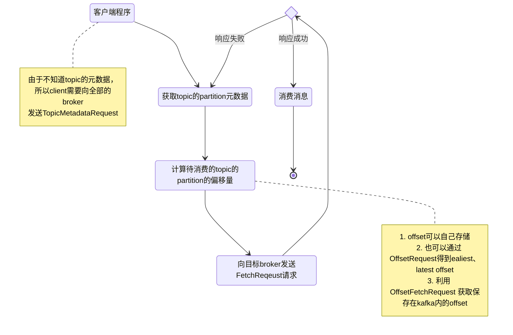
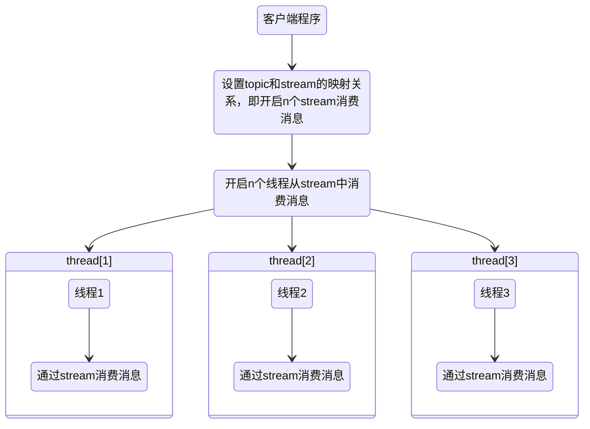
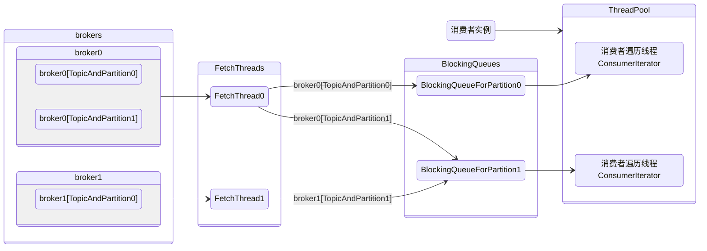

# 消费者

> 消费者分为**简单消费者**和**高级消费者**两个方式：
>
> - 简单消费者需要知道消息在的<TopicAndPartition>信息，需要知道消息对应的partition位于哪台broker；
> - 高级消费者只需要知道消息对应的topic；

## 8.1 简单消费者

> 简单消费者又称为**低级API**，本质是通过向broker发送FetchRequest来获取消息。
>
> 由于只有leader partition才可以提供读取服务，所以用户需要通过TopicMetadataRequest获取指定topic的元数据，进而知道FetchRequest应该发往哪台broker。

### 8.1.1 设计原则

> FetchRequest 可以指定 topic、partition、offset、fetchSize。

> FetchRequest

```scala
case class FetchRequest(versionId: Short = FetchRequest.CurrentVersion,
                        correlationId: Int = FetchRequest.DefaultCorrelationId,
                        clientId: String = ConsumerConfig.DefaultClientId,
                        replicaId: Int = Request.OrdinaryConsumerId,
                        maxWait: Int = FetchRequest.DefaultMaxWait,
                        minBytes: Int = FetchRequest.DefaultMinBytes,
                        requestInfo: Map[TopicAndPartition, PartitionFetchInfo])
        extends RequestOrResponse(Some(RequestKeys.FetchKey)) {
          
        }
```

>TopicAndPartition

```scala
case class TopicAndPartition(topic: String, partition: Int) {
}
```

> PartitionFetchInfo

```scala
case class PartitionFetchInfo(offset: Long, fetchSize: Int)
```

### 8.1.2 消费者流程



### 8.1.3 示例代码

```scala
package kafka.examples;

import java.nio.ByteBuffer;
import java.util.ArrayList;
import java.util.Collections;
import java.util.HashMap;
import java.util.List;
import java.util.Map;
import kafka.api.FetchRequest;
import kafka.api.FetchRequestBuilder;
import kafka.api.PartitionOffsetRequestInfo;
import kafka.cluster.Broker;
import kafka.common.ErrorMapping;
import kafka.common.LeaderNotAvailableException;
import kafka.common.TopicAndPartition;
import kafka.javaapi.FetchResponse;
import kafka.javaapi.OffsetRequest;
import kafka.javaapi.OffsetResponse;
import kafka.javaapi.PartitionMetadata;
import kafka.javaapi.TopicMetadata;
import kafka.javaapi.TopicMetadataRequest;
import kafka.javaapi.TopicMetadataResponse;
import kafka.javaapi.consumer.SimpleConsumer;
import kafka.message.MessageAndOffset;
import org.slf4j.Logger;
import org.slf4j.LoggerFactory;

/**
 * kafka低级消费者示例
 *
 * @author 0x822a5b87
 */
public class KafkaSimpleExampleConsumer {

    private final static Logger LOG = LoggerFactory.getLogger(KafkaSimpleExampleConsumer.class);

    private static final String CLIENT_ID = KafkaSimpleExampleConsumer.class.getName();

    private static final String LEADER_LOOKUP_CLIENT_ID = "leaderLookup";

    private final int soTimeoutMillis;

    private final int bufferSize;

    /**
     * 当前分区所在的broker列表
     */
    private final List<String> replicaBrokers = new ArrayList<>();

    public KafkaSimpleExampleConsumer() {
        this(10 * 1000, 1024 * 64);
    }

    public KafkaSimpleExampleConsumer(int soTimeoutMillis, int bufferSize) {
        this.soTimeoutMillis = soTimeoutMillis;
        this.bufferSize = bufferSize;
    }

    public static void main(String[] args) {
        KafkaSimpleExampleConsumer instance = new KafkaSimpleExampleConsumer();
        instance.run("test", 0, Collections.singletonList("127.0.0.1"), 9092);
    }

    public void run(String topic, int partition, List<String> seedBrokers, int port) {
        //获取partition的元数据
        PartitionMetadata partitionMetadata = findLeader(seedBrokers, port, topic, partition);
        // 如果获取不到partitionMetadata，或者分区的leader不可用则退出
        if (partitionMetadata == null || partitionMetadata.leader() == null) {
            return;
        }
        String leaderBroker = partitionMetadata.leader().host();
        String clientId = "client_" + topic + "_" + partition;
        SimpleConsumer consumer = new SimpleConsumer(leaderBroker, port, soTimeoutMillis, bufferSize, clientId);
        /*
          查询offset，有三种查询方式
          1. 使用OffsetRequest查询
          2. 使用OffsetFetchRequest查询之前提交的offset
          3. 自己在外部存储offset
         */
        long offset = getOffset(consumer, topic, partition, kafka.api.OffsetRequest.EarliestTime(), clientId);
        int numErrors = 0;
        while (true) {
            //消费失败时重启消费者
            if (consumer == null) {
                consumer = new SimpleConsumer(leaderBroker, port, soTimeoutMillis, bufferSize, clientId);
            }
            //组装FetchRequest消费数据
            FetchRequest fetchRequest = new FetchRequestBuilder().clientId(clientId)
                    .addFetch(topic, partition, offset, 1000)
                    .build();
            FetchResponse response = consumer.fetch(fetchRequest);
            if (response.hasError()) {
                numErrors++;
                short errorCode = response.errorCode(topic, partition);
                if (numErrors > 3) {
                    break;
                }
                //如果offset越界则重新获取offset
                if (errorCode == ErrorMapping.OffsetOutOfRangeCode()) {
                    offset = getOffset(consumer, topic, partition, kafka.api.OffsetRequest.LatestTime(), clientId);
                    continue;
                }
                consumer.close();
                consumer = null;
                leaderBroker = findNewLeader(leaderBroker, topic, partition, port);
                continue;
            }
            numErrors = 0;
            long numRead = 0;
            for (MessageAndOffset messageAndOffset : response.messageSet(topic, partition)) {
                long currentOffset = messageAndOffset.offset();
                if (currentOffset < offset) {
                    continue;
                }
                /*
                 * 更新offset，有三种方式：
                 * 1. 使用外部存储
                 * 2. 提交到kafka的zk或者特殊topic
                 * 3. 缓存在内存中
                 */
                offset = messageAndOffset.nextOffset();
                ByteBuffer payload = messageAndOffset.message().payload();
                byte[] bytes = new byte[payload.limit()];
                payload.get(bytes);
                numRead++;
                LOG.info("message : [{}]", new String(bytes));
            }
            if (numRead == 0) {
                try {
                    Thread.sleep(1000);
                } catch (InterruptedException e) {
                    e.printStackTrace();
                }
            }
        }
        consumer.close();
    }

    /**
     * 通过发送{@link kafka.javaapi.OffsetRequest}来查询offset
     *
     * @param whileTime while 对应 {@link PartitionOffsetRequestInfo#time()}，取值为 {@link
     *         kafka.api.OffsetRequest#EarliestTime()} 或者 {@link kafka.api.OffsetRequest#LatestTime()} 或者时间戳。
     */
    private long getOffset(SimpleConsumer consumer, String topic, int partitionId, long whileTime, String clientId) {
        TopicAndPartition topicAndPartition = new TopicAndPartition(topic, partitionId);
        Map<TopicAndPartition, PartitionOffsetRequestInfo> requestInfo = new HashMap<>(1);
        PartitionOffsetRequestInfo partitionOffsetRequestInfo = new PartitionOffsetRequestInfo(whileTime, 1);
        requestInfo.put(topicAndPartition, partitionOffsetRequestInfo);
        OffsetRequest offsetRequest = new OffsetRequest(requestInfo, kafka.api.OffsetRequest.CurrentVersion(),
                                                        clientId);
        OffsetResponse offsetResponse = consumer.getOffsetsBefore(offsetRequest);
        if (offsetResponse.hasError()) {
            return -1;
        } else {
            long[] offsets = offsetResponse.offsets(topic, partitionId);
            if (offsets.length == 0) {
                LOG.error("offsets.length == [{}]", offsets.length);
                return -1;
            } else if (offsets.length == 1) {
                return offsets[0];
            } else {
                LOG.error("offsets.length == [{}]", offsets.length);
                return -1;
            }
        }
    }

    private PartitionMetadata findLeader(List<String> seedBrokers, int port, String topic, int partitionId) {
        PartitionMetadata metadata = null;
        for (String seedBroker : seedBrokers) {
            SimpleConsumer simpleConsumer = null;
            try {
                //新建一个simpleConsumer用来查询leader
                simpleConsumer = new SimpleConsumer(seedBroker, port, soTimeoutMillis, bufferSize,
                                                    LEADER_LOOKUP_CLIENT_ID);
                //组装TopicMetadataRequest
                List<String> topics = Collections.singletonList(topic);
                TopicMetadataRequest topicMetadataRequest = new TopicMetadataRequest(topics);
                TopicMetadataResponse response = simpleConsumer.send(topicMetadataRequest);
                List<TopicMetadata> metadataList = response.topicsMetadata();
                for (TopicMetadata topicMetadata : metadataList) {
                    for (PartitionMetadata partitionMetadata : topicMetadata.partitionsMetadata()) {
                        if (partitionMetadata.partitionId() == partitionId) {
                            //注意，这里不需要判断leader，因为我们要找的是PartitionMetadata
                            metadata = partitionMetadata;
                        }
                    }
                }
            } catch (Exception e) {
                LOG.error("", e);
            } finally {
                if (simpleConsumer != null) {
                    simpleConsumer.close();
                }
            }
            if (metadata != null) {
                replicaBrokers.clear();
                for (Broker replica : metadata.replicas()) {
                    replicaBrokers.add(replica.host());
                }
            }
        }
        return metadata;
    }

    /**
     * 函数用于{@link #findLeader(List, int, String, int)}返回的leader不可用时重新查找leader
     */
    private String findNewLeader(String oldLeader, String topic, int partition, int port) {
        // 重试三次
        for (int i = 0; i < 3; ++i) {
            //此时的seedBrokers为replicaBroker
            PartitionMetadata metadata = findLeader(replicaBrokers, port, topic, partition);
            if (metadata == null || metadata.leader() == null) {
                LOG.warn("metadata and metadata.leader is nul");
            } else if (oldLeader.equalsIgnoreCase(metadata.leader().host()) && (i == 0)) {
                LOG.warn("oldLeader equal newLeader : both of them are [{}]", oldLeader);
            } else {
                return metadata.leader().host();
            }

            try {
                Thread.sleep(1000);
            } catch (InterruptedException e) {
                e.printStackTrace();
            }
        }
        throw new LeaderNotAvailableException(String.format("oldLeader equal newLeader : both of them are [%s]", oldLeader));
    }
}
```

## 8.2 高级消费者

> 高级消费者以 `ConsumerGroup` 的形式管理消息的消费，以`stream`的形式提供具体数据的读取。

### 8.2.1 设计原则

> **客户端只需要知道消息所属的topic，而不需要知道topic具体的元数据。**

### 8.2.2 消费者流程



### 8.2.4 原理解析

> 1. 消费者线程数和stream数量相等；
> 2. 一个ConsumerIterator对应一个BlockingQueue
> 3. 一个BlockQueue对应一个TopicAndPartition
> 4. 一个FetchThread对应一个broker
> 5. 一个broker上可能有多个<TopicAndPartition>，再加上<4>和<5>我们知道一个FetchThread可能对应多个BlockingQueue



> kafka 消费通过 `kafka.consumer.ZookeeperConsumerConnector` 实现。
>
> This class handles the consumers interaction with zookeeper
> Directories:
> 1. Consumer id registry: `/consumers/[group_id]/ids[consumer_id]` -> `topic1,...topicN` A consumer has a unique consumer id within a consumer group. **A consumer registers its id as an ephemeral znode and puts all topics that it subscribes to as the value of the znode**. The znode is deleted when the client is gone. A consumer subscribes to event changes of the consumer id registry within its group.The consumer id is picked up from configuration, instead of the sequential id assigned by ZK. Generated sequential ids are hard to recover during temporary connection loss to ZK, since it's difficult for the client to figure out whether the creation of a sequential znode has succeeded or not. More details can be found at (http://wiki.apache.org/hadoop/ZooKeeper/ErrorHandling)
> 2. Broker node registry: `/brokers/[brokerId]` --> `{ "host" : "host:port", "topics" : {"topic1": ["partition1" ... "partitionN"], ..., "topicN": ["partition1" ... "partitionN"] } }` This is a list of all present broker brokers. A unique logical node id is configured on each broker node. A broker node registers itself on start-up and creates a znode with the logical node id under /brokers. The value of the znode is a JSON String that contains 
>    1. the host name and the port the broker is listening to,
>    2. a list of topics that the broker serves,
>    3. a list of logical partitions assigned to each topic on the broker. A consumer subscribes to event changes of the broker node registry.
> 3. Partition owner registry: `/consumers/[group_id]/owner/[topic]/[broker_id-partition_id]` --> `consumer_node_id`This stores the mapping before broker partitions and consumers. Each partition is owned by a unique consumer within a consumer group. The mapping is reestablished after each rebalancing.
> 4. Consumer offset tracking: `/consumers/[group_id]/offsets/[topic]/[broker_id-partition_id]` --> `offset_counter_value` Each consumer tracks the offset of the latest message consumed for each partition.

#### 8.2.4.1 ConsumerThread 和 Partition 分配算法

> ConsumerThread本质就是客户端的消费线程，一个ConsumerThread消费一个或者多个<TopicAndPartition>，并且ConsumerThread和BlockingQueue一一对应。只要确定了ConsuemrThread和Partition之间的关系，也就确定了BlockingQueue和Partition之间的关系。
>
> 在最开始之前，我们必须了解三个概念：
>
> 1. consumers
> 2. stream
> 3. <TopicAndPartition>
>
> 其中<3>清晰。实际的消费中，我们可能声明M个consumer，每个consumer都有N个stream。我们要做的就是将<TopicAndPartition>尽量均匀的分布到stream上。
>
> 例如，我们有2个consumer，每个consumer有2个stream。那么我们现在就拥有了4个stream，分别是 `c0-0`、`c0-1`、`c1-0`、`c1-1`。

##### RoundRobin 分配算法

> `RoundRobinAssignor`:round-robin assignment is allowed only if:
>
> 1. Every topic has the same number of streams within a consumer instance
> 2. The set of subscribed topics is identical for every consumer instance within the group.

```scala
class RoundRobinAssignor() extends PartitionAssignor with Logging {

  def assign(ctx: AssignmentContext): scala.collection.Map[TopicAndPartition, ConsumerThreadId] = {
    val partitionOwnershipDecision = collection.mutable.Map[TopicAndPartition, ConsumerThreadId]()

    //检查条件是否满足
    //取出第一个topic的Set<ConsumerThreadId>
    val (headTopic, headThreadIdSet) = (ctx.consumersForTopic.head._1, ctx.consumersForTopic.head._2.toSet)
    ctx.consumersForTopic.foreach { case (topic, threadIds) =>
      //使用订阅的所有的topic对应的Set<ConsumerThreadId>，和第一个比较，必须完全相同。
      val threadIdSet = threadIds.toSet
      require(threadIdSet == headThreadIdSet,
              "Round-robin assignment is allowed only if all consumers in the group subscribe to the same topics, " +
              "AND if the stream counts across topics are identical for a given consumer instance.\n" +
              "Topic %s has the following available consumer streams: %s\n".format(topic, threadIdSet) +
              "Topic %s has the following available consumer streams: %s\n".format(headTopic, headThreadIdSet))
    }

    //为所有的ConsumerThreadId创建一个循环迭代器
    val threadAssignor = Utils.circularIterator(headThreadIdSet.toSeq.sorted)

    info("Starting round-robin assignment with consumers " + ctx.consumers)
    val allTopicPartitions = ctx.partitionsForTopic.flatMap { case(topic, partitions) =>
      //将{topic} -> {partitions}的映射修改为TopicAndPartition列表
      info("Consumer %s rebalancing the following partitions for topic %s: %s"
           .format(ctx.consumerId, topic, partitions))
      partitions.map(partition => {
        TopicAndPartition(topic, partition)
      })
    }.toSeq.sortWith((topicPartition1, topicPartition2) => {
      //将TopicAndPartition列表按照hashCode随机排序，以减少某个topic的全部分区落在一个consumer的可能性
      topicPartition1.toString.hashCode < topicPartition2.toString.hashCode
    })

    //将TopicAndPartition列表分配到不同的ConsumerThread
    allTopicPartitions.foreach(topicPartition => {
      val threadId = threadAssignor.next()
      if (threadId.consumer == ctx.consumerId)
        partitionOwnershipDecision += (topicPartition -> threadId)
    })

    partitionOwnershipDecision
  }
}
```

##### Range 分配算法

> Range partitioning works on a per-topic basis. **For each topic**, we lay out the available partitions in numeric order and the consumer threads in lexicographic order. We then divide the number of partitions by the total number of consumer streams (threads) to determine the number of partitions to assign to each consumer. If it does not evenly divide, then the first few consumers will have one extra partition. 
>
> For example, suppose there are two consumers C1 and C2 with two streams each, and there are five available partitions (p0, p1, p2, p3, p4). So each consumer thread will get at least one partition and the first consumer thread will get one extra partition. So the assignment will be: p0 -> C1-0, p1 -> C1-0, p2 -> C1-1, p3 -> C2-0, p4 -> C2-1

```scala
class RangeAssignor() extends PartitionAssignor with Logging {

  def assign(ctx: AssignmentContext):scala.collection.Map[TopicAndPartition, ConsumerThreadId]= {
    val partitionOwnershipDecision = collection.mutable.Map[TopicAndPartition, ConsumerThreadId]()

    for ((topic, consumerThreadIdSet) <- ctx.myTopicThreadIds) {
      //获取当前的消费者ID
      val curConsumers = ctx.consumersForTopic(topic)
      //获取目标partition
      val curPartitions: Seq[Int] = ctx.partitionsForTopic(topic)

      //每个ConsumerThread应该消费多少分区
      val nPartsPerConsumer = curPartitions.size / curConsumers.size
      //多出来的分区
      val nConsumersWithExtraPart = curPartitions.size % curConsumers.size

      info("Consumer " + ctx.consumerId + " rebalancing the following partitions: " + curPartitions +
        " for topic " + topic + " with consumers: " + curConsumers)

      for (consumerThreadId <- consumerThreadIdSet) {
        val myConsumerPosition = curConsumers.indexOf(consumerThreadId)
        assert(myConsumerPosition >= 0)
        /**
         * 假设有6个partition，2个consumer，每个consumer包含2个thread
         * 1. myConsumerPosition = 0, startPart = 0, nParts = 2
         * 2. myConsumerPosition = 1, startPart = 2, nParts = 2
         * 3. myConsumerPosition = 2, startPart = 4, nParts = 1
         * 4. myConsumerPosition = 3, startPart = 5, nParts = 1
         *
         * val startPart = myConsumerPosition + myConsumerPosition.min(2)
         * val nParts = 1 + (if (myConsumerPosition + 1 > 2) 0 else 1)
         *
         * 这个算法主要是计算两个值，{开始索引}和分到的partition数量。
         * 我们可以这样理解这个算法：
         * 1. nPartsPerConsumer 代表了每个区域最少负责的partition数量
         * 2. nConsumersWithExtraPart 表示分配完之后多出来的partition数量，而这个partition数量是一定小于我们的thread的数量的。
         *    那么，我们从索引 [0, 1, ...] 开始，每个thread分配一个剩余的partition。
         *
         * 所以，startPart = nPartsPerConsumer * myConsumerPosition + 步骤2所分配的partition数量。
         * 而步骤2所分配的partition数量就是当前索引和nConsumersWithExtraPart的最小值。
         * - 当myConsumerPosition < nConsumersWithExtraParts 时，我们还在继续分配，所以索引的偏移量和index有关；
         * - 当myConsumerPosition >= nConsumersWithExtraParts时，分配已经结束，后续的都加上这个值即可；
         *
         * 而nParts在nConsumersWithExtraParts时没有分配完时，需要分配 nPartsPerConsumer + 1，分配完之后就是 nPartsPerConsumer
         */
        //计算开始索引
        val startPart = nPartsPerConsumer * myConsumerPosition + myConsumerPosition.min(nConsumersWithExtraPart)
        //计算自己分配了几个partition
        val nParts = nPartsPerConsumer + (if (myConsumerPosition >= nConsumersWithExtraPart) 0 else 1)

        /**
         *   Range-partition the sorted partitions to consumers for better locality.
         *  The first few consumers pick up an extra partition, if any.
         */
        if (nParts <= 0)
          warn("No broker partitions consumed by consumer thread " + consumerThreadId + " for topic " + topic)
        else {
          for (i <- startPart until startPart + nParts) {
            val partition = curPartitions(i)
            info(consumerThreadId + " attempting to claim partition " + partition)
            // record the partition ownership decision
            partitionOwnershipDecision += (TopicAndPartition(topic, partition) -> consumerThreadId)
          }
        }
      }
    }

    partitionOwnershipDecision
  }
}
```

#### 8.2.4.2 ConsumerFetcherThread 线程的消费

> 1. 低级消费者需要知道partition的leader，而在高级消费者中，这个是由LeaderFinderThread完成；
> 2. ConsumerFetcherThread 由 ConsumerFetcherManager 管理。

##### ConsumerFetcherThread 的启动

> ConsumerFetcherManager 内部的 `noLeaderPartitionSet` 保存了leader不可用的partition，LeaderFinderThread 通过查询它并向broker发送TopicMetadataRequest来获取相关的元数据信息。

```scala
  private class LeaderFinderThread(name: String) extends ShutdownableThread(name) {
    // thread responsible for adding the fetcher to the right broker when leader is available
    override def doWork(): Unit = {
      val leaderForPartitionsMap = new mutable.HashMap[TopicAndPartition, Broker]
      lock.lock()
      try {
        while (noLeaderPartitionSet.isEmpty) {
          trace("No partition for leader election.")
          cond.await()
        }

        trace("Partitions without leader %s".format(noLeaderPartitionSet))
        //遍历brokers并发送TopicMetadataRequest
        val brokers = getAllBrokersInCluster(zkClient)
        val topicsMetadata = ClientUtils.fetchTopicMetadata(noLeaderPartitionSet.map(m => m.topic).toSet,
                                                            brokers,
                                                            config.clientId,
                                                            config.socketTimeoutMs,
                                                            correlationId.getAndIncrement).topicsMetadata
        if(logger.isDebugEnabled) topicsMetadata.foreach(topicMetadata => debug(topicMetadata.toString()))
        //使用response更新leader不可用的set，更新成功从noLeaderPartitionSet中删除
        topicsMetadata.foreach { tmd =>
          val topic = tmd.topic
          tmd.partitionsMetadata.foreach { pmd =>
            val topicAndPartition = TopicAndPartition(topic, pmd.partitionId)
            if(pmd.leader.isDefined && noLeaderPartitionSet.contains(topicAndPartition)) {
              val leaderBroker = pmd.leader.get
              leaderForPartitionsMap.put(topicAndPartition, leaderBroker)
              noLeaderPartitionSet -= topicAndPartition
            }
          }
        }
      } catch {
        case t: Throwable => {
            if (!isRunning.get())
              throw t /* If this thread is stopped, propagate this exception to kill the thread. */
            else
              warn("Failed to find leader for %s".format(noLeaderPartitionSet), t)
          }
      } finally {
        lock.unlock()
      }

      try {
        //为新加入的leader添加ConsumerFetcherThread
        addFetcherForPartitions(leaderForPartitionsMap.map{
          case (topicAndPartition, broker) =>
            topicAndPartition -> BrokerAndInitialOffset(broker, partitionMap(topicAndPartition).getFetchOffset())}
        )
      } catch {
        case t: Throwable => {
          if (!isRunning.get())
            throw t /* If this thread is stopped, propagate this exception to kill the thread. */
          else {
            warn("Failed to add leader for partitions %s; will retry".format(leaderForPartitionsMap.keySet.mkString(",")), t)
            lock.lock()
            noLeaderPartitionSet ++= leaderForPartitionsMap.keySet
            lock.unlock()
          }
        }
      }

      shutdownIdleFetcherThreads()
      Thread.sleep(config.refreshLeaderBackoffMs)
    }
  }
```

##### ConsumerFetcherThread 的执行逻辑

> ConsumerFetcherThread 会遍历内部的 `partitionMap`，并消费对应的topicAndPartition的数据并发送到相应的BlockingQueue


